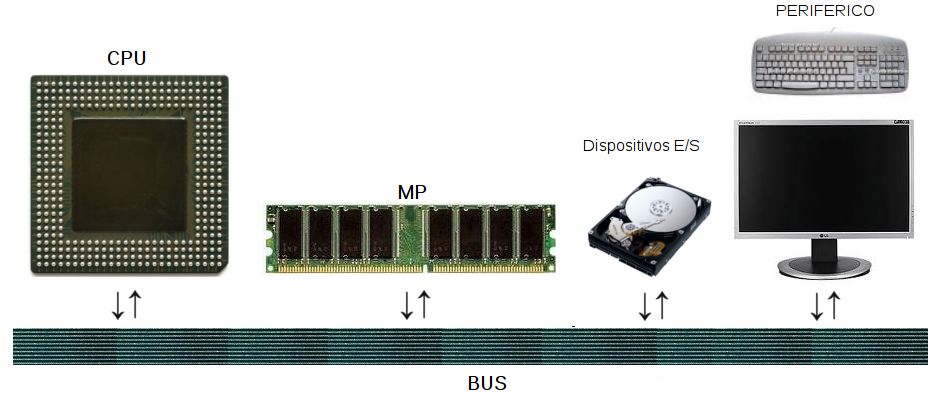
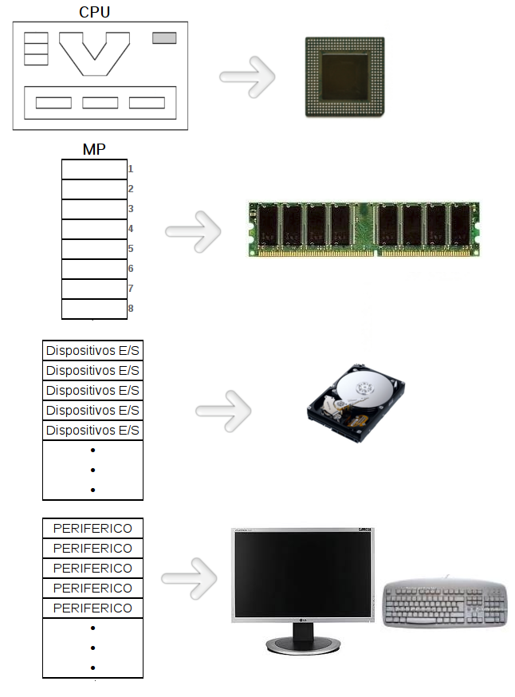
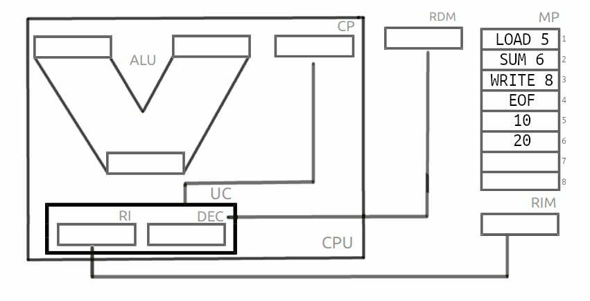
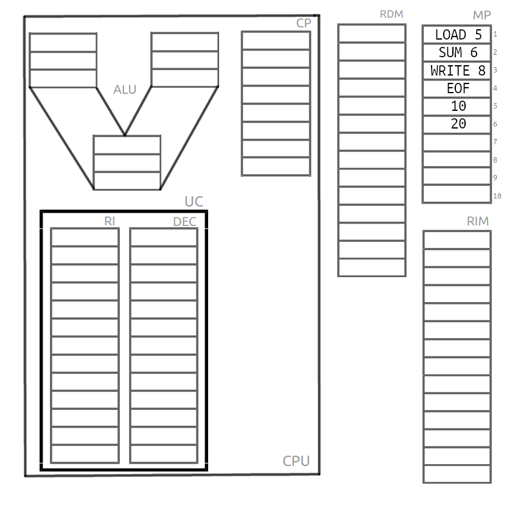
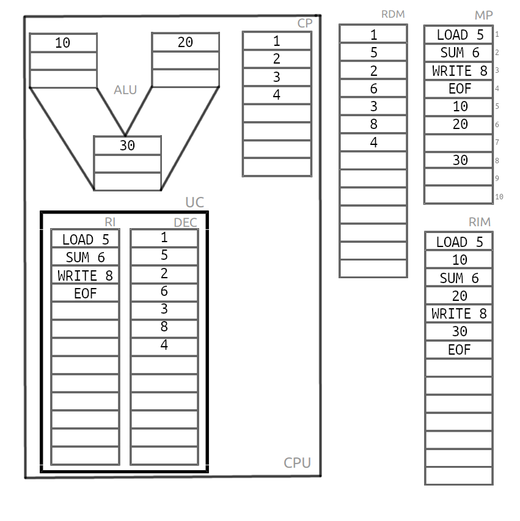

**************************
Arquitectura del ordenador
**************************

Fíjate en el siguiente ordeandor:

* `zx80 sinclair anuncio pag1 <https://raw.githubusercontent.com/dgtrabada/dgtrabada.github.io/master/docsrc/source/hardware/imagenes/arquitectura/zx80advert.jpg>`_
* `zx80 sinclair anuncio pag2 <https://raw.githubusercontent.com/dgtrabada/dgtrabada.github.io/master/docsrc/source/hardware/imagenes/arquitectura/zx80_advert.jpg>`_
* `zx80 sinclair <https://raw.githubusercontent.com/dgtrabada/dgtrabada.github.io/master/docsrc/source/hardware/imagenes/arquitectura/sinclair.jpg>`_
* `zx80 inside <https://raw.githubusercontent.com/dgtrabada/dgtrabada.github.io/master/docsrc/source/hardware/imagenes/arquitectura/sinclair2.jpg>`_
* `zx80 circuit diagram <https://raw.githubusercontent.com/dgtrabada/dgtrabada.github.io/master/docsrc/source/hardware/imagenes/arquitectura/zx80_circuit.gif>`_

Las computadoras con arquitectura Von Neumann se refiere a las arquitecturas de computadoras que utilizan el mismo dispositivo de almacenamiento tanto para las instrucciones como para los datos (a diferencia de la arquitectura Harvard).

.. image:: imagenes/arquitectura/VN3.png

Ejemplo:

`Paso a paso pdf <https://raw.githubusercontent.com/dgtrabada/dgtrabada.github.io/master/docsrc/source/hardware/imagenes/arquitectura/VN_sencillo.pdf>`_

Instrucciones para hacer los cuestionarios.
===========================================

En el caso de que quieras practicar utilizando un papel como haremos en el examén, puedes descárgate la hoja de ejercicios desde `aquí <https://raw.githubusercontent.com/dgtrabada/dgtrabada.github.io/master/docsrc/source/hardware/imagenes/arquitectura/VN_template.pdf>`_ si lo prefires puedes decargartelo para prácticar utilizando el LibreOffice desde `aquí <https://raw.githubusercontent.com/dgtrabada/dgtrabada.github.io/master/docsrc/source/hardware/imagenes/arquitectura/VN_template.ods>`_. Como ejemplo vamos a realizar el siguiente ejercicio:

Funcionamiento:

    * `VonNewmann.pdf <https://raw.githubusercontent.com/dgtrabada/dgtrabada.github.io/master/docsrc/source/hardware/imagenes/arquitectura/VonNewmann.pdf>`_
    * `Contador + decodificador <https://raw.githubusercontent.com/dgtrabada/dgtrabada.github.io/master/docsrc/source/hardware/imagenes/arquitectura/contador%2Bdecodificador.sim1>`_
    * `Sumador con acarreo <https://raw.githubusercontent.com/dgtrabada/dgtrabada.github.io/master/docsrc/source/hardware/imagenes/arquitectura/ALU.sim1>`_
    * `CPU sin direccionamiento <https://raw.githubusercontent.com/dgtrabada/dgtrabada.github.io/master/docsrc/source/hardware/imagenes/arquitectura/CPU.sim1>`_
         