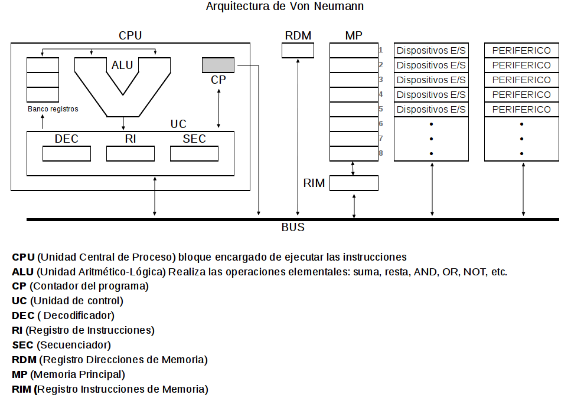

**************************
Arquitectura del ordenador
**************************

.. image:: arquitectura/VN1.png

.. image:: arquitectura/VN2.png

Las computadoras con arquitectura Von Neumann se refiere a las arquitecturas de computadoras que utilizan el mismo dispositivo de almacenamiento tanto para las instrucciones como para los datos (a diferencia de la arquitectura Harvard).

Ejemplo:

.. image:: arquitectura/VN_sencillo.gif

Paso a paso pdf

Instrucciones para hacer los cuestionarios.

* En el caso de que quieras practicar puedes descárgate la hoja de ejercicios desde aquí.
* Como ejemplo vamos a realizar el siguiente ejercicio:

.. image:: arquitectura/Ejemplo_enunciado.png

Funcionamiento:

* `VonNewmann.pdf <arquitectura/VonNewmann.pdf>`_
* `Contador + decodificador</arquitectura/VonNewmann.pdf>`_
* [Sumador con acarreo](ALU.sim1)
* [CPU sin direccionamiento](arquitectura/ALU.sim1)

                     CPU.sim1               
contador+decodificador.sim1          