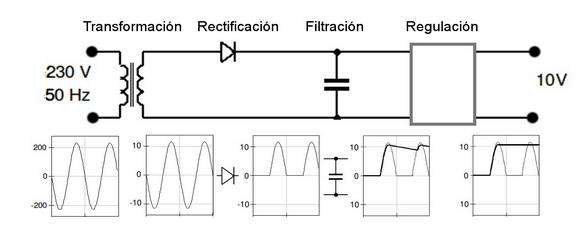

*******************************************************
Conceptos eléctricos - electrónicos y elementos básicos
*******************************************************

El Átomo
========

Átomo significa *"indivisible"*, sin embargo hoy día se sabe que el átomo está formado por partículas más pequeñas, las llamadas partículas subatómicas.

El núcleo del átomo es su parte central. Tiene carga positiva, y en él se concentra casi toda la masa del mismo. Sin embargo, ocupa una fracción muy pequeña del volumen del átomo: su radio es unas diez mil veces más pequeño. El núcleo está formado por protones (carga +) y neutrones (sin carga).

Alrededor del núcleo se encuentran los electrones (carga -), partículas de carga negativa (Culombios) y masa muy pequeña comparada con la de los protones y neutrones: un 0,05% aproximadamente. Los electrones se encuentran alrededor del núcleo, ligados por la fuerza electromagnética que éste ejerce sobre ellos, y ocupando la mayor parte del tamaño del átomo, en la llamada nube de electrones.

.. image:: imagenes/conceptos_electronicos/atomo.png
    :width: 250

Conceptos de Electricidad
=========================

Corriente
=========

Se llama corriente eléctrica, al paso de electrones a través de un conductor.

Corriente continua
==================

La corriente continua (CC en español, en inglés DC, de Direct Current) se genera a partir de un flujo continuo de electrones (cargas negativas) siempre en el mismo sentido, es decir que siempre tiene el mismo valor

.. image:: imagenes/conceptos_electronicos/continua.jpeg
    :width: 400

Corriente alterna
=================

Se denomina corriente alterna (abreviada CA en español y AC en inglés, de alternating current) a la corriente eléctrica en la que la magnitud y el sentido varían cíclicamente

.. image:: imagenes/conceptos_electronicos/alterna.jpeg
    :width: 400
    
Intensidad
==========

La intensidad eléctrica es la carga por unidad de tiempo que recorre un material. Se debe al movimiento de los electrones en el interior del material.
En el Sistema Internacional de Unidades se expresa en amperios **A = C/s** (culombios sobre segundo). Medimos la intensidad con el amperímetro colocado en serie

Diferencia de potencial (tensión)
=================================

La diferencia de potencial, tensión eléctrica o voltaje cuantifica la diferencia de potencial eléctrico entre dos puntos.

En el Sistema Internacional de Unidades se expresa en Voltios (V).
Se puede medir con un voltímetro colocado en paralelo.

La tensión que llega a nuestros hogares es de 220 V alterna, a una frecuencia de 50 Hz.

Resistencia.
============

La resistencia eléctrica de un objeto es una medida de su oposición al paso de corriente.
La unidad de la resistencia en el Sistema Internacional de Unidades es el ohmio (Ω). Podemos utilizar el polímetro para medir la resistencia o utilizar el código de colores.

.. image:: imagenes/conceptos_electronicos/resistenacia_codigo_colores.png
  :width: 200
  
A cada color le corresponde un número, por ejemplo el negro es cero , el marrón uno, etc.

.. image:: imagenes/conceptos_electronicos/resistencias.png

El primer color representa la primera cifra, el segundo color representa la segunda cifra y el tercer color la potencia de 10.
El cuarto color indica la tolerancia, por ejemplo dorado ±5%

* KΩ =1000Ω = 10³Ω
* MΩ =1000000Ω = 10⁶Ω
* GΩ =1000000000Ω = 10⁹Ω

En general podemos decir que los materiales pueden ser :

* **Conductores** : permiten el paso de la corriente, como por ejemplo la plata el cobre, hierro, etc
* **Aislantes** : no permiten el paso de la corriente, como por ejemplo el caucho, madera, aire, vidrio, plástico, cartón, etc
* **Semiconductores** : se pueden comportar como conductores o aislantes según el voltaje al que se les someta, como por ejemplo el silicio, el carburo de silicio, etc ...

.. image:: imagenes/conceptos_electronicos/circuito.png

Más ejemplos:

* `Ejercicios resistencias serie <http://www.aulataller.es/ejercicios/resistencias-serie/ejercicio-resistencias-serie.html>`_
* `Ejercicios resistencias paralelo <http://www.aulataller.es/ejercicios/resistencias-paralelo/ejercicio-resistencias-paralelo.html>`_

Vemos a continuación la comparación de un circuito electrico con un circuito hidráulico

.. image:: imagenes/conceptos_electronicos/tuberia.png

Ley de Ohm
==========

La Ley de Ohm establece que la intensidad que circula por un conductor, circuito o resistencia, es inversamente proporcional a la resistencia (R) y directamente proporcional a la tensión (V).

:math:`I=\frac{V}{R}`

Donde, I es la corriente que pasa a través del objeto en amperios, V es la diferencia de potencial de las terminales del objeto en voltios, y R es la resistencia en ohmios (Ω).

**Ejemplo 1:**

¿Qué intensidad mediría el amperímetro?

.. image:: imagenes/conceptos_electronicos/ejemplo1.png

Utilizando la Ley de Ohm : I = V/R = 12 V / 6 Ω = 2 A

**Ejemplo 2:**

¿Qué voltaje mediría el voltímetro si el amperímetro mide 4 Amperios?

.. image:: imagenes/conceptos_electronicos/ejemplo2.png

Utilizando la Ley de Ohm : V=RI = 2 Ω 4 A = 8V

Enlaces interesantes:

* `Ejercicios ley Ohm <http://www.aulataller.es/ejercicios/ley-de-ohm/ley-de-ohm-corriente-continua.html>`_
* `Ejercicios ley Ohm <http://phet.colorado.edu/sims/ohms-law/ohms-law_en.html>`_

Potencia
========

La potencia eléctrica se define como el producto de la tensión por la intensidad que circula por el circuito. la potencia se mide en vatios (W). La fórmula para calcularla es:

:math:`P=VI`

Medidor de potencia eléctrica

.. image:: imagenes/conceptos_electronicos/potenciometro.png
  :width: 100

**Ejemplo:** Calcular la potencia del ejercicio anterior : P = VI = 12 V * 2 A = 24 w

**Ejemplo de cálculo de consumo:**

La potencia de los ordenadores se encuentran entre los siguientes rangos:

* CPU: 40-130 w (consumo medio ~ 85 w)
* monitor LCD : ~ 30 w

Si tomamos que 1 kWh esta a 0,3 € ¿Cuánto costaría tener el monitor encendido durante una hora?

0.3 €/kWh * 0.03 kW * 1h = 0.009 €

Más ejemplos:

`Ejercicios potencia electrica <http://www.aulataller.es/ejercicios/potencia-electrica/potencia-corriente-continua.html>`_

Componentes electrónicos
========================

* **Resistencias**

  La resistencia eléctrica de un objeto es una medida de su oposición al paso de corriente. Se mide en ohmios (Ω)

  .. image:: imagenes/conceptos_electronicos/resistencias2.png

* **Condensadores**

  Es un dispositivo que almacena energía eléctrica. La capacidad de un condensador se mide en faradios (F).

  .. image:: imagenes/conceptos_electronicos/condensadores.png

* **Diodos**

  Permite la circulación de la corriente electrica a través de él en un sentido.

  .. image:: imagenes/conceptos_electronicos/led.png

* **Transistores**

  Cumple funciones de amplificador, oscilador, conmutador o rectificador.

  .. image:: imagenes/conceptos_electronicos/transistores.png

* **Pilas**

  Una pila eléctrica es un dispositivo que convierte energía química en energía eléctrica.

  .. image:: imagenes/conceptos_electronicos/pilas.png

* **Baterías**

 Dispositivo que almacena energía eléctrica y que posteriormente la devuelve casi en su totalidad.

  .. image:: imagenes/conceptos_electronicos/baterias.png

* **Pulsadores**

  .. image:: imagenes/conceptos_electronicos/pulsadores.png

* **Interruptores**

  .. image:: imagenes/conceptos_electronicos/interruptores.png

* **Displays**

  .. image:: imagenes/conceptos_electronicos/displays.png

* **Fusible**

  El fusible permite el paso de la corriente mientras esta no supere un valor establecido.

  .. image:: imagenes/conceptos_electronicos/fusibles.png
    :width: 150

**Aparatos de medida de magnitudes eléctricas.**

* **El polímetro.**

  .. image:: imagenes/conceptos_electronicos/polimetro.jpeg
      :width: 200

* **Amperímetro** : mide la intensidad (en serie).

  .. image:: imagenes/conceptos_electronicos/amperimetro.png
  
* **Voltímetro** : mide el Voltaje o tensión (en paralelo)

  .. image:: imagenes/conceptos_electronicos/voltimetro.png

* **Óhmetro** : mide la resistencia.

  .. image:: imagenes/conceptos_electronicos/ohmetro.png

* **HFE** : probador de transistores

  .. image:: imagenes/conceptos_electronicos/hfe.png

  Los multímetros tienen diferentes escalas, en caso de no conocer el valor de la medición, se debe seleccionar la escala más grande a partir de ella se va reduciendo hasta tener una escala adecuada para hacer la medición.
  
Fuente de Alimentación.

.. image:: imagenes/conceptos_electronicos/fuente_alimentacion.png

Los componentes internos del sistema van a estar alimentados por una corriente continua con valores entre -12V y 12V. Sin embargo la tensión que obtenemos de la red eléctrica es alterna con un valor de 230 V y una frecuencia de 50 Hz.
Para convertir la tensión alterna de la red en continua utilizaremos una fuente de alimentación .

**Funcionamiento:**

* **Transformación** : Se disminuye la corriente alterna de entrada (230 V 50 Hz)
* **Rectificación** : Con la ayuda de diodos se consigue que la corriente siempre sea positiva.
* **Filtración** : Se utiliza un condensador para corregir las caídas de tensión.
* **Regulación** : se corrigen lo picos que quedan en la señal.

Fuente Simple (con rectificación simple, no corregimos la señal negativa)

.. image:: imagenes/conceptos_electronicos/fuente_simple_alimentacion_circuito.png

(rectificación de la señal negativa)

.. image:: imagenes/conceptos_electronicos/fuente_rectificacion_alimentacion_circuito.png

