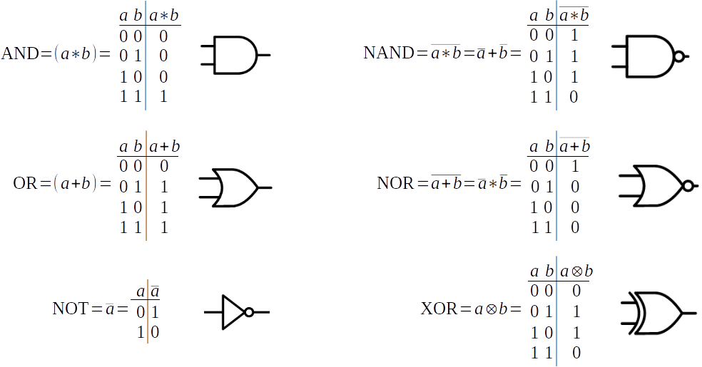
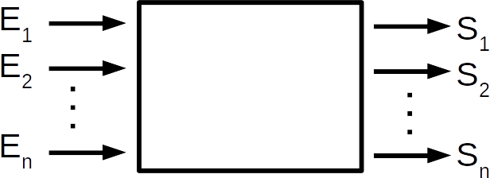

***************
Puertas lógicas
***************

En 1854 George Boole desarrollo una teoría matemática que permitió la representación de circuitos de conmutación “teoría de circuitos lógicos”. Esta teoría gira entorno al álgebra de Boole.

El álgebra de Boole esta formada por variables lógicas (a,b,c…) que pueden tomar loa valores 0 ó 1 y operadores lógicos (AND = * , OR = +, ...)

Circuitos combinacionales:
=========================

Resuelve una función lógica a partir de sus entradas, de tal forma que sus salidas toman valores que solo dependen de sus entradas

Dentro de la variada gama de circuitos combinacionales, tenemos los denominados circuitos aritméticos, estos tienen como objetivo realizar operaciones aritméticas como por ejemplo sumadores, comparadores, etc..

.. image:: puertas/comparador.jpeg 
  :width: 400

* **Decodificador** tiene n entradas y 2\ :sup:`n`\  salidas, su función es generar el código binario correspondiente a la entrada

  .. image:: puertas/decodificador.png
    :width: 300
\
  .. image:: puertas/dec2.jpeg
    :width: 400

* **Codificador** Tiene  2\ :sup:`n`\   entradas y n salidas, su función es generar el código binario correspondiente a la entrada.

  .. image:: puertas/codificador.png
    :width: 300

* **Multiplexor** Tiene  2\ :sup:`n`\   entradas, n entradas de selección y una salida de información.

  .. image:: puertas/multiplexor.png
    :width: 350

* **Conversores de código** Por ejemplo: conversor BCD natural a 7 segmentos

  .. image:: puertas/BCD.png
    :width: 250

Circuitos secuenaciales:
=========================

Resuelve una función lógica tal que los valores de sus salidas en un determinado momento dependen de los valores de sus entradas en ese momento y de los valores con anterioridad es decir la salida no solo depende de la entrada, sino que también de los estados anteriores.

.. image:: puertas/circuito_secuencial.png
  :width: 400

Biestables  
----------

Circuitos capaces de retener información, mantienen su ultimo estado hasta que se produzca un cambio en sus entradas.

* **Biestable RS** (reset, set)

  .. image:: puertas/RS.png
    :width: 250
  
* **Biestable  JK** (similar al RS, pero se corrige el error que se producía con el 11)

  .. image:: puertas/JK.png
    :width: 250  

* **Biestable T** (Disparador, cambia en el 01)

  .. image:: puertas/T.png
    :width: 450 

* **Biestable D** (Delay, la salida sigue a la entrada un paso por detrás)

  .. image:: puertas/D.png
    :width: 250 

* **Regitstros** : Una colección e dos o más biestables D, con una entrada común, además de almacenar una serie de bits pueden ser usados para pasar una señal de serie a paralelo, esto lo podemos hace con un registro de desplazamiento.

  .. image:: puertas/Registro.png
    :width: 400 

* **Contadores** : Presenta en binario el número de impulsos que han aparecido en la entrada             

  .. image:: puertas/Contadores.png
    :width: 400 