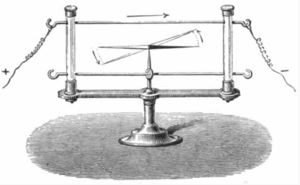
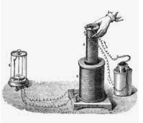
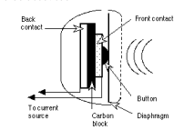
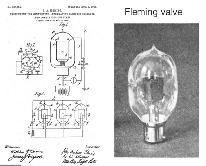

*****************************
Transición, la electricicidad
*****************************

1800 La primera pila, la de Volta
=================================

El italiano Alessandro Volta diseña la primera pila eléctrica de la historia colocando una solución salina entre discos de zinc y plata.

Se trataba de una serie de pares de discos (apilados) de zinc y de cobre (o también de plata), separados unos de otros por trozos de cartón o de fieltro impregnados de salmuera, que medían unos 3 cm de diámetro. Cuando se fijó una unidad de medida para la diferencia de potencial, el voltio (precisamente en honor de Volta) se pudo saber que cada uno de esos elementos suministraba una tensión de 0,75 V aproximadamente, pero ninguno de estos conceptos se conocía entonces. Su apilamiento conectados en serie permitía aumentar la tensión a voluntad, otro descubrimiento de Volta.

.. image:: electricicidad/Volta.png

1820 Christian Oersted
=============

Christian Oersted descubre los primeros efectos del electromagnetismo. En un famoso experimento en la Universidad de Copenhagen, Oersted dispuso una brújula bajo un conductor eléctrico. Al hacer circular corriente por el conductor, la aguja de la brújula se mueve, demostrando que las corrientes eléctricas producen campos magnéticos.
 

1821 Michael Faraday
=============

Descubre la inducción, demostrando que los efectos descubiertos por Oersted son “reversibles”. Faraday logra hacer circular corriente por conductores eléctricos que giran alrededor de un imán permanente. De hecho, se inventa el primer generador eléctrico, convirtiendo energía mecánica en energía eléctrica.

1837 Samuel Morse
=============

Inventa el telégrafo.

.. image:: electricicidad/Morse.png  

1854, George Boole
=============

Matemático inglés, desarrolla la Teoría del Álgebra de Boole que permitió a  sus sucesores la representación de circuitos de computación y el desarrollo de la llamada Teoría de los circuitos lógicos.

Desarrollo una teoría matemática que permitió la representación de circuitos de conmutación “ teoría de circuitos lógicos”. Esta teoría gira entorno al álgebra de Boole.

Portada de The Mathematical Analysis of Logic, edición de 1847. En su portada incluye la frase de Aristóteles (Anal. post., lib. I, cap. XI) «Todas las ciencias se asocian con otras respecto a elementos comunes. (Y yo llamo común a todo aquello que utilizan en sus demostraciones, no a aquello que puede ser o no ser probado)».
 El álgebra de Boole esta formada por variables lógicas (a,b,c…) que pueden tomar loa valores 0 ó 1 y operadores lógicos (AND = * , OR = +, ...)
 
.. image:: electricicidad/Boole.png  
   :width: 500
.. image:: electricicidad/Boole1.png  
   :width: 500

1877 Thomas Edison
=============

Presentó una solicitud de patente para un nuevo tipo de transmisor, que haría viable a la telefonía.

En 1854 Antonio Meucci fue el inventor del teletrófono («telettrófoni»).
El 9 de julio de 1877, Bell, junto con Sanders y Hubbard, fundan la primer compañía de teléfonos (“Bell telephone company”).

1904 John Ambrose Fleming
=================

Inventa un “rectificador electrónico de dos electrodos”, también llamada válvula electrónica, válvula de vacío, tubo de vacío o bulbo, .

 
