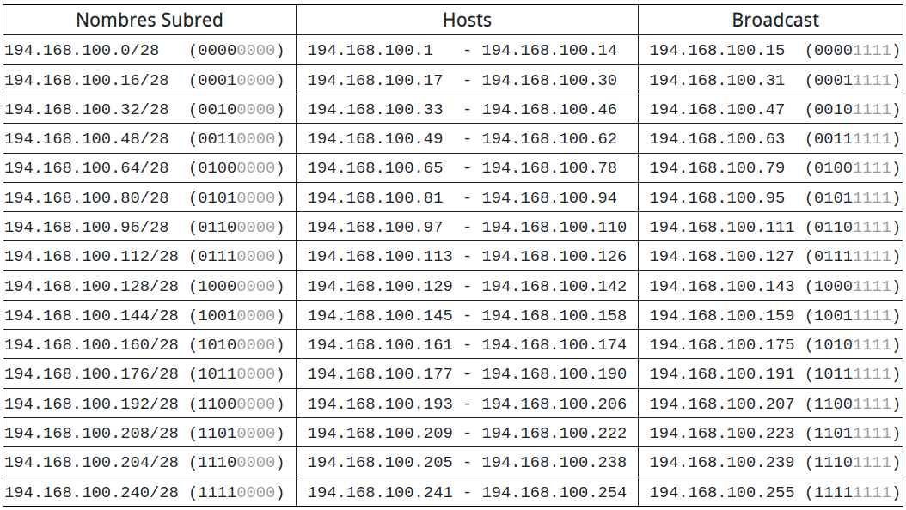
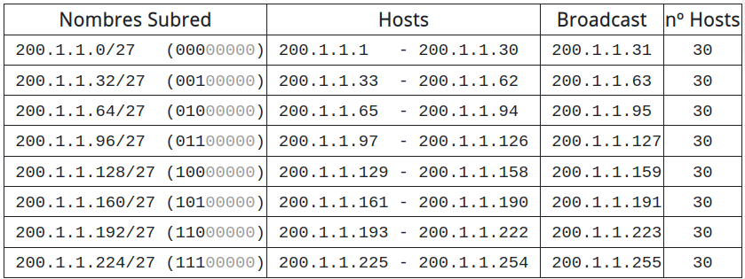
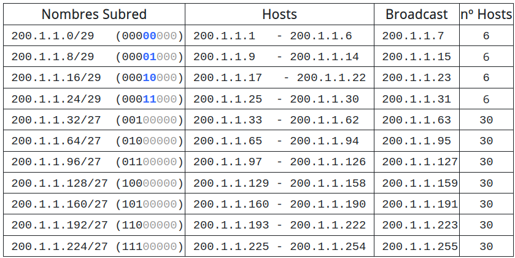
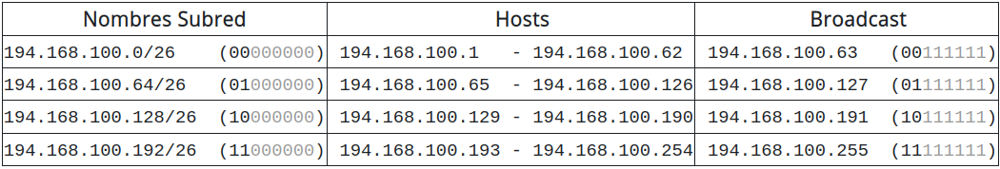
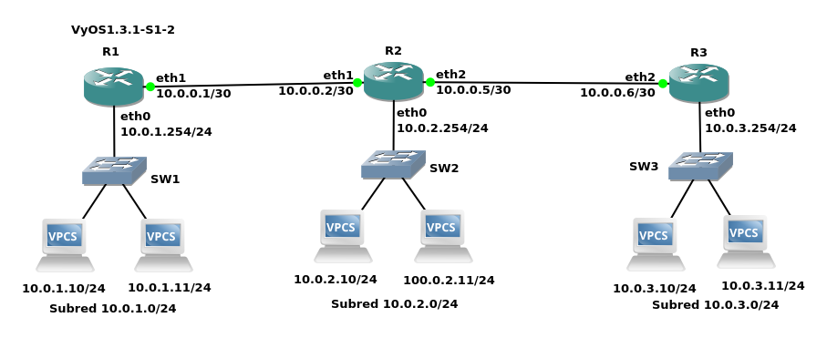

*******************
Direccionamiento IP
*******************

El direccionamiento IP es la parte encargada de asignar de forma correcta a cada equipo una dirección IP, de forma que los equipos puedan comunicarse correctamente entre sí

Las direcciones IPV4 se expresan mediante un número binario de 32 bits permitiendo un espacio de direcciones de hasta 4.294.967.296 (2\ :sup:`32`\ ) direcciones posibles.

Se reservaron ciertos rangos de direcciones IP de las clases A, B y C para permitir su uso interno o privado en redes de área local (LAN) como por ejemplo las de una casa o una oficina.

.. image:: imagenes/clasesIP.png

.. image:: imagenes/ip_clases.png

Dirección red (Network)  es aquella en la que todos los bits de la porción de host están a cero, se obtiene **Dirección IP (Addres) and Máscara de red(Network)**, veamos el ejemplo con la siguiente IP de tipo B 128.192.244.240:

.. code-block::

  Address:   128.192.224.240      10000000.11000000.11100000. 11110000
  Netmask:   255.255.255.0 = 24   11111111.11111111.11111111. 00000000
  Network:   128.192.224.0/24     10000000.11000000.11100000. 00000000
  HostMin:   128.192.224.1        10000000.11000000.11100000. 00000001
  HostMax:   128.192.224.254      10000000.11000000.11100000. 11111110

La dirección de broadcast es aquella en la que todos los bits de la porción de host están a 1, los mensajes se dirigen a todas las computadoras en una red

.. code-block::

    Broadcast: 128.192.224.255      10000000.11000000.11100000. 11111111
    Hosts/Net: 2^8-2 = 254          Class B

En la clase A, se asigna el primer octeto para identificar la red, reservando los tres últimos octetos (24 bits) para que sean asignados a los hosts,​ de modo que la cantidad máxima de hosts es 2²⁴ - 2 (se excluyen la dirección reservada para broadcast (últimos octetos a 1) y de red (últimos octetos a 0)), es decir, 16 777 214 host

.. code-block::

    10000000 = 128
    11000000 = 192 = 128 + 64
    11100000 = 224 = 128 + 64 + 32
    11110000 = 240 = 128 + 64 + 32 + 16
    11111000 = 248 = 128 + 64 + 32 + 16 + 8
    11111100 = 252 = 128 + 64 + 32 + 16 + 8 + 4
    11111110 = 254 = 128 + 64 + 32 + 16 + 8 + 4 + 2
    11111111 = 255 = 128 + 64 + 32 + 16 + 8 + 4 + 2 + 1

Ahora podemos hacernos una pregunta simple ¿que parte de la dirección 165.57.57.89 es la red y qué la dirección de host? Para eso se crearon las máscaras de red. Una máscara de red no es más que un número binario de 32 bits que contiene unos «1» en todos los bits de la dirección que identifica a la red, y ceros «0» en las posiciones de la dirección que corresponden al host.

Las redes privadas son bastante comunes en esquemas de redes de área local (LAN) de oficinas, empresas y ámbito doméstico, debido a que no tienen la necesidad de usar direcciones IP públicas en sus dispositivos (PC, impresora, etcétera), compartiendo todos los dispositivos de la red privada la misma dirección pública, habitualmente la del módem del enrutador.

Las direcciones de Internet privadas son:

.. image:: imagenes/ip_privadas.png

Esta última red de clase B queda reservada para equipos que tienen activa la configuración de la tarjeta de red automática (para que un servidor DHCP les responda y les ofrezca su configuración) y ningún servidor DHCP les responda (habitualmente este servidor está configurado en el enrutador), en ese caso estos equipos cogen aleatoriamente una ip de este rango de IP privadas para poder comunicarse con otros equipos de la red a los que tampoco les haya respondido el servidor DHCP.

El subnetting IP
================

La subnetting (o subdivisión de redes) es una técnica utilizada para dividir una red de direcciones IP en subredes más pequeñas y eficientes. En otras palabras, se trata de dividir una red IP en varias subredes más pequeñas, para que los dispositivos puedan comunicarse de manera más eficiente.

Por tanto si tengo por ejemplo la dirección de host 172.17.12.95 ya sabemos que es de clase B y que pertenece a la red 172.17.0.0 sin necesidad de especificar máscara ninguna. Y esto es así porque el 172 inicial de la dirección pertenece a la clase B.

Ahora bien ¿Y si queremos disponer de redes más pequeñas que pertenezcan al espacio de direccionamiento 172.17.x.x?

Nada impide hacer lo siguiente:

- 172.17.1.0 255.255.255.0
- 172.17.2.0 255.255.255.0
- 172.17.3.0 255.255.255.0
- ..etcétera.

Pero claro la red 172.17.1.0 255.255.255.0 no es en realidad una red de clase C, sino que con la máscara hemos definido una subred (subnet) de tipo C dentro de la red 172.17.0.0 que es una red tipo B y mucho más amplia.

Así pues este subnetting permite tener redes más pequeñas dentro de una red estándar mayor.
A nivel de routing todas esas subredes de tipo C quedan englobadas en una sola ruta de tipo B y el router de la red sólo necesita una ruta para el encaminamiento de estas subredes.

Además del subnetting, este juego con los bits de máscara permite hacer lo contrario que el subnetting y se llamó sumarizacion de redes IP.

CIDR
====

CIDR, en esencia, aplica lo mismo que el subnetting pero ampliando el concepto. En CIDR no existen clases A, B o C. El valor de la dirección IP no implica ninguna máscara implícita, como sucedía antes con los primeros bits de la dirección. Toda definición de una red IP debe ser acompañada de una definición de máscara que concreta la red.

Por ejemplo, cuando hablamos en términos de CIDR no podemos decir que la dirección 172.17.25.12 pertenezca a la red 172.17.0.0 a menos que se especifique como 172.16.25.12/16.

En CIDR ya no se utiliza el término «clase de una red», ya no hay clases como tal, sino redes definidas por el prefijo que acompaña a la dirección de red, utiliza la nomenclatura de barra invertida, del tipo /xx (donde xx representa los bits puestos a 1 de la máscara en binario) y está basada en lo que se denominó variable-length subnet masking (VLSM).

Así por ejemplo, hablando en términos de subnetting, podemos decir que la red:
172.17.11.25 con máscara 255.255.255.0 (que no es en realidad una red de clase C) es una subred (o subnet) de la red de clase B 172.17.0.0.

.. image:: imagenes/cdir.png

La dirección de red sigue siendo la que tiene todos los bits del host a 0, y la de broadcast a 1, se utiliza una máscara de red, realizando la operación AND con la dirección IP para encontrar la dirección de red, por ejemplo:

La dirección IP es 192.168.20.100/26

.. code-block::

  Address:   192.168.20.100       11000000.10101000.00010100.01 100100
  Netmask:   255.255.255.192 = 26 11111111.11111111.11111111.11 000000
                       AND     ---------------------------------------
  Network:   192.168.20.64/26     11000000.10101000.00010100.01 000000
  
  HostMin:   192.168.20.65        11000000.10101000.00010100.01 000001
  HostMax:   192.168.20.126       11000000.10101000.00010100.01 111110
  Broadcast: 192.168.20.127       11000000.10101000.00010100.01 111111
  Hosts/Net: 62                    Class C, Private Internet

En el estándar CIDR se reserva la primera y última red de cada partición

Por ejemplo, al dividir la red de clase C 192.168.20.0/24 en 4 redes (pasando a máscara /26), las redes 192.168.20.0/26 y 192.168.20.192/26 quedan reservadas

La mayoría de routers e implementaciones de IP pueden trabajar con ellas, pero es mejor no utilizarlas para no tener problemas con equipos antiguos o quisquillosos.

Ejemplos
--------

Ejemplo de subneting clásico

**¿ Qué máscara habría que aplicar para dividir la red 194.168.100.0 en 16 subredes ?**

2\ :sup:`n`\  ≥ 16 , es decir n ≥ 4

tomamos los 4 primeros bits

**1111** 0000 = **128 + 64 + 32 + 16** + 0*8 + 4*0 + 2*0 + 1*0 = 240

es decir 194.168.100.0/28 (255.255.255.240)

hay 2⁴-2 = 14 hosts por subred

VLSM (Máscara de Red de Longitud Variable) permite dividir un espacio de red en partes desiguales, es decir, la mascara de subred de una dirección IP variara según la cantidad de bits que se tomen prestados para una subred especifica, se conoce también como división de subredes en subredes.

Veamos el siguiente ejemplo, **una empresa compra una red con direcciones IP públicas de clase C 200.1.1.0, las quieres repartir entre todas sus 8 departamentos, en el caso de que haga un subneting sin VLSM, quedaría (2 = 8) es decir n = 3 (11100000)**

Podemos hacer de nuevo subnetting con la primera subred, 200.1.1.0/27 para crear 4 subredes (/29)

Volvamos al caso anterior, 194.168.100.0 (Ejemplo de subneting clásico) y hagamos n=2, es decir 194.168.100.0/26 (255.255.255.192)

hay 2⁶-2 = 60 hosts por subred

Vamos hacer sugneting con las 3 ultimas redes, tomaremos n=1,2,3

.. image:: imagenes/subred5.png

.. image:: imagenes/subneting.png

Tablas encaminamiento
=====================

Los routers confeccionan una tabla de encaminamiento en donde registran qué nodos y redes son alcanzables, estas rutas pueden ser estáticos (las programa el administrador de la red) o dinámicos (hacen de forma dinámica las de encaminamiento)

* Cada nodo decide a que nodo (dirección de red) mandará cada paquete, para ello contiene pares, dirección IP destino y dirección del siguiente salto.

* Para direccionar un único equipo (no una red) , se usa una máscara 255.255.255.255 (/32)

* Para establecer una ruta por defecto (dónde ir si no se encuentra destino), se usa una dirección 0.0.0.0/0 (izquierda)

* Si la red es directamente alcanzable, dirección del siguiente salto es una Interface del router, se indica por 0.0.0.0 (derecha)

* Dirección de red la obtiene tomando la "dirección IP AND máscara"

* Si tienen la misma dirección de red "Dir_Red_1 XOR Dir_Red_2 = 0", los dos host están en la misma red.

* Dirección de Broadcast es "Dir_red OR NOT máscara", es siempre la última dirección de una red/subred.

* El router necesita una dirección IP en cada subred a la que esté conectado y solo enrutará si el destino está en otra subred, si no puede resolver siguiente nodo manda de vuelta mensaje ICMP, destino inalcanzable

Caso práctico: Tres routers
---------------------------

Fíjate en la siguiente figura en la que se muestran 6 ordenadores unidos por 3 switch y 3 routers

Como podemos ver en la figura tenemos tres segmentos de red /24 y dos segmentos de red que unen los router en /30.

Para este caso práctico vamos a utilizar **GNS3** que es un software de emulación de red de código abierto que permite a los usuarios simular topologías de red complejas y experimentar con diferentes configuraciones de red y **VyOS**, que es un sistema operativo de red de código abierto basado en el proyecto Vyatta. Está diseñado para ser utilizado como un enrutador de red, firewall, VPN y plataforma de virtualización de red.

La forma más rápida de confiruar los 6 clientes es utilizando el botón de la derecha del ráton y pulsando Edit config, copiamos en cada caso la confiruación correspondiente:

.. code-block:: bash
  
 set pcname 10.0.1.10/24
 ip 10.0.1.10 10.0.1.254 24
 
 set pcname 10.0.1.11/24
 ip 10.0.1.11 10.0.1.254 24
 
 set pcname 10.0.2.10/24
 ip 10.0.2.10 10.0.2.254 24

 set pcname 10.0.2.11/24
 ip 10.0.2.11 10.0.2.254 24

 set pcname 10.0.3.10/24
 ip 10.0.3.10 10.0.3.254 24

 set pcname 10.0.3.11/24
 ip 10.0.3.11 10.0.3.254 24

Abre una terminal y comprueba que los clientes solo pueden hacer ping con nodos que esten en su misma subred, para que puedan verse todos entre sí pasamos a configurar los routers, para ello empezamos con **R2**, abrimos la teminal y vemos que no esta configuradas las interfaces de red

.. code-block:: bash
   
 vyos@vyos:~$ show interfaces
 Codes: S - State, L - Link, u - Up, D - Down, A - Admin Down
 Interface        IP Address                        S/L  Description
 ---------        ----------                        ---  -----------
 eth0             -                                 u/u  
 eth1             -                                 u/u  
 eth2             -                                 u/u  
 lo               127.0.0.1/8                       u/u  
                 ::1/128       
                 
Para configurarlas, abrimos una terminal:

.. code-block:: bash

 vyos@vyos:~$ configure
 WARNING: You are currently configuring a live-ISO environment,....
 [edit]
 vyos@vyos# set interfaces ethernet eth1 address 10.0.0.2/30
 [edit]
 vyos@vyos# set interfaces ethernet eth0 address 10.0.2.254/24
 [edit]
 vyos@vyos# set interfaces ethernet eth1 address 10.0.0.5/30
 
Tampoco estan configuradas las tablas de encaminamiento

.. code-block:: bash

 vyos@vyos:~$ netstat -r
 Kernel IP routing table
 Destination     Gateway         Genmask         Flags   MSS Window  irtt Iface
 
  
Añadimos las siguientes rutas estaticas: 

.. code-block:: bash

 vyos@vyos# set protocols static route 10.0.1.0/24 next-hop 10.0.0.1
 [edit]
 vyos@vyos# set protocols static route 10.0.3.0/24 next-hop 10.0.0.6
 [edit]

Para que los cambios tengan efectos los subimos y salvamos:

.. code-block:: bash

 vyos@vyos# commit
 [edit]
 vyos@vyos# save
 Saving configuration to '/config/config.boot'...
 Done
 [edit]

Comprobamos la tabla de encaminamiento

.. code-block:: bash

 vyos@vyos# netstat -r
 Kernel IP routing table
 Destination     Gateway         Genmask         Flags   MSS Window  irtt Iface
 10.0.0.0        0.0.0.0         255.255.255.252 U         0 0          0 eth1
 10.0.0.4        0.0.0.0         255.255.255.252 U         0 0          0 eth1
 10.0.1.0        10.0.0.1        255.255.255.0   UG        0 0          0 eth1
 10.0.2.0        0.0.0.0         255.255.255.0   U         0 0          0 eth0
 10.0.3.0        10.0.0.6        255.255.255.0   UG        0 0          0 eth1
 [edit]
 
y las interfaces de red como

.. code-block:: bash

 vyos@vyos# show interfaces
  ethernet eth0 {
      address 10.0.2.254/24
      hw-id 0c:51:f2:fd:00:00
  }
  ethernet eth1 {
      address 10.0.0.2/30
      address 10.0.0.5/30
      hw-id 0c:51:f2:fd:00:01
  }
  ethernet eth2 {
      hw-id 0c:51:f2:fd:00:02
  }
  loopback lo {
  }
 [edit]
 
 
Para el caso **R1**, ponemos un resumen de los comandos utilizados

.. code-block:: bash

 show interfaces
 configure
 set interfaces ethernet eth0 address 10.0.1.254/24
 set interfaces ethernet eth1 address 10.0.0.1/30
 set protocols static route 10.0.2.0/24 next-hop 10.0.0.2
 set protocols static route 10.0.3.0/24 next-hop 10.0.0.2
 commit
 save

Quedaría la tabla de encaminamiento

.. code-block:: bash

 vyos@vyos# netstat -r
 Kernel IP routing table
 Destination     Gateway         Genmask         Flags   MSS Window  irtt Iface
 10.0.0.0        0.0.0.0         255.255.255.252 U         0 0          0 eth1
 10.0.1.0        0.0.0.0         255.255.255.0   U         0 0          0 eth0
 10.0.2.0        10.0.0.2        255.255.255.0   UG        0 0          0 eth1
 10.0.3.0        10.0.0.2        255.255.255.0   UG        0 0          0 eth1
 [edit]

y las interfaces de red como

.. code-block:: bash

 vyos@vyos# show interfaces
  ethernet eth0 {
      address 10.0.1.254/24
      hw-id 0c:36:d7:ab:00:00
  }
  ethernet eth1 {
      address 10.0.0.1/30
      hw-id 0c:36:d7:ab:00:01
  }
  ethernet eth2 {
      hw-id 0c:36:d7:ab:00:02
  }
  loopback lo {
  }
 [edit]

Para el caso de **R3**

.. code-block:: bash

 show interfaces
 configure
 set interfaces ethernet eth0 address 10.0.3.254/24
 set interfaces ethernet eth2 address 10.0.0.6/30
 set protocols static route 10.0.1.0/24 next-hop 10.0.0.5
 set protocols static route 10.0.2.0/24 next-hop 10.0.0.5
 commit
 save

Quedaría la tabla de encaminamiento 

.. code-block:: bash

 vyos@vyos# netstat -r
 Kernel IP routing table
 Destination     Gateway         Genmask         Flags   MSS Window  irtt Iface
 10.0.0.4        0.0.0.0         255.255.255.252 U         0 0          0 eth2
 10.0.1.0        10.0.0.5        255.255.255.0   UG        0 0          0 eth2
 10.0.2.0        10.0.0.5        255.255.255.0   UG        0 0          0 eth2
 10.0.3.0        0.0.0.0         255.255.255.0   U         0 0          0 eth0
 [edit]
 
y las interfaces de red como

.. code-block:: bash

 vyos@vyos# show interfaces 
  ethernet eth0 {
      address 10.0.3.254/24
      hw-id 0c:73:d2:39:00:00
  }
  ethernet eth1 {
      hw-id 0c:73:d2:39:00:01
  }
  ethernet eth2 {
      address 10.0.0.6/30
      hw-id 0c:73:d2:39:00:02
  }
  loopback lo {
  }
 [edit]
