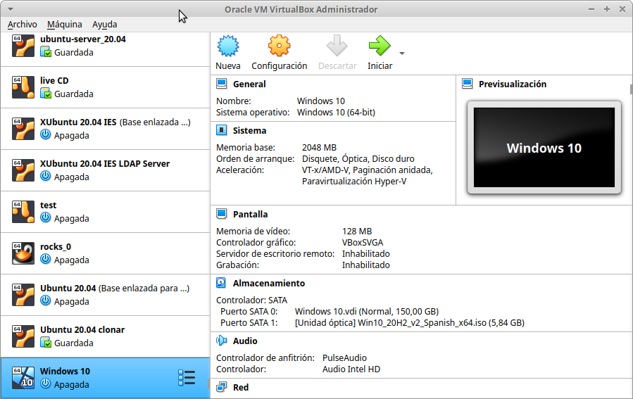

******************
Maquinas Virtuales
******************

Una máquina virtual es un software que emula a un ordenador completo, es decir, que puede hacerse pasar por otro dispositivo -como un PC- de tal modo que puedes ejecutar otro sistema operativo en su interior. Tiene su propio disco duro, memoria, tarjeta gráfica y demás componentes de hardware, aunque todos ellos son virtuales.

Que sus componentes sean virtuales no quiere decir necesariamente que no existan. Por ejemplo, una máquina virtual puede tener unos recursos reservados de 2 GB de RAM y 20 GB de disco duro, que salen del PC donde está instalada la máquina virtual

Hay varias aplicaciones muy conocidas capaz de hacer esto, aunque las más famosas son VMWare, VirtualBox, QEMU , etc..

En clase utilizaremos VirtualBox:

Resumen:

**OVF/OVA** : es un estándar abierto para empaquetar y distribuir un dispositivo virtual que consta de una o varias máquinas virtuales (VM).

**Clonación completa**, una copia exacta (incluyendo todos los archivos de disco duro virtual) de la máquina original serán creados.

**Clonación enlazada**, una nueva máquina será creada, pero los archivos de las unidades de disco duro virtuales serán vinculados a los archivos de disco duro virtual de la máquina original y no podrá mover la nueva máquina virtual a una computadora diferente sin mover los originales también.

* **RED**

  * **Cable conectado** que se encuentra en la parte de opciones avanzadas en la sección de red de la MV (también en el menú contextual del icono de red que se encuentra en la parte inferior derecha de la ventana de la MV, eligiendo Connect Network Adapter, o a través del menú de la MV Dispositivos -> Red).
  * **Modo NAT** es la forma más sencilla que tiene una MV para acceder a una red externa. Por lo general, no se requiere ninguna configuración en la red, ni en el anfitrión ni en el invitado. Por esta razón, es el modo de red por defecto en VB. En modo NAT, VB coloca un router entre el exterior (hacia donde hace NAT) y el invitado. Dicho router posee un servidor DHCP que sirve hacia el interior. Este router mapea el tráfico desde y hacia la MV de forma transparente. Cada MV en modo NAT tendrá su propio router, por lo que estarán en redes aisladas, lo que implica, que por defecto, las MMVV que tienen su tarjeta de red en modo NAT no pueden verse entre sí.
  * **Modo Red NAT**, el cual funciona como el router de nuestra casa, es decir, los equipos que estén dentro de la misma red NAT podrán comunicarse entre sí, y es aquí donde radica la diferencia con el modo NAT el cual siempre constituye una red con un único equipo y no de varios como ahora es el caso. 
    Para utilizarlo tenemos que crear la red NAT : Desde el menú Archivo -> Preferencias -> Red -> Redes NAT.
  * **Modo Adaptador puente** simula que la tarjeta virtual está conectada al mismo switch que la tarjeta física del anfitrión, por lo tanto, la MV se va a comportar como si fuese un equipo más dentro de la misma red física en la que está el equipo anfitrión. 
  * **Modo Red interna**, podemos construir redes aisladas, en las cuales solo habrá comunicación entre las MsVs que pertenezcan a la misma red interna.
  * **Modo Solo-anfitrión** se utiliza para crear una red interna a la que pertenecerá también el equipo anfitrión, algo que no sucede en el modo Red interna.

*Puede que en algún momento, por diversos motivos, nos encontremos con alguna dirección MAC duplicada en una MV (poco frecuente) o entre MV diferentes. Como ya sabemos, en una misma LAN no puede haber dos interfaces de red con igual MAC, esto nos daría problemas de red a nivel de enlace. Para evitar este problema debemos cambiar las MAC para que no estén duplicadas.*

Comandos útiles virtualBox:

.. code-block:: bash
    
 VBoxManage list vms
 VBoxManage list runningvms
 VBoxManage startvm 'Ubuntu Server 16.04' --type headless
 VBoxManage controlvm 'Ubuntu Server 16.04' savestate

En modo gráfico:

* Ctrl_derecho + Supr = Ctrl + Atl + Supr
* Ctrl_derecho = Salir de pantalla
* Ctrl_derecho + f = pasar/volver de pantalla completa
* Ctrl_derecho + c = pasar/volver modo escalado

Caso práctico: MV Ubuntu Server 22.04
*************************************

* Descárgate el sistema operativo Ubuntu Server 22.04 en formato (ISO) de su página oficial

* Utiliza un disco de 200 GB y 2G de RAM

* Iniciamos la maquina y procedemos a la instalación, llama a esta maquina virtual **MV Ubuntu Server 22.04**

* Utiliza un adaptador puente para la red con **IP** 10.4.X.Y/8 (255.0.0.0), donde **X.Y** son parte de las ips de vuestros equipos, en el caso de que tengas un portátil utiliza DHCP.

* **DNS** 8.8.8.8, **Gateway** 10.0.0.2 y **subred** 10.0.0.0/8, 

* Hacemos el siguiente esquema de particiones, para ello selecciona (x) Custom storage layout

  .. image:: imagenes/MV_Ubuntu_Server_22.04.jpg

* Usuario: tunombre y utiliza de contraseña: alumno
  Para el nombre del servidor utiliza compute-0-0, para ello modifica el archivo **/etc/hostname** 

Caso práctico: Windows 11
*************************

* Descarte la ISO de Windwos 11 de la página de `Microsoft <https://www.microsoft.com/es-es/software-download/windows11>`_

* Creamos una nueva maquina virtual llamada **Windows11**

* Creamos una maquina virtual con 100GB de disco duro reservado dinámicamente, 4096MB de RAM, un adaptador en modo modo puente y un memoria de vídeo de 128MB

* Para la instalación desconecta el cable de red virtual:
  
  Configuración/Red/Adaptador1/Avanzadas/[  ]Cable conectado
  
* En el caso de que aparezca el aviso de **"startup.nsh"** en Virtualbox, presionamos shift+F10 y cambiamos el idioma a English, vamos a continuar y pasamos al menu de instalación.

* Selecciona "No tengo clave de producto" y selecciona Windows 11 Education  

* Selecciona la instalación personalizada : instalar solo Windows (avanzado)

* Configuramos Windows con una cuenta local [#f1]_, para ello :

  * Omitimos una segunda distribución de teclado y cuando se quiera conectar a una red seleccionamos "No tengo internet",
 
  * Seguimos con **Continuar con la configuración limitada** 
  
  * Configuramos Windows con una cuenta local
 
    * usuario : **tunombre**
    * contraseña : **@lumn0**

  * Preguntas de seguridad para esta cuenta:
   
    * ¿Cuál era el nombre de tu primera mascota? **@lumn0**      
    * ¿Cuál es el nombre de la ciudad en la que naciste? **@lumn0**      
    * ¿Cuál era tu apodo de infancia? **@lumn0**

* **No** permitimos que Microsoft y las aplicaciones usen tu ubicación, ni permitimos que encuentren nuestro dispositivo, es decir que en las siguientes preguntas, le diremos que "**No**" o "**Solo los obligatorios**",  le daremos los mínimos permisos a Microsoft sobre nuestros datos y maquinas.

* De igual manera rechazamos la ayuda del asistente digital, ni usamos el reconocimiento de voz en línea

.. rubric:: Notas
  
.. [#f1] En el caso de que no aparezca haz la instalación como si fuera a se parte de un Dominio

Caso práctico: Windows Server 2022
**************************

Si no dispones de de una licencia de Windows Server 2022, puedes obtener, de forma totalmente gratuita, una versión de evaluación plenamente funcional durante un periodo de 180 días en la siguiente dirección https://www.microsoft.com/es-ES/evalcenter/evaluate-windows-server-2022

* Creamos una maquina virtual con 100GB de disco duro reservado dinámicamente, 4096MB de RAM, un adaptador en modo modo puente y un memoria de vídeo de 128MB

* Para la instalación seleccionamos: Windows Server 2022 Standard Evaluation (experiencia de escritorio)

* Contraseña del Administrador: @lumn0

* Utiliza un adaptador puente para la red con **IP** 10.4.X.Y/8 (255.0.0.0), donde X.Y son parte de las ips de vuestros equipos, en el caso de que tengas un portátil utiliza ¿DHCP?, **DNS** 8.8.8.8, **Gateway** 10.0.0.2

* Configurar nombre: Panel / Servidor local : Cambiamos nombre equipo, le llamamos SRV-tunombre

* Comprobar que la zona horaria sea la correcta : Servidor local / Ajustar zona horaria

* Habilitamos ping : Administrador del servidor / Panel / Herramientas, buscamos la opción de firewall de Windows con seguridad avanzada nos vamos a las reglas entrantes, que es donde nos está bloqueando el tráfico firewall. Nos dirigimos a la zona de la derecha y buscamos “Archivos e impresoras compartidas (petición eco IMCPv4…” solicitud de echo entrante v4 y damos a habilitar