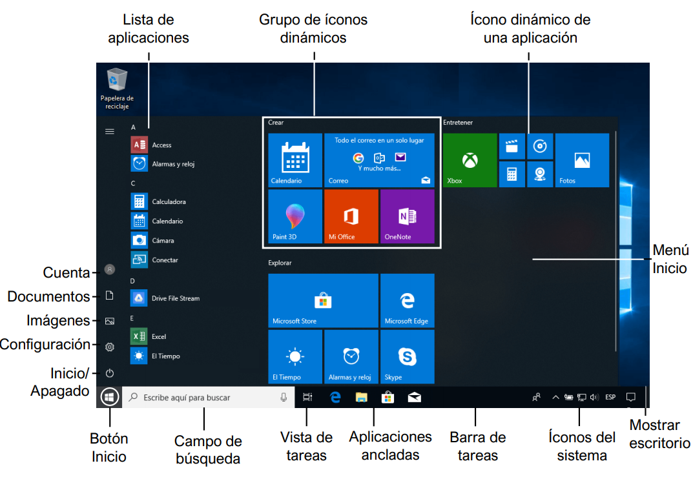
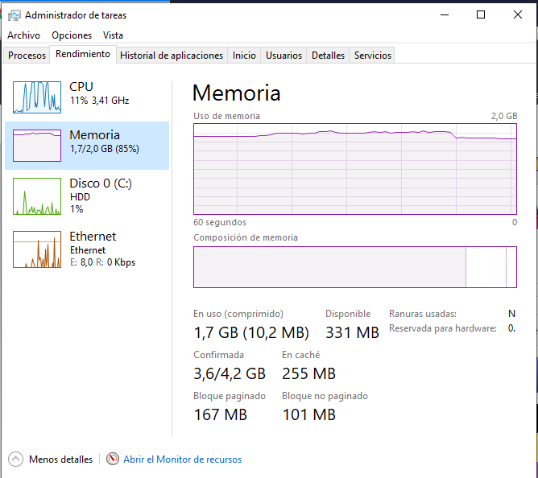
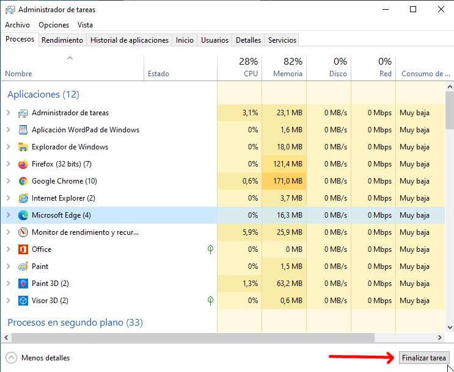

*********************
Configuración Windows
*********************

Menú inicio
===========

Explorador de Windows
=====================

* El explorador de Windows es un componente principal del sistema operativo que permite administrar el equipo, crear archivos y carpetas, lanzar aplicaciones, etc

  .. image:: imagenes/explorador.png

* Podemos buscar archivos por tamaño **System.Size: > 100 MB**

* Podemos buscar por una cierta extensión y tamaño **System.Size: > 100 MB .reg**

* Solo por extensión ***.reg**, empiezan por An y acaban por dat **An*dat**

* Entre varios tamaños **System.Size: > 100 MB < 200MB**

* por fecha de modificación **fechademodificación:hoy**

Administrador de tareas
=======================

Para ver el Administrador de tareas, tienes que hacer clic sobre cualquier espacio libre de la barra de tareas del Escritorio.

.. image:: imagenes/administrador_tareas.png

Poner más detalles

.. image:: imagenes/administrador_tareas1.png

Además, en la solapa Rendimiento obtendremos información gráfica y numérica sobre el uso del procesador, la memoria, el disco y el hardware de red durante el último minuto.

Información sobre el procesador.

.. image:: imagenes/administrador_tareas2.png

Mientras estemos mostrando la información sobre la CPU, podremos revisar bastantes datos sobre ella:

* El grado de utilización en este instante
* Su velocidad.
* La cantidad de procesos y subprocesos que está ejecutando.
* Los identificadores que tiene asignados.
* El tiempo que lleva funcionando desde que se arrancó el ordenador.
* El tamaño de la caché de nivel 1 (L1) y de nivel 2 (L2).
* El número de núcleos que incluye.
* etc.

Además, en la parte superior, se muestra su modelo exacto (en mi caso, Intel(R) Core(TM) i5-4460 a 3,2GHz) y un gráfico que muestra su comportamiento en el último minuto.

Si observáramos un consumo excesivo de procesador (un gráfico estadístico que muestra continuamente valores elevados), podríamos tener un proceso que funciona de forma inadecuada y está consumiendo demasiado tiempo de procesador. También puede ocurrir que estemos ejecutando demasiados programas de forma simultánea. En cualquier caso, habremos comprobado que el procesador estará suponiendo un cuello de botella en el rendimiento del equipo.

Cuando tenemos varios procesadores, o un procesador con varios núcleos, podemos mostrar gráficos de uso diferenciados para cada uno de ellos.Haciendo clic sobre la categoría Memoria en el panel izquierdo, obtendremos detalles sobre el uso de la RAM.

Información sobre la memoria.

Sobre la memoria, podremos consultar la cantidad que se está usando y la que aún nos queda disponible. Además, podemos ver cuál es el máximo que podremos utilizar (incluyendo la memoria virtual), cuanta tenemos destinada a caché, la cantidad que tenemos paginada y la que aún no lo está.

Como en el caso anterior, también disponemos de una representación gráfica que nos muestra la evolución en el uso de la memoria durante el último minuto. Además, ahora se incluye un gráfico que nos representa (de izquierda a derecha) diferentes datos:

* La cantidad de memoria ocupada por los procesos, los controladores y el sistema operativo.

* La memoria que debe escribirse a disco.

* La memoria que contiene datos y código a modo de caché, pero que no se están usando de forma activa.

* La memoria libre (la primera que será asignada cuando sea necesario).

Si observamos un nivel de ocupación excesivamente elevado (porque estamos ejecutando demasiados programas para la cantidad de memoria instalada o porque tenemos un proceso que está consumiendo una cantidad excesiva), el sistema operativo se estará viendo forzado a usar de forma intensiva la memoria virtual. Esto supondrá un intercambio continuo de páginas de memoria entre la RAM y el disco, lo que puede implicar, de nuevo, un cuello de botella en el sistema que afectará directamente a su rendimiento.

Haciendo clic sobre la categoría Disco en el panel izquierdo, obtendremos detalles sobre el uso del disco duro.

Aspecto de la información sobre el disco.

.. image:: imagenes/administrador_tareas4.png
 
Como ves en la imagen, cuando tenemos más de un disco, aparecen varias entradas, etiquetadas como Disco 0, Disco 1, etc.

En cada uno de ellos podremos consultar diferentes datos:

* El tiempo de actividad (en porcentaje).
* El tiempo medio de respuesta (en milisegundos).
* La velocidad de lectura y escritura en cada instante (medida en KB/s).
* La capacidad total (antes y después de formatear).
* Si se trata del disco donde está instalado el sistema.
* Si contiene el archivo de paginación.

Además, en la parte superior, disponemos de una representación gráfica del tiempo de actividad y de la velocidad de transferencia en el último minuto

Haciendo clic sobre la categoría Ethernet en el panel izquierdo, obtendremos detalles sobre el uso de la conexión de red.

Aspecto de la información sobre la conexión de red.

.. image:: imagenes/administrador_tareas6.png

Como en el caso anterior, es importante que aclaremos que, en el caso de que nuestro ordenador tuviese varias tarjetas de red, en el panel izquierdo aparecería una entrada por cada una de ellas.

Entre los datos que contiene, nos encontramos los siguientes:

* La velocidad de envío y recepción de datos en cada momento (medida en Kbps).

* La dirección IP (tanto IPv4 como IPv6).

* El nombre DNS del equipo.

* etc.

Como antes, la parte superior incluye un gráfico que representa la actividad del dispositivo en el último minuto.

Por último, debemos tener en cuenta que el panel izquierdo puede contener otros elementos, según los dispositivos que tenga nuestro ordenador. En este sentido, es frecuente que incluya entradas para Wi-Fi o Bluetooth.

Algo que puede resultar muy útil es mantener la ventana del Administrador de tareas en primer plano.

Lo conseguimos eligiendo la opción Siempre visible dentro del menú Opciones.

.. image:: imagenes/administrador_tareas_opciones.png

Incluso podemos reducir la ventana para que sólo nos muestre el gráfico que queramos.

En el caso de que queramos finalizar una tarea con el Administrador de tareas simplemente la seleccionamos y finalizamos tarea.

Otra pestaña muy interesante es la de **Rendimiento**, que se centra en mostrarnos información sobre nuestros componentes internos de hardware como el procesador, la memoria o el disco duro.

Aquí podremos conocer, en tiempo real, el consumo que hacemos de cada una de los núcleos del procesador, la velocidad de procesado actual, la memoria RAM libre y ocupada, así como la velocidad de trabajo de los discos duros que tenemos instalados e incluso de la conexión a la red que estemos usando en ese mismo instante.

.. image:: imagenes/administrador_tareas7.png

Copia de seguridad y restauración en Windows 10
===============================================

Existen dos tipos principales de copias de seguridad:

* **Copia de seguridad de los archivos**. La copia de seguridad de archivos te permite crear una copia de los documentos que tienes guardados en tu PC, ya sea de manera individual o de varios ficheros a la vez, para tenerlos en otro dispositivo y recuperarlos cuando quieras.

* **Copia de seguridad del sistema**. La copia de seguridad del sistema te permite crear una copia de todo el sistema operativo Windows que en ese momento tienes en tu ordenador, es decir, de todos los programas, los archivos y los valores de configuración.

El registro de Windows
======================

El registro de Windows es una base de datos dónde aplicaciones y controladores guardan/buscan la información necesaria para funcionar. Su estructura esta formada en forma de carpetas:

**Inicio /Ejecutar/RegEdit**

.. image:: imagenes/registro_windows.png

HKEY = HomeKey = Clave
 
* Tipos:

  * **CONSTANTES**: Se crean y modifican sólo en determinados momentos. Modificación del sistema, instalación/eliminación de un programa, creación de un usuario….
  
  * **DINÁMICAS**: Se vuelven a crear cuando se incia Windows.
    
* **HKEYS’S**

  * **HKEY_CLASSES_ROOT**,  contiene información sobre aplicaciones registradas.
    
  * **HKEY_CURRENT_USER**,  almacena configuraciones específicas del usuario con sesión iniciada en esos momentos.
  
    * Acceso directo a la clave HKEY_USER que concierne al Directorio Activo.
    
    * Control Panel/Desktop/WallPaper/  Imagen de fondo de escritorio
    
  * **HKEY_LOCAL_MACHINE**, almacena configuraciones específicas del equipo local.
  
  * **HKEY_USERS**, contiene subclaves correspondientes a las claves 
  
  * **HKEY_CURRENT_USER** de cada perfil de usuario cargado activamente en el equipo, aunque normalmente solo se cargan los subárboles de usuario correspondientes a los usuarios con sesión iniciada en esos momentos.
  
  * **HKEY_CURRENT_CONFIG**,  contiene la información referente a algunos de los dispositivos Plug and Play que tiene el ordenador.
  
* **Búsquedas en el registro**

    HKEY correspondiente, y hacemos: Edición / Buscar

* **Limpieza del registro**
    
    Analiza las claves HKEY_CLASSES_ROOT, localiza los valores erróneos y antes de eliminarlos, propone guardarlos en el archivo undo.reg.
    
* **Copia de seguridad del registro**, es aconsejable realizarlos siempre antes que:
     
  * Para realizar la copia: Archivo > Exportar
  
  * Para realizar la restaurar : Archivo > Importar
  
    * Copia parcial
    
      * Seleccionamos la rama o la clave a guardar
      * Pulsamos en: Registro /Exportar archivo de registro

Comandos Panel de Control
=========================

* **ACCESS.CPL**: abre las opciones de accesibilidad (únicamente para XP).
* **APPWIZ.CPL**: abre Agregar o quitar programas.
* **AZMAN.MSC**: abre el administrador de autorización (únicamente para Vista).
* **CERTMGR.MSC**: abre los certificados para el usuario actual.
* **CLICONFG**: abre la herramienta de configuración de cliente de red SQL.
* **COLLAB.CPL**: abre la visualización instantánea (únicamente para Vista).
* **COMEXP.MSC o DCOMCNFG**: abre los servicio de componentes (únicamente para Vista).
* **COMPMGMT.MSC**: abre la administración de equipos.
* **COMPUTERDEFAULTS**: abre la herramienta de programas predeterminados (únicamente para Vista).
* **CONTROL /NAME MICROSOFT.BACKUPANDRESTORECENTER**: abre el centro de respaldo y recuperación (para Vista únicamente).
* **CONTROL ADMINTOOLS**: abre las herramientas administrativas.
* **CONTROL COLOR**: abre las propiedades de pantalla.
* **CONTROL FOLDERS**: abre las opciones de carpeta.
* **CONTROL FONTS**: abre las fuentes.
* **CONTROL INTERNATIONAL o INTL.CPL**: abre la configuración regional y de idioma.
* **CONTROL KEYBOARD**: abre las propiedades del teclado.
* **CONTROL MOUSE o MAIN.CPL**: abre las propiedades del mouse.
* **CONTROL PRINTERS**: impresoras y faxes disponibles.
* **CONTROL USERPASSWORDS**: abre las cuentas de usuario.
* **CONTROL USERPASSWORDS2 o NETPLWIZ**: administración de usuarios y su acceso.
* **CONTROL**: abre el Panel de control.
* **CREDWIZ**: abre la ventana para hacer copias de seguridad y restaurar contraseñas de usuarios (únicamente para Vista).
* **DESK.CPL**: abre las propiedades de pantalla.
* **DEVMGMT.MSC**: abre el Administrador de dispositivos.
* **DRWTSN32**: abre Dr. Watson (para XP únicamente).
* **DXDIAG**: abre la herramienta de diagnóstico de DirectX.
* **EVENTVWR o EVENTVWR.MSC**: abre el Visor de sucesos.
* **FSMGMT.MSC**: abre las carpetas compartidas.
* **GPEDIT.MSC**: abre el editor de directiva de grupo (para las ediciones profesionales y más de Windows).
* **HDWWIZ.CPL**: abre el asistente para agregar hardware.
* **INFOCARDCPL.CPL**: abre el asistente de compatibilidad de programas.
* **IRPROPS.CPL**: abre la utilidad de infrarrojos.
* **ISCSICPL**: abre la herramienta de configuración del iniciador ISCI Microsoft (únicamente para Vista).
* **JOY.CPL**: abre el dispositivo de juegos.
* **LPKSETUP**: abre el asistente de instalación y desinstalación de idiomas (únicamente para Vista).
* **LUSRMGR.MSC**: abre el editor de usuarios locales y grupos.
* **MDSCHED**: abre la herramienta de diagnóstico de la memoria (únicamente para Vista).
* **MMC**: abre una nueva consola vacía.
* **MMSYS.CPL**: abre las propiedades de dispositivos de sonido y audio.
* **MOBSYNC**: abre elementos para sincronizar.
* **MSCONFIG**: abre la utilidad de configuración del sistema.
* **NAPCLCFG.MSC**: abre la herramienta de configuración del cliente NAP (únicamente para Vista).
* **NTMSMGR.MSC**: abre el administrador de medios de almacenamiento extraíbles.
* **NTMSOPRQ.MSC**: abre las solicitudes del operador de medios de almacenamiento extraíbles.
* **ODBCAD32**: abre el administrador de orígenes de datos ODBC.
* **OPTIONALFEATURES**: abre la herramienta Agregar o quitar componentes Windows (únicamente para Vista).
* **PERFMON o PERFMON.MSC**: abre el monitor de rendimiento de Windows.
* **POWERCFG.CPL**: abre el administrador de opciones de energía.
* **REGEDIT o REGEDT32** (únicamente para Vista): abre el editor del registro.
* **REKEYWIZ**: abre el administrador de certificados de cifrado de archivos (únicamente para Vista).
* **RSOP.MSC**: abre el conjunto resultante de directivas.
* **SECPOL.MSC**: abre la configuración de seguridad local.
* **SERVICES.MSC**: abre el administrador de servicios.
* **SLUI**: abre el asistente de activación de Windows (únicamente para Vista).
* **SYSDM.CPL**: abre las propiedades del sistema.
* **SYSEDIT**: abre el editor de configuración del sistema (atención, manipular con prudencia).
* **SYSKEY**: abre la herramienta de protección de la base de datos de cuentas de Windows (atención, manipular con mucha prudencia).
* **TABLETPC.CPL**: abre la configuración para Tablet PC (únicamente para Vista).
* **TASKSCHD.MSC o CONTROL SCHEDTASKS**: abre el planificador de tareas (únicamente para Vista).
* **TELEPHON.CPL**: abre la herramienta de información de la ubicación.
* **TIMEDATE.CPL**: abre las propiedades de fecha y hora.
* **TPM.MSC**: abre la herramienta gestión de módulo de plataforma protegida en el equipo local (únicamente para Vista).
* **UTILMAN**: abre el administrador de utilidades.
* **VERIFIER**: abre el administrador del comprobador de controlador.
* **WMIMGMT.MSC**: abre el instrumental de administración de Windows.
* **WSCUI.CPL**: abre el centro de seguridad de Windows.
* **WUAUCPL.CPL**: abre el servicio de actualizaciones automáticas de Windows (únicamente para XP).

