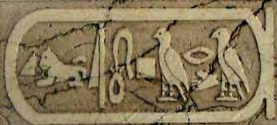
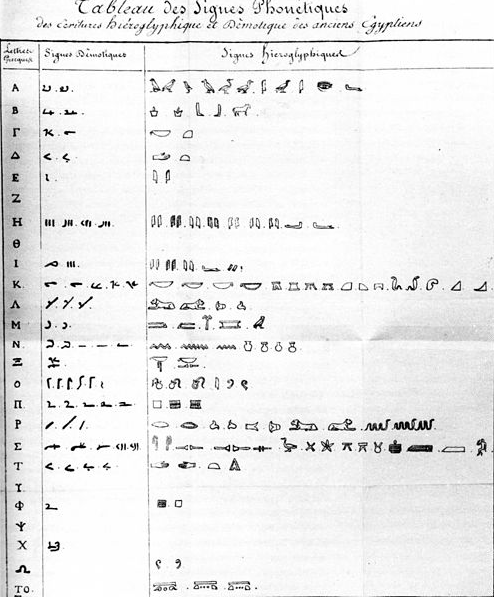
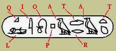

********************************
Representación de la información
********************************

Cuando realizamos la operación de codificación lo que estamos realizando es la conversión de unos datos en un conjunto de signos, representar un conjunto de informaciones por otro conjunto de informaciones siguiendo una ley dada por una tabla de correspondencia. A esta tabla se le denomina código.

El conjunto de todos lo símbolos posible que componen un determinado código toma el nombre de alfabeto.

Código morse
------------

.. image:: imagenes/morse.png
  :width: 200
  
Alfabeto Braille
----------------

.. image:: imagenes/braille.png
  :width: 300

Cartucho egipcio
----------------

Piedra rosetta
--------------

.. image:: imagenes/roseta.png

Champollion elaboró en 1822 esta tabla con los caracteres fonéticos jeroglíficos y sus equivalentes demóticos y griegos.

