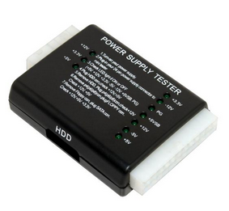

***********************
Fuentes de Alimentación
***********************

Los componentes internos del sistema van a estar alimentados por una corriente continua con valores entre -12V y 12V. Sin embargo la tensión que obtenemos de la red eléctrica es alterna con un valor de 230 V y una frecuencia de 50 Hz.
Para convertir la tensión alterna de la red en continua utilizaremos una fuente de alimentación .

.. image:: imagenes/fuentes/fuente_alimentacion.png
  :width: 300

.. image:: imagenes/fuentes/fuente_alimentacion2.png

Funcionamiento
==============

.. image:: imagenes/fuentes/fuente_alimentacion_circuito.png

* **Transformación** : Se disminuye la corriente alterna de entrada (230 V 50 Hz)
* **Rectificación** : Con la ayuda de diodos se consigue que la corriente siempre sea positiva.
* **Filtración** : Se utiliza un condensador para corregir las caídas de tensión.
* **Regulación** : se corrigen lo picos que quedan en la señal.

Fuente Simple (con rectificación simple, no corregimos la señal negativa)

.. image:: imagenes/fuentes/fuente_simple_alimentacion_circuito.png

(rectificación de la señal negativa)

.. image:: imagenes/fuentes/fuente_rectificacion_alimentacion_circuito.png

Características de las fuentes de alimentación
==============================================

* **Potencia máxima total.**

  Expresada en vatios (w). Especifica la máxima potencia que, puntualmente, puede proporcionar la fuente.

* **Potencia combinada**

  Aunque la potencia máxima total nos dá una idea de la carga total que podrá soportar, es más relevante la potencia soportada por cada una de las salidas. 
  
  Hay que tener en cuenta que el aumento de potencia de algunos dispositivos actuales ha aumentado más que la de otros (Micros, tarjetas gráficas, etc).

* **Eficiencia**

  Indica el porcentaje de energía que se convierte de alterna a continua, el resto se pierde en forma de calor.

  Las fuentes de alimentación no mantienen los niveles de eficiencia energética estática. En la actualidad, la eficiencia energética varía en función de la cantidad de carga que se está cargando en la fuente de alimentación.

  .. image:: imagenes/fuentes/eficiencia.png
    :width: 300

  `Efficiency curves for HP CS Platinum Plus power supplies <https://support.hpe.com/hpesc/public/docDisplay?docId=emr_na-c03502743>`_

  Actualmente, existen 6 tipos de Certificaciones 80 Plus: Estándar, Bronce, Plata, Oro, Platino y Titanio. Una fuente de alimentación es probada para comprobar su eficiencia al 10%, 20%, 50% y 100% de carga.

  .. image:: imagenes/fuentes/80plus.png
    :width: 300

* **Protección contra sobretensión (Overvoltage Protection).**

  Es conveniente que la fuente incluya protección ante una eventual subida de tensión de las salidas por encima de un valor. Cuando se sobrepasa este valor, la fuente apagará dicha salida protegiendo así la carga.

* **Protección contra sobrecorriente (Overcurrent Protection).**

  Cuando las salidas demandan más corriente de la permitida, algunas fuentes de alimentación se reinician para proteger la carga.
  
Cómo elegir la fuente de alimentación
=====================================

Lo recomendable es elegir una fuente de alimentación de marca conocida. En la actualidad, algunas marcas comerciales, respetan más sus especificaciones que otras. Antec, Corsair, Enermax, Fortron (FSP Group), Seasonic

* No adquirir una fuente de alimentación muy exacta, ya que calentará mucho y el ventilador hará ruido, ni muy potente, ya que el rendimiento no será bueno.
* **PFC** (Power Factor Correction)  es la relación entre la potencia real (potencia aparente) suministrada por la red eléctrica y la potencia que la fuente puede ofrecer (potencia activa o de trabajo). El factor de potencia ideal es 1, pero veréis que está representado por decimales que van desde 0 hasta 1. Lamentablemente, la corriente eléctrica viaja dando picos de voltaje. Para rectificar estos picos, la fuente de alimentación equipa transformadores internos. Mediante estos transformadores, la fuente proporciona corriente continua para los componentes PC. En otras palabras, es imposible conseguir ese 1, pero sí llegar al 0.95-0.99.

  * **PFC Pasivo**: Se trata de una corrección pasiva que consiste en un núcleo de ferrita en la entrada de la fuente de alimentación. El valor de factor de potencia en caso de utilizar PFC pasivo ronda entre unos 60-80% (0.6-0.8). Su uso tiene varios inconvenientes, como por ejemplo, la necesidad de seleccionar el voltaje de entrada mediante un interruptor y el “ruido” electromagnético que llega a producir.
    
    .. image:: imagenes/fuentes/PCPactivo.png
     :width: 200
    
  * **PFC Activo**: se trata de un circuito electrónico, capaz de ajustar la tensión de entrada (ya no hace falta seleccionarlo con un interruptor). El valor de factor de potencia en algunos casos se acerca a 99% (0.99). Este circuito requiere un filtro EMI. Casi todas las fuentes de alimentación de gama alta, media-alta y media-baja incorporan hoy en día el PFC Activo.
    
    .. image:: imagenes/fuentes/PFCpasivo.png
     :width: 200
    
  * La contaminación sonora: Algunas fuentes de alimentación son silenciosas incluso en carga, otras no tanto... Lo mejor es permanecer debajo de 45dB, se debe evitar las fuentes que superan los 50dB en carga.

* **GAMA BAJA**:

  * Peso muy reducido y baja calidad de chasis de la fuente de alimentación
  * Ventilador de baja calidad y muy ruidoso
  * Los disipadores muy finos y pequeños
  * Cables muy finos (20AWG-22AWG) y cortos, pocos conectores disponibles.
  * PCB medio-vacía, se nota la economía total en los componentes
  * No disponen de PFC ni de ningún otro tipo de filtro (o en caso contrario, está incompleto).
  * Las características técnicas “falsas”, incumplimiento de especificaciones ATX.

* **GAMA MEDIA**:

  * Chasis de calidad y un peso considerable (1,2-1,5 kg)
  * Ventilador con control automático en función de carga o temperatura.
  * Grandes disipadores
  * Cables más “gordos” (18AWG) y bastante largos.
  * Montaje de calidad con todas o casi todas las piezas
  * Las características técnicas indicadas corresponden con la realidad y cumplen con especificaciones ATX (en mayoría de ocasiones).
  * Incorporan PFC activo con filtros.
  * Son fuentes con una eficiencia medio-alta.

* **GAMA ALTA**:

  * Chasis de alta calidad y un gran peso (más de 1,8 kg).
  * Ventilador de alta calidad (de un fabricante conocido) con un control de velocidad muy efectivo.
  * Disipadores muy grandes que cubren todos los elementos de la fuente de alimentación.
  * Cables con una sección de 16AWG-18AWG; muy largos y con muchos conectores tipo molex, sata, pci-express, eps12v, etc…
  * PFC activo, filtros, circuitos de protección y posiblemente estabilización independiente de las líneas.
  * Alta calidad de los componentes y muy buen montaje.
  * Cumplimiento con las normas ATX; las características indicadas corresponden con valores reales.

Cuidados de la fuente de alimentación
=====================================

* Como consecuencia de la circulación de aire recoge mucho polvo del PC. La acumulación de polvo puede bloquear o entorpecer las aspas del extractor  provocando perdida de de refrigeración en el PC, provocando calentamiento y mal funcionamiento o bloqueo del ordenador -> mantenerla limpia de polvo.
* Mejor reponer (barata) que reparar (problemas de difícil diagnostico -> microcortes).
* Desenchufar siempre la corriente (220V) antes de abrir el ordenador.
* Precaución: anotar la posición de los conectores o no desconectar (sobre todo de la placa).

Testear una fuente de alimentación
==================================

Los comprobadores de la fuente alimentación miden el voltaje de salida, si este se encuentra dentro de cierto rango no nos dará ningún error:

Este comprobador testea las salidas de voltaje de su fuente de alimentación ATX con conexión a placa base de 20 o 24 pines, la toma de alimentación SATA, Disco Duro-Unidad Óptica Molex, o de Disquete.
En el caso de que no tengamos un comprobador de la fuente de alimentación, veremos en laboratorio como chequear las fuentes de alimentación con un voltímetro.
