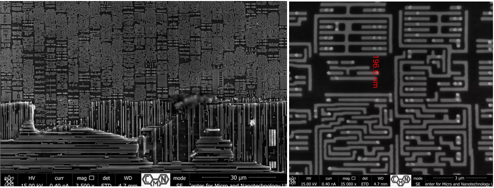

*****************************
Breve historia del procesador
*****************************

**En 1965 More** se percato de que el número de transistores en un microprocesador se duplicaba cada 18 meses. Hoy en día podemos ver que esta tendencia se sigue cumpliendo no cada 18 meses, sino más bien cada 2 años. Por ejemplo un Intel 4004 tenía 2.300 transistores en 1971 y un Core i7 tiene unos 730 millones, según la ley de More debería tener 850 millones, como se puede comprobar es un ajuste muy bueno.

.. image:: imagenes/micros/more.png

Una fecha señalada en la historia del microprocesador fue en el 2000 cuando Intel saco uno de los modelos más exitosos el **Pentium 4** basado en la arquitectura x86 de 32 bits. Con este modelo Intel esperaba llegar a los 7-8 GHz, aunque la velocidad máxima oficial se quedo en los 3.8 GHz.

Se fabricaron muchas variantes, entre ellas se desarrollo el Hyper-Threading un "doble núcleo virtual" además de aumentar el bus has 800 Mhz y llegar a 1MB de cache L2.

La respuesta de AMD fue en el 2003 con lo **Opteron**, fueron los primeros procesadores de 64bits en triunfar en el mundo del PC. Después de los Opteron sacaron los **Athlon 64** que tenían la ventaja de incluir el controlador de memoria dentro del micro en lugar de tenerlo en el northbridge. Además sacaron un novedoso bus frontal llamado HyperTransport que gracias al doble aprovechamiento de la señal llego hasta los 2 GHz. La ventaja de los procesadores de 64 bits, es que pueden direccionar hasta 2 :sup:`64` = 16 exabytes de memoria, mientras que los procesadores de 32 bits solo pueden direccionar 2 :sup:`32` = 4 GB de memoria RAM

Intel saca el **Pentium D**, estos serían los primeros procesadores de doble núcleo, aunque en realidad eran 2 núcleos juntos con 1 MB de cache L2 cada uno y 3.2 GHz.

AMD responde con los **Athlon 64x2**, en realidad eran micros Phenom con dos núcleos desactivados, se caracteriza por el bajo consumo y por soportar la memoria DDR con dual chanel, lo que permite unir dos canales de memoria.

Intel es una empresa con una producción 10 veces mayor que AMD, su respuesta fueron los Core 2 de 64 bits, el Core 2 Solo (1 núcleo) destinado para portátiles, el Core 2 Duo de 2 núcleos, el Quad Core 4 núcleos y el Extreme, de 2-4 núcleos y una cache L2 12 MB.

Los **Core2** empezaron a fabricarse con tecnología de **65 nm** y después pasaron a **45 nm**. Para AMD fue imposible llegar a los Core 2, sacaron lo Phenom, con la versión 3.0 del Hiper-Transport gracias al doble aprovechamiento de la señal, ofrece hasta 7.2 GBs. Los Phenon son capaces de apagar un core (Cool'n Quiet) para ahorrar energía un phenon típico tiene 4 núcleos con 512 KB L2 y 2MB L3 compartida.

Finalmente Intel hace un "tack" sacando los **Core i7/i5/i3**, entre sus principales características mete la memoria DDR3 dentro del micro (AMD desde el Athlon 64),

AMD saco **AMD Fusion** en 2011, un ambicioso proyecto fruto de la fusión entre AMD y ATI, y que se ha ido renovando mediante distintas generaciones, como Trinity en 2012, Kabini en 2013, y Kaveri en 2014 28nm. Muy importante es también el movimiento de AMD de desarrollar los chips APU de bajo consumo que impulsan a las actuales XBox One y PlayStation 4, dejando el mercado de los PC en un segundo plano. AMD también tiene un ojo puesto en la arquitectura ARM para su uso en servidores como una alternativa a los chips actuales de bajo consumo x86, todo ello con el objetivo de recuperar la cuota de mercado perdida en el negocio de chips de servidor.

Sin embargo,  AMD dejo el mercado de los ordenadores en un segundo plano ha facilitado que Intel se haga con el control total del mismo. Con diferentes arquitecturas como Sandy Bridge, Ivy Bridge y la más reciente Haswell "Chipset X99", la gama Core i7, i5 e i3 ha ganado una notoriedad sin par en el mundo de los ordenadores, tanto portátiles como de sobremesa. Llegando a unas cifras récord de 22 manómetros y 1400 millones de transistores.

**Actualidad:**

Los nuevos **Intel Core i9 14ª generación** en condiciones ideales puede llegar hasta los 6 Ghz, con capacidad para hasta 80 Gbps de ancho de banda bidireccional. Los procesadores de escritorio desbloqueados de última generación ahora incluyen la nueva función Intel® XTU AI Assist para overclocking guiado por IA, así como compatibilidad con velocidades DDR5 XMP.

**AMD Ryzen** son los procesadores más de moda en la actualidad. Este nombre hace referencia a la microarquitectura de nueva generación de AMD, “Zen 5”, 4nm, y al resurgir de AMD gracias a estos nuevos procesadores. AMD Ryzen llegó al mercado después de que AMD pasará más de cinco largos años sin poder competir con Intel, pues sus anteriores procesadores, los AMD FX, no resultaron ser competitivos ni en rendimiento ni en eficiencia energética, haciendo que la compañía perdiera casi toda su cuota de mercado.

Hoy en día  tenemos encontramos el Core i7-13700T y Ryzen 7 7800X, son los procesadores de gama alta, con 8 núcleos (16 hilos).

Fabricación de un procesador
----------------------------

.. image:: imagenes/micros/si.png

Evolución del tamaño en la fabricación de transistores
------------------------------------------------------

* 10 µm – 1971
* 1.5 µm – 1981
* 600 nm – 1990
* 130 nm – 2001
* 32 nm – 2009
* 22 nm – 2012
* 14 nm – 2014
* 10 nm – 2016
* 7 nm – 2018
* 5 nm – 2020
* 4 nm ~ 2024

