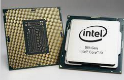
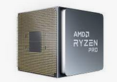
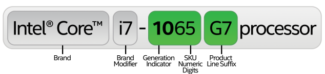
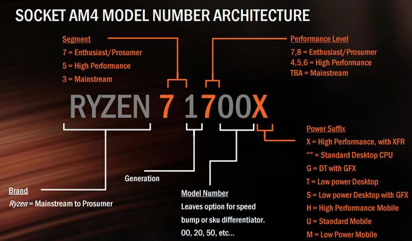
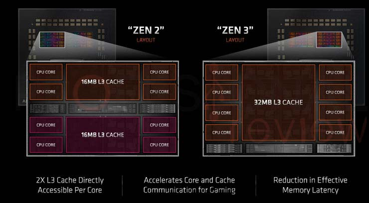
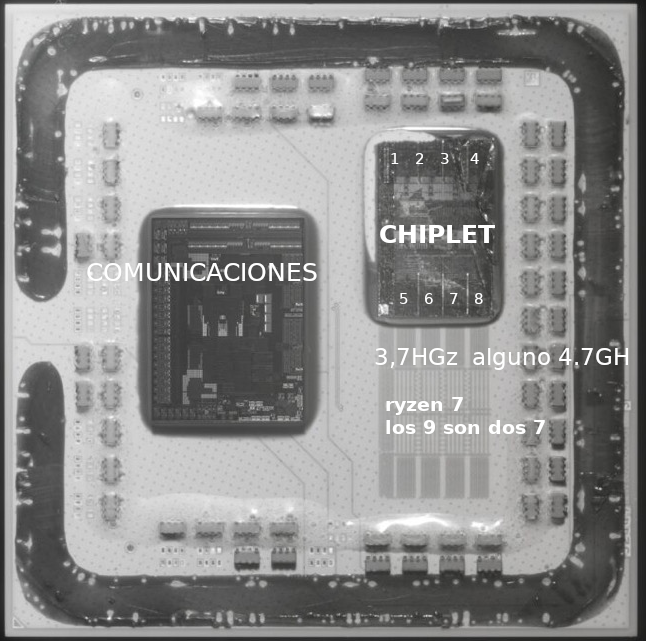
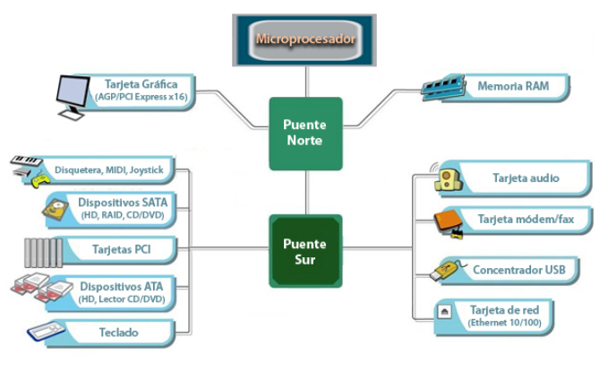
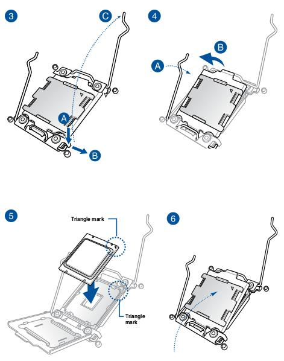

*****************
Microprocesadores
*****************

El procesador
=============

El procesador (también denominado microprocesador) es el cerebro del ordenador. Ejecuta programas a partir de un conjunto de instrucciones.

Algunas de las características básicas de los procesadores son las siguientes:

* **Frecuencia** es una magnitud que mide el número de repeticiones por unidad de tiempo de cualquier fenómeno o suceso periódico. Se mide en (Hercios) Hz = 1/s.
* **La velocidad** a la que un procesador puede realizar estas operaciones se mide en ciclos por segundo, también conocido como hercios (Hz). Un procesador de alta velocidad puede realizar más operaciones por segundo que un procesador de baja velocidad, lo que le permite ejecutar programas de manera más rápida y eficiente. Un procesador de 3GHz puede realizar 3000 millones de operaciones por segundo. (GHz=103MHz=106MHz=109Hz)
* **Zócalo** (socket en inglés) es un sistema electromecánico de soporte y conexión eléctrica, instalado en la placa base, que se usa para fijar y conectar un microprocesador sin soldar.

  .. image:: imagenes/micros/micro3.png
     :height: 120 
  .. image:: imagenes/micros/micro4.png
     :height: 120  
  .. image:: imagenes/micros/micro5.png
     :height: 120 
    
* **Litografía** se refiere a la tecnología de semiconducción que se utiliza para fabricar el circuito integrado, indicada en nanómetros (nm), y es un indicador del tamaño de las funciones incluidas en el semiconductor.
* **TDP** es una medida de la cantidad máxima de energía térmica que un procesador, puede generar sin sufrir daños. La TDP se mide en vatios (W) y representa el límite superior de la potencia que el dispositivo puede consumir mientras se encuentra en un estado de operación normal. La TDP se utiliza a menudo como una medida de la capacidad de un dispositivo para manejar la carga de trabajo y determinar si es necesario proporcionar un enfriamiento adecuado para evitar sobrecalentamiento.
* **Cantidad de núcleos** de un procesador es el número de unidades de procesamiento que se encuentran en un solo chip de procesador, 
 
  * **Performance-cores (P-cores)**, diseñados para alto rendimiento: Estos núcleos están optimizados para tareas que requieren mucho poder de procesamiento, como videojuegos, edición de video, diseño 3D, simulaciones y otras cargas de trabajo intensas y funcionan a frecuencias más altas, lo que les permite realizar cálculos más rápidos. Por otro lado encontramos los  
  * **Efficient-cores (E-cores)** estos núcleos están diseñados para maximizar la eficiencia energética y manejar tareas de fondo o de baja prioridad.
  
* **Hyper-Threading** permite a un procesador de un solo núcleo realizar varias tareas de forma simultánea, lo que se conoce como procesamiento de múltiples hilos. Esto se logra mediante la división de cada núcleo físico en dos núcleos lógicos, cada uno de los cuales puede realizar operaciones de manera independiente. Esto permite que el procesador maneje mejor la carga de trabajo y mejore el rendimiento del sistema.
* **Overclocking** es el acto de aumentar la velocidad de reloj de un procesador por encima de su velocidad de fábrica con el fin de mejorar el rendimiento del sistema. El overclocking se realiza a menudo por usuarios experimentados y requiere ajustes en la configuración del BIOS
* **Turbo Boost**. es una característica incorporada en algunos procesadores Intel que aumenta la velocidad de reloj del procesador cuando se detecta una demanda de carga de trabajo elevada. El Turbo Boost aumenta la velocidad de reloj hasta un límite predeterminado "Frecuencia turbo máxima" y se activa y desactiva automáticamente según sea necesario.
* **Memoria caché**. Es una memoria en la que se almacena una serie de datos para su rápido acceso. Básicamente, la memoria caché de un procesador es un tipo de memoria volátil (del tipo RAM), pero de una gran velocidad. Hay tres tipos diferentes de memoria caché para procesadores:

  * **Caché de 1er nivel (L1)**: Esta caché está integrada en el núcleo del procesador, trabajando a la misma velocidad que este. Normalmente tiene de unos 64KB a 512KB.
  * **Caché de 2º nivel (L2)**: Integrada también en el procesador, aunque no directamente en el núcleo de este, tiene las mismas ventajas que la caché L1, aunque es algo más lenta que esta. La caché L2 puede superar los 8MB.
  * **Caché de 3er nivel (L3)**: Es un tipo de memoria caché más lenta que la L2, hoy en día también esta dentro del procesador y suele ser compartida por los diferentes cores ~64MB
  
* **Arquitectura**: Algunas de las características que definen la arquitectura de un procesador son las siguiente:Actualmente tenemos de 32 bits y de 64 bits, una de la diferencia entre ambas arquitecturas es que la de 32 bits solo puede referenciar 2 :sup:`32` direcciones o 4 gigabytes de RAM y trabaja con una precisión de 32 bits. ( 2 :sup:`32` direcciones * 1 palabra (byte) = 2 :sup:`32` B = 2 :sup:`2` GB = 4 GB)El conjunto de instrucciones que utilizan:

  * **CISC** (complex instruction set computer) Computadoras con un conjunto de instrucciones complejo. Se refiere a los microprocesadores tradicionales que operan con grupos grandes de instrucciones de procesador (lenguaje de maquina). Los microprocesadores INTEL 80xxx estan dentro de esta categoría (incluido el PENTIUM). Los procesadores CISC tienen un Set de instrucciones complejas por naturaleza que requieren varios a muchos ciclos para completarse. En la actualidad CISC tiene a x86 como su mayor exponente (Motorola 68000, Zilog Z80 y toda la familia Intel x86, AMD x86-64)
  * **RISC** (reduced instruction set computer) Computadoras con un conjunto de instrucciones reducido, los procesadores RISC tienen un grupo de o Set de instrucciones simples requiriendo uno o pocos ciclos de ejecución. Estas instrucciones pueden ser utilizadas más eficientemente que la de los procesadores CISC con el diseño de software apropiado, resultando en operaciones más rapídas. En la actualidad el mayor ejemplo de procesador RISC son los productos ARM, utilizados ampliamente en dispositivos móviles pero también en otros campos como los supercomputadores. (PowerPC, DEC Alpha, MIPS, ARM, SPARC )
  
* **FBS (front-side bus)** El bus frontal es un canal de comunicación que se utiliza para transferir datos y comandos entre el procesador y la memoria principal. La velocidad del bus frontal se mide en MHz y determina la cantidad de datos que pueden transferirse entre el procesador y la memoria principal en un segundo.

  * **Hyper-Transport (HT)** = Bus que sustituye al FSB (Front Side Bus), gracias al doble aprovechamiento en suversión más reciente HT 3.1 ofrece hasta 51.2 GB/s, hoy en día sea sustituido por **Infinity Fabric (AMD) y PCIe Gen 4 o Gen 5** son tecnologías que ahora dominan el mercado, con velocidades de hasta 64 GB/s (PCIe Gen 4) y más de 128 GB/s (PCIe Gen 5), mucho más rápidas que las versiones más avanzadas de HyperTransport.
  
  * **Quick Path Interconnect (QPI)** = Como el Hyper-Transport aprovecha la señal en ambos sentidos y además bidireccional, full-fuplex. En procesadores más modernos, Intel ha empezado a utilizar su **Ultra Path Interconnect (UPI)**, que es una evolución de QPI con mayor ancho de banda y menores latencias. UPI se introdujo con las arquitecturas Skylake y posteriores para servidores, y está diseñado para ofrecer un mejor rendimiento en configuraciones multiprocesador,el ancho de banda total puede alcanzar hasta up to 25.6 GB/s por dirección en configuraciones de múltiples enlaces. En configuraciones de dos vías, el ancho de banda total puede duplicarse, alcanzando hasta 51.2 GB/s
  
* **BSB (Back-side bus)** El bus posterior es un canal de comunicación que se utiliza para transferir datos y comandos entre el cache L2 y la memoria principal.
* **Multiplicador** (multiplier factor) es la relación que hay entre la velocidad interna(micro) y externa(FSB) BSB/FSB
* **Cool'n Quiet**. es una tecnología de gestión térmica desarrollada por AMD que se utiliza en algunos procesadores para mejorar la eficiencia energética y reducir el ruido generado por el enfriamiento del sistema. La tecnología Cool'n Quiet utiliza sensores de temperatura y un controlador de frecuencia de procesador para ajustar la velocidad de reloj del procesador en función de la carga de trabajo y la temperatura del sistema. Cuando el sistema está en un estado de baja carga, Cool'n Quiet reduce la velocidad de reloj del procesador y reduce la potencia consumida, lo que reduce la generación de calor y el ruido del sistema de enfriamiento. Cuando se detecta una demanda de carga de trabajo elevada, Cool'n Quiet aumenta la velocidad de reloj del procesador para mejorar el rendimiento.
* **Chipset X99** es un conjunto de chips de controlador utilizados en placas base de computadora compatibles con procesadores Intel Core de sexta generación (también conocidos como procesadores de socket LGA 2011-v3). El chipset X99 proporciona la conectividad entre el procesador, la memoria RAM y otros componentes del sistema, como la tarjeta gráfica y los dispositivos de almacenamiento. Además, el chipset X99 también incluye características como soporte para tecnologías de memoria DDR4, la tecnología Intel Rapid Storage y la tecnología Intel Turbo Boost 2.0. Las placas base con chipset X99 se utilizan principalmente en sistemas de alto rendimiento y están diseñadas para proporcionar un rendimiento y una capacidad de expansión superiores
* **Tamaño de memoria máximo** es el máximo tamaño de memoria se refiere a a la capacidad máxima de memoria que admite el procesador
* **Virtualización (VT-x)** permite que una plataforma de hardware funcione como varias plataformas "virtuales". 
* **Estados de inactividad**. Los estados de inactividad (estados C) se utilizan para ahorrar energía cuando el procesador esté inactivo. C0 es el estado operacional, lo que significa que la CPU está funcionando correctamente. C1 es el primer estado de inactividad, C2 el segundo, etc., donde se realizan más acciones de ahorro de energía para estados C con valores numéricos más altos.
* **APU** (Accelerated processing unit) es la unidad de procesamiento acelerado es un tipo de procesador que combina un procesador central (CPU) y una tarjeta gráfica (GPU) en un solo chip. Las APUs se utilizan en computadoras de escritorio y portátiles para mejorar el rendimiento de la unidad de procesamiento gráfico y proporcionar un rendimiento general más rápido. Las APUs suelen tener un mayor rendimiento que los procesadores tradicionales que no tienen una GPU integrada, ya que pueden ejecutar tareas de procesamiento de datos y gráficos de manera simultánea utilizando el mismo chip. Las APUs también suelen consumir menos energía que los procesadores tradicionales con tarjetas gráficas externas, lo que las hace más eficientes en términos energéticos.

Características de INTEL
------------------------

* **Brand** = Intel® Core™, Celeron®,  Pentium®
* **Brand Modifies** = i3, i5, i7, and i9
* **Generation indicator** = generación a la que pertencen
* **SKU** = sirve  catalogarlo dentro de su generación
* **Produc Line Suffix** = indica capacidades especiales

Características AMD
-------------------

En diciembre de 2019, AMD comenzó a lanzar productos Ryzen de primera generación construidos con la arquitectura Zen+ de segunda generación

* Zen , 14 nm ,  
* Zen+, +12 nm 
* Zen2 , +7 nm 
* Zen3 , +7 nm 

La arquitectura **Zen 3** es una transición a un nuevo diseño complejo unificado que  incorpora 8 núcleos y 32 MB de caché L3 en un solo grupo de recursos.
El chipset

El **chipset** es un conjunto de circuitos integrados cuya función consiste en coordinar la transferencia de datos entre los distintos componentes de la placa, como son la memoria, las tarjetas de expansión, los puertos USB, ratón, teclado, etc
Algunos chipsets pueden incluir un chip de gráficos o de audio, lo que significa que no es necesario instalar una tarjeta gráfica o de sonido. Sin embargo, en algunos casos se recomienda instalar tarjetas de expansión de alta calidad en las ranuras apropiadas.

Los circuitos integrados más destacados por su funcionalidad se denominaban puente Norte (NorthBridge) y puente Sur (SouthBridge). Para Intel el puente norte sería memory controller hub (MCH) y el puente Sur I/O Controller Hub (ICH).
Intel antiguamente unieron el puente Norte y el Sur,  por un bus muy rápido llamado FBS (Front Side Bus), que posteriormente evoluciono en el QPI (QuickPath Interconnect), actualmente ha desaparecido dado que el puente Norte se ha integrando dentro del procesador. El bus que comunica el puerto Sur y el puente Norte en el caso de AMD se llama HyperTransport (HT).

A la derecha un chipset de intel (i9 de 11th generación), como se puede ver el microprocesador se une por medio del DMI 3.0 x8 a 8 GT/s

.. image:: imagenes/micros/chipset1.png
    :height: 200 

Instalación
===========

