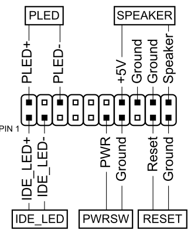
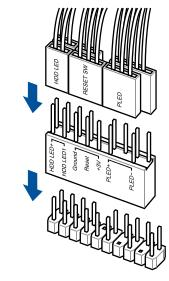
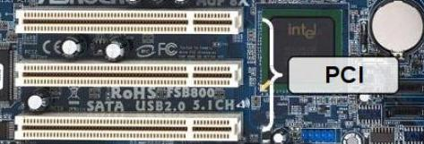
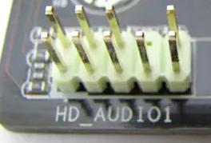

*************************************
La placa base, el “chipset”, la EPROM
*************************************

**La placa base**, también denominada motherboard "placa madre", es una placa de circuito impreso en la que conectamos todos los componentes y periféricos de un equipo microinformático.

El factor de forma
==================

El factor de forma son unos estándares que definen algunas características físicas de la placa base. Referencia como es la geometría, las dimensiones, la disposición y los requisitos eléctricos de la placa base. Los factores de forma más habituales son los siguientes

* **ATX (Advanced Technology Extended)** estándar (30.5 x 24.4 cm). Dominante en PCs de escritorio.
  
* **Micro-ATX (mATX)** (24.4 x 24.4 cm), es compatible con la ATX, los puntos de anclaje coinciden con algunos de las placas ATX y el panel lateral es identico. Por esta razón, las placas micor-ATX pueden instalarse en cajas ATX ya que, además, utilizan los mismos conectores para la alimentación de corriente.

* **Mini-ITX** (17.0 x 17.0 cm) Sistemas ultracompactos.

* **Thin-ITX** (17.0 × 17.0 × 2.5 cm) All-in-One y sistemas embebidos.

Además existen multitud de formatos especializados como **E-ATX (Extended ATX)** (30.5x33.0) usado en workstations y servidores, **Mini-STX (5×5)** (14.7 × 14.0 cm), **Nano-ITX* (12.0 x 12.0 cm) o **Pico-ITX** (10.0 x 7.2 cm) para  IoT y dispositivos miniaturizados

Existen muchos factores obsoletos como el **BTX** (Tecnología Balanceada Extendida) fué un formato diseñado para mejorar tanto la disposición de componentes como la circulación de aire, la acústica y la disipación del calor. Los distintos conectores (ranuras de memoria, ranuras de expansión) se hallan distribuidos en paralelo, en el sentido de la circulación del aire. De esta manera, el microprocesador está ubicado al final de la carcasa, cerca de la entrada de aeración, donde el aire resulta más fresco.

.. image:: imagenes/placa_base/tamaño_placa_base.jpg

Componentes integrados
======================

El chipset
----------

El chipset es un conjunto de circuitos integrados cuya función consiste en coordinar la transferencia de datos entre los distintos componentes del ordenador.

El reloj, la pila, CMOS, ROM y EPROM
------------------------------------

**El reloj** está constituido por un cristal que, cuando vibra, emite pulsos. La frecuencia del temporizador (expresada en MHz) no es más que el número de veces que el cristal vibra por segundo, es decir, el número de pulsos de temporizador por segundo.

**La memoria CMOS** conserva algunos datos del sistema, como la hora, la fecha del sistema y algunas configuraciones esenciales del sistema, cuando se apaga el ordenador. La memoria CMOS se alimenta de manera continua gracias a una pila (tipo botón).

.. image:: imagenes/placa_base/pila.png

Para borrar los datos del CMOS hay que cortocircuitar dos patillas en el lugar indicado en la placa base (para ello cambiamos el jumper de posición)

.. image:: imagenes/placa_base/pila3.png
.. image:: imagenes/placa_base/pila2.png

La BIOS se encuentra en la memoria ROM, EPROM o FLASH EPROM.
La memoria ROM es una memoria que solo se puede leer Read-Only Memory.
EPROM son las siglas de Erasable Programmable Read-Only Memory (ROM programable y borrable).

.. image:: imagenes/placa_base/eprom.png

La botonera
-----------

Salvo los botones (Power SW y Reset) el resto tienen posición, hay que conectar en el pin + el cable que NO es masa (suele ser de color negro o blanco). Algunas placas traen un adaptador que a modo de plantilla nos facilita la conexión.

.. image:: imagenes/placa_base/botonera1.png
  :width: 200
.. image:: imagenes/placa_base/botonera2.png
  :width: 200
\

.. image:: imagenes/placa_base/botonera5.jpeg

Socket del procesador
---------------------

La placa base posee una ranura, en la cual se inserta el procesador y que se denomina socket del procesador.

.. image:: imagenes/placa_base/socket_micro2.png
.. image:: imagenes/placa_base/socket_micro.jpeg
  :width: 200

Conectores de la RAM
--------------------

.. image:: imagenes/placa_base/ram2.png

Ranura AGP
----------

AGP "Accelerated Graphics port", es una interfaz gráfica, su tasa de transferencia va desde los 300 MB/s hasta los 2GB/s

Ranura PCI
----------

PCI "Peripheral Component Interconnect " con una tasa de transferencia máxima de 133 MB/s en el bus de 32 bits y 266 MB/s en el bus de 64bits

Ranura PCIe
-----------

Las ranuras PCIe (PCI-Express) nacen en como respuesta a la necesidad de un bus más rápido que los PCI o los AGP (para gráficas en este caso).

- PCIe 1.0 x1: 250MB/s

- PCIe 1.0 x4: 1GB/s (250MB/s x 4)

- PCIe 1.0 x16: 4GB/s (250MB/s x 16)

.. image:: imagenes/placa_base/pcie2.png

.. image:: imagenes/placa_base/pcie.jpeg

Entre sus ventajas cuenta la de poder instalar dos tarjetas gráficas en paralelo, es decir conectar dos o más tarjetas de vídeo y que produzcan una sola señal de salida (sistemas SLI o CrossFire) o la de poder utilizar memoria compartida, es decir utilizar la memoria RAM como parte de la memoria gráfica (sistemas TurboCaché o HyperMemory).

.. image:: imagenes/placa_base/sli.jpeg

Este tipo de ranuras no debemos confundirlas con las PCIX, ya que mientras que éstas son una extensión del estándar PCI, las PCIe tienen un desarrollo totalmente diferente.

TPM
----

TPM es Trusted Platform Module o, lo que es lo mismo, tecnología de módulo de plataforma segura. Un chip hardware que incluye varios mecanismos de seguridad física que permite que se proteja el equipo. El chip es un procesador de criptografía seguro “diseñado para realizar operaciones criptográficas”

puede venir soldado a la placa base o:

.. image:: imagenes/placa_base/tpm_esq.png
.. image:: imagenes/placa_base/tpm.png

Conectores ATX, ATX12V
----------------------

.. image:: imagenes/placa_base/atx.png

Ventilación
-----------

.. image:: imagenes/placa_base/sys.png

USB2
----

.. image:: imagenes/placa_base/usb2_2.jpeg
  :width: 200
.. image:: imagenes/placa_base/usb2_3.jpeg
  :width: 200
  
USB3
----

F_AUDIO
-------

.. image:: imagenes/placa_base/faudio2.png
.. image:: imagenes/placa_base/faudio.png

COM (serie)
-----------

El puerto COM se usa a menudo para la comunicación de datos de bajo nivel, como la configuración de BIOS, la depuración de hardware y la programación de microcontroladore

.. image:: imagenes/placa_base/com2.png

SATA
----

.. image:: imagenes/placa_base/sata.png
.. image:: imagenes/placa_base/satag.png
.. image:: imagenes/placa_base/sataf.jpeg
  :width: 200

M.2
----

.. image:: imagenes/placa_base/m2.jpeg
.. image:: imagenes/placa_base/m2f.jpeg

SPDIF
-----

transmisión de señales de audio digital utilizada para conectar dispositivos de audio, como reproductores de CD, reproductores de DVD

.. image:: imagenes/placa_base/spidf.jpeg

