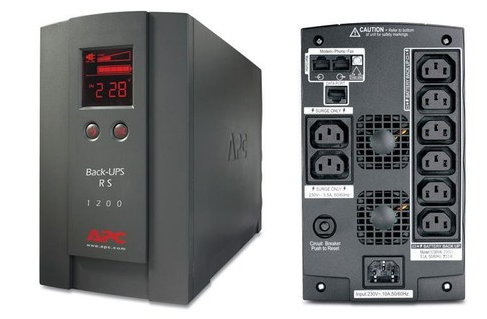
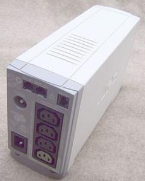

*************************************
Sistemas de alimentación interrumpida
*************************************
Sistema de alimentación ininterrumpida (SAI), en inglés uninterruptible power supply (UPS), es un dispositivo que gracias a sus baterías u otros elementos almacenadores de energía, puede proporcionar energía eléctrica por un tiempo limitado y durante un apagón eléctrico a todos los dispositivos que tenga conectados

El UPS permite que los equipos reciban alimentación de una batería de emergencia durante varios minutos en caso de que se produzcan problemas eléctricos, como por ejemplo en:

* Interferencias en la red eléctrica; es decir, un corte de electricidad de un segundo que puede provocar que el ordenador se reinicie
* Cortes de electricidad, correspondientes a una interrupción en la fuente de alimentación por un tiempo determinado
* Sobrevoltaje; es decir, un valor nominal mayor que el valor máximo previsto para el funcionamiento normal de los aparatos eléctricos
* Baja tensión, es decir, un valor nominal menor al valor mínimo previsto para el funcionamiento normal de los aparatos eléctricos
* Picos de voltaje; es decir, sobrevoltajes transitorios (de corta duración) de amplitud alta. Estos picos ocurren cuando se apagan y se encienden dispositivos que demandan mucha alimentación. Con el tiempo, esto puede ocasionar daños a los componentes eléctricos.

La batería, el cargador y el inversor.
======================================

.. image:: imagenes/fuentes/sai3.png

Las baterías de los SAI suelen ser de plomo y ácido, muy similares a los de los coches y las motos. Tienen una vida limitada, de unos pocos años (3-5), luego se van degradando. No se suelen utilizar otro tipo de baterías, como las de Niquel e Hidruro Metálico, o las de iones de litio(external link) debido a que en general, no son capaces de entregar demasiada energía rápidamente y presentan algunos inconvenientes. No obstante, algunas sí son aptas para su utilización en SAIs, pero encarecen mucho el producto.

Pueden encontrarse repuestos de la batería de casi todos los modelos de una cierta calidad. Las baterías reemplazadas deben ser procesadas convenientemente, ya que son contaminantes. No deben tirarse a la basura.

La batería acumula corriente continua (DC), a diferencia de la alterna, que es la que viene por la red eléctrica, y también la que esperan los aparatos eléctricos conectados al SAI, así que para que la batería se recargue, el SAI lleva en su interior un circuito llamado cargador, que como ya te imaginas, convierte la AC en DC y la inyecta en la batería hasta que ésta llega a su máxima capacidad.

Análogamente, si desde la batería se debe proporcionar AC a un ordenador, pero la batería sólo puede proporcionar DC, se necesita un circuito llamado inversor, que toma la DC de la batería, y la convierte en AC, cambiando también la tensión de salida (desde los 12 o 24V que suele tener una batería de ácido a los 220V necesarios para un ordenador). A este circuito, también se le suele llamar rizador u ondulador.

Tipos
=====

Generalmente existen tres tipos de UPS:

* Los SAI **fuera de línea** se conectan a través de un relé eléctrico. Cuando todo funciona de manera adecuada, se utiliza el voltaje de la red eléctrica para recargar las baterías. Cuando la batería supera o se encuentra debajo de cierto nivel (máximo o mínimo), el relé se abre y el voltaje se regenera mediante el uso de la energía almacenada en la batería. Debido al tiempo que se necesita para que el relé se abra y se cierre, este tipo de UPS no ofrece protección contra interferencias en la red eléctrica.

  .. image:: imagenes/fuentes/ups_in.png
  
* Los SAI **en línea**   se conectan en serie y regulan el voltaje constantemente.

  .. image:: imagenes/fuentes/ups_out.png
  
* Los SAI **interactivos en línea** cuentan con tecnología híbrida. Los UPS interactivos en línea se conectan en forma paralela a través de un relé, pero cuentan con un microprocesador que controla el voltaje constantemente. En caso de una caída de voltaje leve o una interferencia en la red eléctrica, el UPS puede inyectar voltaje para compensar. Sin embargo, en los casos en que se produzca un corte total de electricidad, el UPS funcionará como un UPS fuera de línea.

Características
===============

En un SAI hay que observar las siguientes características, a la hora de elegir uno para adaptárselo a nuestro equipo.

* **Potencia**

  Debemos saber que potencia necesitaremos para poder alimentar lo que queremos proteger y en función de eso comprar un SAI que aporte una potencia algo superior a lo que necesitamos. Normalmente encontraremos los SAI clasificados por Potencias expresadas en VA o KVA.

  La unidad de potencia para configurar un SAI es el voltiamperio (VA), que es la potencia aparente, o el vatio (W) que es la potencia activa, también denominada potencia efectiva o eficaz, consumida por el sistema.
  
  Para calcular cuánta energía requiere un equipo de SAI, se debe conocer el consumo de los dispositivos que tenga conectados y dividir por el Factor de potencia (FA):
 
  **VA = W / FA**
  
  El factor de potencia lo fíja la SAI, los SAI básicos tienen un Factor de potencia de 0,6 y los profesionales en torno al 0,8 - 0,9. Si todavía no tienes decidida la gama de SAI que vas a adquirir, puedes usar un FA = 0,6
  
  Por ejemplo un SAI con 1000VA podría ofrecer unos 600W reales
  
  Un equipo que consume 200W necesitaría un SAI de 200W/0.6 ~ 300VA

* **¿Que autonomía de funcionamiento tiene un SAI?**

  Los SAI normalmente tienen una autonomía aproximada unos 10 minutos, aunque existen modelos de gran autonomía de servicio. Esta autonomía esta directamente relacionada con el consumo que tengan los dispositivos conectados al SAI y con el número de baterías. En función del tiempo que necesitemos que el SAI mantenga activos los equipos conectados a él, deberemos de elegir un modelo con mayor o menor tiempo de autonomía. En este punto hemos de decir que, mientras mayor tiempo de autonomía sea capaz de ofrecer, mayor será el coste de éste.

* **Típos de conexión electrica**

  .. image:: imagenes/fuentes/schuko.png
  
* **Consumos usuales**

  Para que tengas una referencia a la hora de comprar un SAI, un PC doméstico  consume entre 100W y 200W con su monitor LED.

  En caso de que tu equipo sea un PC preparado para gaming o una estación de trabajo, no recomendamos un SAI inferior a los 500W para soportar el uso intensivo del PC y tener un tiempo de autonomía suficiente para terminar las tareas, guardar el trabajo y apagar el equipo.

  Los servidores NAS, por su parte, suelen tener consumos de entre 30W y 50W para modelos de una a 4 bahías y de 50W a 100W para modelos de 4 a 8 bahías. Para modelos profesionales y/o de más bahías, lo mejor es consultar las especificaciones técnicas en el manual o la página del fabricante.

  Por último, otros equipos domésticos como los modem/router WIFI / fibra están consumiendo alrededor de los 25W.

