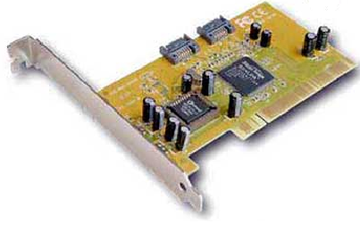

*********************
Tarjetas de expansión
*********************

Se utilizan para agregar una nueva función o para mejorar una existente.
Para ensamblar la tarjeta de expansión en la ranura correspondiente, primero tendremos que quitar las ranura trasera del panel trasero de la carcasa, este es el sitio por donde se mostrara al exterior.

.. image:: imagenes/tarjetas/tarjeta1.jpeg

Finalmente la atornillaremos al chasis, siempre que sea posible, se recomienda dejar una ranura vacía entre las tarjetas para permitir una mejor circulación de aire.

Los tipos de tarjetas de expansión mas comunes son:

Tarjetas gráficas
=================

.. image:: imagenes/tarjetas/tarjeta_graf2.png
  :width: 400

.. image:: imagenes/tarjetas/tarjeta_graf2.jpeg

* **GPU** : (graphics processing unit o unidad de procesamiento gráfico) es un procesador como la CPU dedicado al procesamiento de gráficos; su razón de ser es aligerar la carga de trabajo del procesador central y, por ello, está optimizada para el cálculo en coma flotante, predominante en las funciones 3D. Tres de las más importantes características son la frecuencia de reloj del núcleo, que puede oscilar entre 825 MHz en las tarjetas de gama baja, y 2000 MHz (e incluso más) en las de gama alta, el número de procesadores shaders (estos shaders unificados reciben el nombre de núcleos CUDA en el caso de NVIDIA y procesadores stream en el caso de AMD) y el número de pipelines (vertex y fragment shaders), encargadas de traducir una imagen 3D compuesta por vértices y líneas en una imagen 2D compuesta por píxeles.

* **RAMDAC**: Conversor analógico-digital (DAC) de la memoria RAM, empleado en las tarjetas gráficas para transformar la señal digital con que trabaja el ordenador en una salida analógica que pueda entender el monitor.

* **Ray tracing** es una tecnología desarrollada por NVIDIA que se encarga de mejorar las iluminaciones, sombras y reflejos de los videojuegos. En español, ray tracing significa trazado de rayos y hace referencia a un cálculo mucho más preciso de las iluminaciones del juego que impactan en los reflejos y sombras.

* **GDDR**. Las memorias GDDR (Graphics Double Data Rate) son una variación de las memorias RAM DDR, a las que se les ha aumentado la velocidad respecto a las memorias DDR, debido a que las tarjetas gráficas necesitan procesar mucha información, y leer y escribir continuamente a una velocidad muy alta.

  * **GDDR5**: Puede alcanzar velocidades de transferencias de hasta 17 GB/s.
  
  * **GDDR5X**: es una versión mejorada de la anterior, con un mejor rendimiento. Es dos veces más rápida que una GDDR5 normal.

  * **GDDR6**: también funciona a 1.35v, pero consigue velocidades de 768 GB/s.

  * **HBM2** (High Bandwidth Memory 2) es la segunda generación de la memoria HBM, un tipo de memoria RAM de alto rendimiento diseñada para ofrecer enorme ancho de banda y bajo consumo energético, principalmente utilizada en tarjetas gráficas de gama alta, inteligencia artificial y supercomputación. 256–460 GB/s

* **Velocidad de Refresco**. Rapidez con que el contenido de la memoria de vídeo se envía al monitor, es el número de veces por segundo que se dibuja la pantalla. La resolución está relacionada con la velocidad de refresco: a mayor resolución, menor velocidad de refresco. Se mide en Hz. Velocidades de refresco habituales son 75Hz,  80Hz o 85HZ. El mínimo es 60 Hz. Para jugar, podemos encontrar velocidades de refresco de 144 a 240Hz

* **Profundidad de color**: Número de bits usados para el color de cada píxel. Determina el número máximo de colores que puede mostrar una imagen de forma simultánea 

+-----+--------------------------+-------------------------------+    
|Bitts| Nº Colores               | Nombre                        |
+-----+--------------------------+-------------------------------+    
| 1   | 2                        | Monocromo                     |
+-----+--------------------------+-------------------------------+    
| 2   | 4                        | CGA                           |
+-----+--------------------------+-------------------------------+    
| 4   | 16                       | EGA                           | 
+-----+--------------------------+-------------------------------+    
| 8   | 256                      | VGA                           |
+-----+--------------------------+-------------------------------+    
| 16  | 65536                    | XGA, color de alta densidad   |
+-----+--------------------------+-------------------------------+    
| 24  | 16777216                 | SVGA, color verdadero         |
+-----+--------------------------+-------------------------------+    
| 32  | 16777216 + Transparencia |                               |
+-----+--------------------------+-------------------------------+    

* **Resolución**: Número de píxeles que es capaz de representar una tarjeta de vídeo en la pantalla tanto en horizontal como en vertical, ejemplo: Resolución de 800x600.

  .. image:: imagenes/tarjetas/tamaño.png

  .. image:: imagenes/tarjetas/tamaño2.png
    :width: 400

* **OpenGL**: Es una especificación estándar que define una API multilenguaje y multiplataforma para escribir aplicaciones que produzcan gráficos 2D y 3D. Es el principal competidor de Direct3D de Microsoft.

* **DirectX**: Es una colección de APIs creadas para facilitar tareas relacionadas con la programación de juegos en la plataforma Microsoft Windows.

* **SLI y CrossFire**: Tecnología de Intel/Nvidia y AMD/ATI respectivamente, que permite conectar dos tarjetas gráficas en un mismo ordenador con el objetivo de aumentar el rendimiento gráfico.

  .. image:: imagenes/tarjetas/graficas.png

* **VGA**: Estándar analógico diseñado para monitores CRT: sufre de ruido y distorsión por la conversión de digital a analógico y el error de muestreo al evaluar los píxeles a enviar al monitor.  Este tipo de interfaz se usa para enviar 3 señales analógicas a la pantalla. Dichas señales corresponden a los componentes rojos, azules y verdes de la imagen.

  .. image:: imagenes/tarjetas/vga.png

* **DVI**: Sustituto del anterior que hace obtener la máxima calidad de visualización en las pantallas digitales como los LCD o proyectores.

  .. image:: imagenes/tarjetas/dvi.png

* **S-Video**: Incluido para dar soporte a televisores, reproductores de DVD, vídeos y videoconsolas.

  .. image:: imagenes/tarjetas/svideo.png

* **Video Compuesto**: Analógico de muy baja resolución mediante conector RCA.

  .. image:: imagenes/tarjetas/rca.png

* **HDMI**: Tecnología digital que pretende sustituir todas las anteriores. Es una norma de audio y video digital de alta definición. Permite el uso de vídeo estándar, mejorado o de alta definición, así como audio digital multicanal en un único cable puede llegar a 4,9 Gbit/s.

  .. image:: imagenes/tarjetas/hdmi.png
    :width: 300

* **DisplayPort** es una alternativa al HDMI que fue desarrollado entre 2006 y 2007. Puedes diferenciarlo porque uno de los lados es diferente al otro. No es compatible con tantos dispositivos como el HDMI, pero tiene unas cualidades mayores. Podríamos decir que es una especie de evolución, el estándar heredero que sin ser tan soportado, aunque tiene un arma secreta que es la compatibilidad con puertos USB de tipo C.

  .. image:: imagenes/tarjetas/displayport.png
    :width: 100
  .. image:: imagenes/tarjetas/displayportf.png
    :width: 100

Tarjetas de sonido
==================

+-----------+------------------------------------------------------------------------------------------------------+
| Color     | Función                                                                                              | 
+-----------+------------------------------------------------------------------------------------------------------+
| Rosa      | Entrada analógica para micrófono.                                                                    |
+-----------+------------------------------------------------------------------------------------------------------+
| Azul      | Entrada analógica "Line-In"                                                                          |
+-----------+------------------------------------------------------------------------------------------------------+
| Verde     | Salida analógica para la señal estéreo principal (altavoces frontales).                              |
+-----------+------------------------------------------------------------------------------------------------------+
| Negro     | Salida analógica para altavoces traseros.                                                            |
+-----------+------------------------------------------------------------------------------------------------------+
| Game Port | Joystick, dos puertos MIDI IN y MIDI OUT                                                             |
+-----------+------------------------------------------------------------------------------------------------------+
| Naranja   | Salida Digital SPDIF (que algunas veces es utilizado como salida analógica para altavoces centrales).|
+-----------+------------------------------------------------------------------------------------------------------+

* **Entrada / Salida digital SPDIF óptica**

  SPDIF (Sony/Philips Digital Interface) es un estándar de conexión digital para transmitir audio entre dispositivos sin convertirlo a analógico, manteniendo la mejor calidad de sonido posible.

  .. image:: imagenes/placa_base/spdif.png

  .. image:: imagenes/placa_base/spidf.jpeg

  .. image:: imagenes/tarjetas/spidf.png
    :width: 200

* **Entrada/Salida digital SPDIF coaxial**

  .. image:: imagenes/tarjetas/spidf_coaxial.png
    :width: 200

* **Conversores DAC y ADC**: Conversor digital-analógico y analógico-digital respectivamente

* **Formato MIDI**: MIDI (Musical Instrument Digital Interface). Permite la comunicación entre instrumentos musicales y tarjetas de sonido.

* **Formato MP3**: MP3 (MPEG-1 Audio Layer 3), Estándar de compresión de archivos de audio, Como el oído humano no es capaz de percibir todos los sonidos que se emiten  estos no se incluyen, consiguiendo un mayor grado de compresión. Una canción de 3min. En formato CD-DA ocupa 33MB. En formato mp3 sólo 3MB

* **Formato WMA**: WMA (Windows Media Audio), WMA (Windows Media Audio). Calidad similar a mp3 pero con mejores tasas de compresión

* **Formato OGG ORBIS**. Formato libre  usado en codecs. Nivel de calidad superior a MP3 con una tasa de compresión similar.

* **Formato MP3 PRO**. Formato libre  usado en codecs. Nivel de calidad superior a MP3 con una tasa de compresión similar.

* **Formato MP4**: MP4 es un formato de audio y/o vídeo, con mayor compresión y potencia. Almacenan diferentes tipos de datos, desde música a imágenes, y la idea es intentar ser un formato único, en el que se podría incluso almacenar datos de diferentes tipos en un mismo archivo.

* **Sonido envolvente** : Los sistemas más usados son Dolby Porlogic Surround, Dolby Digital AC-3 y DTS.

  .. image:: imagenes/tarjetas/dolby.png

Tarjeta de red (PCI, PCMIA, INALÁMBRICAS)
========================================

.. image:: imagenes/tarjetas/red2.png
  :width: 300
.. image:: imagenes/tarjetas/pcmia.png
  :width: 300
.. image:: imagenes/tarjetas/wifi.png
  :width: 300

Tarjetas sintonizadores de televisión.
======================================

.. image:: imagenes/tarjetas/TV.png

Adaptadores de interfaz 
=======================

Por ejemplo: Firewire, IDE, USB, SATA, eSATA, SCSI:

.. image:: imagenes/tarjetas/x3.png
  :width: 300
.. image:: imagenes/tarjetas/x4.png
  :width: 300

.. image:: imagenes/tarjetas/x7.png
  :width: 300

Controladoras RAID
------------------

.. image:: imagenes/tarjetas/raid.png
  :width: 300
