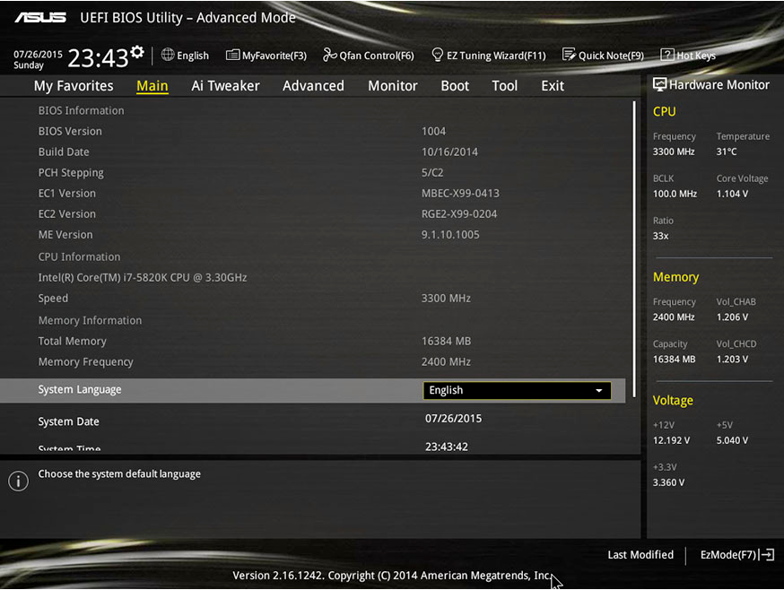
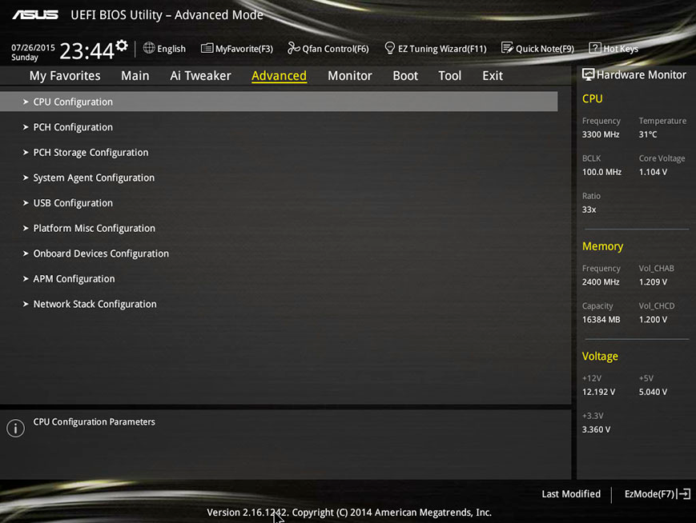
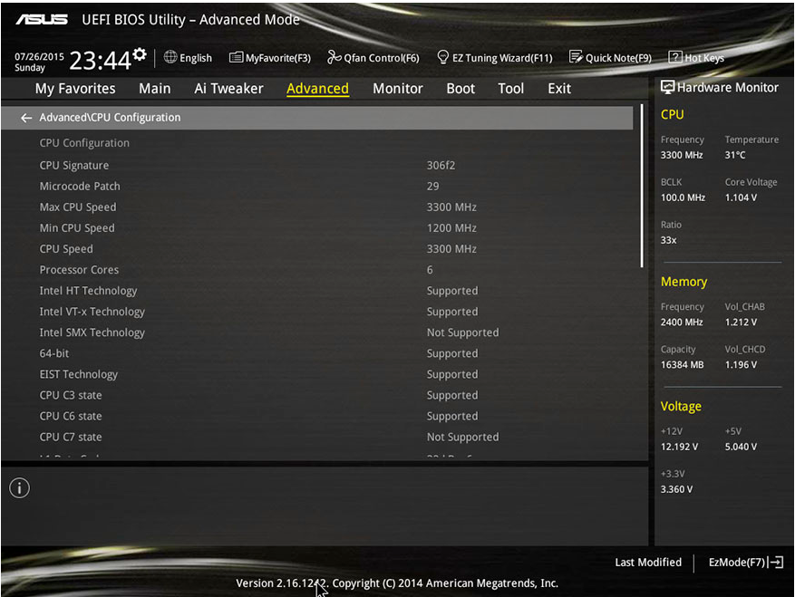
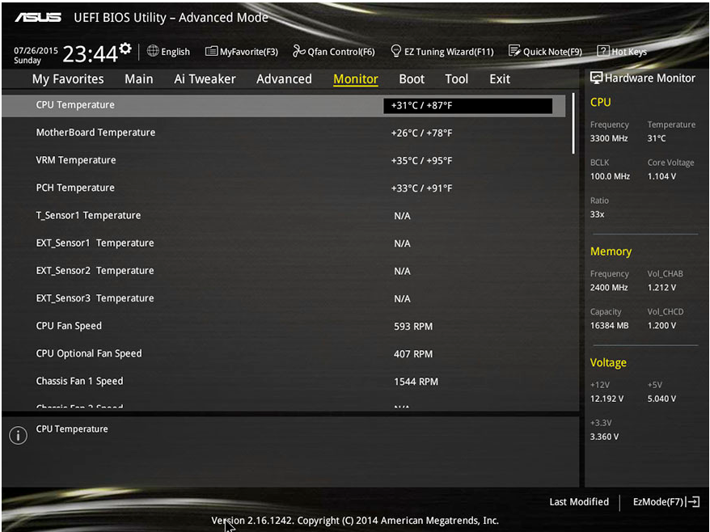
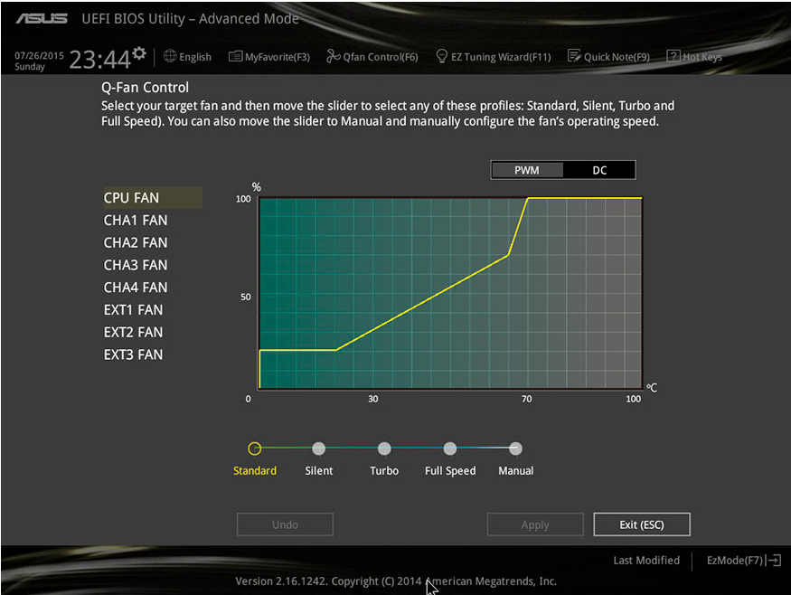
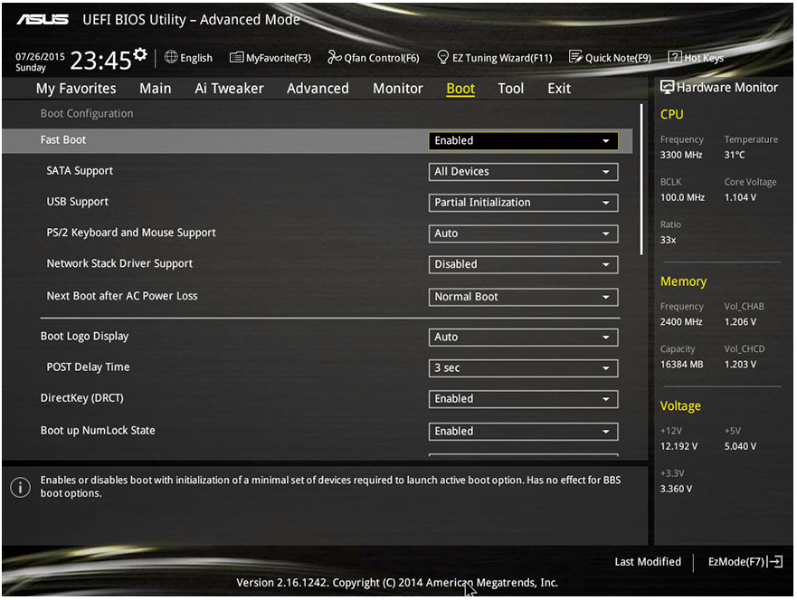
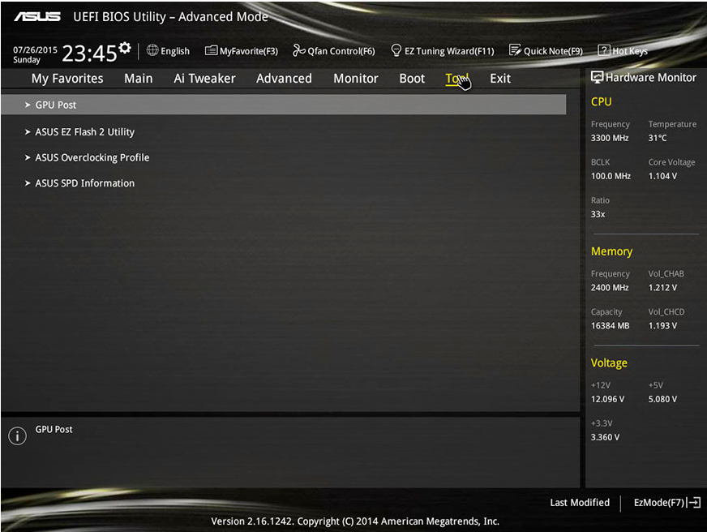
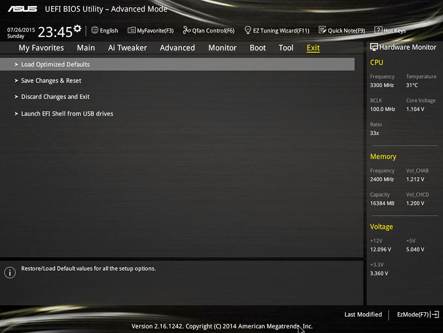

****
UEFI
****

**UEFI** (Unified Extensible Firmware Interface) es una interfaz de firmware estándar para PCs, diseñada para reemplazar el BIOS (sistema básico de entrada y salida). Es un estándar creado por más de 140 compañías tecnológicas que forman parte del consorcio UEFI. Se ha diseñado para mejorar la interoperabilidad del software y solucionar las limitaciones del BIOS. Algunas de las ventajas que ofrece el firmware UEFI son:

* Compatibilidad y emulación del BIOS para los sistemas operativos solo compatibles con esta última.
* Soporte completo para la Tabla de particiones GUID (GPT), se pueden crear hasta 128 particiones por disco
* El MBR solo permite hasta 32 bits por cada sector de la unidad de almacenamiento, lo cual acaba limitando el tamaño máximo de estas unidades a los 2 TB. Sin embargo, el GPT permite un máximo de 64 bit por sector, lo que se traduce en que es capaz de ser empleado con unidades de 9,4 ZB
* Capacidad de arranque desde unidades de almacenamiento grandes, dado que no sufren de las limitaciones del MBR.
* Independiente de la arquitectura y controladores de la CPU.
* Entorno amigable y flexible Pre-Sistema Operativo, incluyendo capacidades de red.
* Mejora la seguridad con su funcionalidad Secure Boot (UEFI). Se trata de un arranque seguro que empezó a utilizar Windows 8 con bastante polémica, y que evita el inicio de sistemas operativos que no estén autenticados para protegerte de los bootkits. No obstante se puede deshabilitar.
* UEFI y legacy son dos formas diferentes de arranque, UEFI es el nuevo BIOS, y el legacy es el BIOS tradicional. El sistema que instale en modo UEFI solo puede arrancar en modo UEFI. Del mismo modo, si instala el sistema en modo Legacy, solo puede ingresar al sistema en este modo

.. image:: imagenes/UEFI/uefi1.png

Mediante la utilidad EZ Tuning Wizard lograremos optimizar nuestro sistema de una manera sencilla hasta el extremo. Tan solo habremos de responder las preguntas que se nos van haciendo para que la BIOS optimice el rendimiento del sistema. Detecta el consumo, pregunta sobre el tipo de refrigeración utilizada y el uso final del equipo para finalmente sugerir un nivel de overclocking que se puede aplicar de forma automática.

**"Advanced Mode"**, que es módulo que sustituye al EZ Mode, es este modo podremos configurar todos los parámetros  de forma manual

**"AI Tweaker"** seremos capaces de personalizar y poner a punto multitud de parámetros, entre los que encontramos la frecuencia de la memoria, el ratio del microprocesador, tremendamente util en las versiones "K" en los que el ratio está desbloqueado, las tensiones, DIGI+ Power y la administración de la energía. Los menus son muy profundos ofreciendo múltiples opciones.

.. image:: imagenes/UEFI/uefi3.png

En la pestaña ***"Advanced"** se da al usuario la posibilidad de configurar parámetros hasta un punto que satisfará hasta al más enfermo de los entusiastas.

Echamos un vistazo al apartado de configuración del microprocesador:

El apartado "Monitor" se ve las temperaturas y parámetros de nuestros ventiladores. 

Entrando en la sección "QFan control" podremos configurar los ventiladores a nuestrro antojo, distinguiéndolos entre DC y PWM, y definiendo el perfil (Standar, silent, turbo o velocidad máxima)

En la siguiente pantalla tendremos acceso a todo lo ralativo con el arranque del equipo:

Bajo la pestaña "Tool" podremos actalizar la BIOS de la placa, establecer perfiles OC y obtener información sobre SPD.

