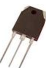
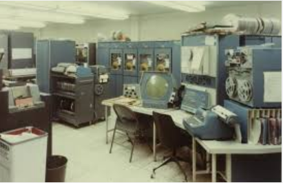
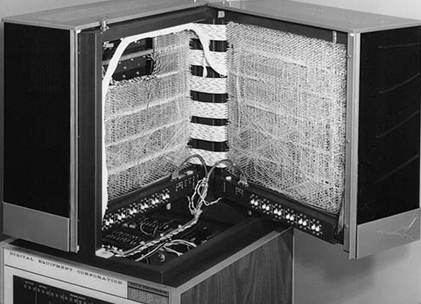

******************
Segunda generación
******************

Segunda generación (1958 - 1964): Transistores
====================

   
Esta generación se caracteriza por la aparición de los transistores que permitieron la construcción de ordenadores más pequeños y potentes. La programación se realizaba en lenguaje ensamblador y en FORTRAN sobre tarjetas perforadas. Otro aspecto importante de esta  generación es el procesamiento por lotes, en el cual mientras el sistema operativo está ejecutando un proceso, éste último dispone de todos  los recursos hasta su finalización. La preparación de los trabajos se realiza a través de un lenguaje de control de trabajos conocido como JCL. El sistema operativo residía en memoria y tenía un programa de control que interpretaba las tarjetas de control, escritas JCL. Dependiendo del contenido de la tarjeta de control el sistema operativo realizaba una acción determinada. Este programa de  control es un antecedente de los modernos intérpretes de órdenes.

Procesamiento Fuera de línea (Offline) Como mejora del procesamiento por lotes surgió el procesamiento fuera de línea (off-line), en el cual las operaciones de carga de datos y salida de resultados de un  proceso podían realizarse de forma externa y sin afectar al tiempo que el procesador dedicaba a los procesos. A esto ayudó la aparición de las cintas magnéticas y las impresoras de líneas. Ejemplos  de sistemas operativos de la época son FMS (Fortran Monitor System) y IBSYS.

1957 Atlas Guidance Computer (Burroughs)̧
============================

Control del lanzamiento del misil Atlas

.. image:: 2gen/Atlas.png
   :width: 350
   
1960 DEC PDP - 1 (Digital Equipment Corporation)̧
====================

Primer ordenador comercial con monitor y teclado

1961 IBM 7030, Stretcḩ 
=================

30x más rápido que el IBM 704

.. image:: 2gen/IBM.png
   :width: 350
   
1964 CDC 6600 (Control Data Corporation)̧
=================

Primer supercomputador comercial

.. image:: 2gen/CDC.png
   :width: 350
   
1965 DEC PDP - 8 
=================

(Digital Equipment Corporation)̧ Primera minicomputadora

.. image:: 2gen/DEC.jpg
   :width: 350

