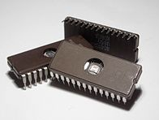
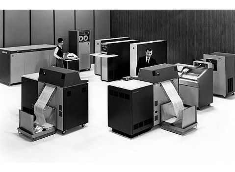
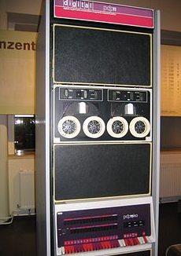
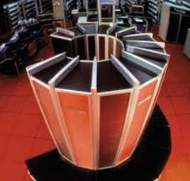
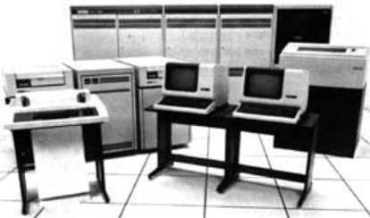

******************
Tercera generación
******************
 
Tercera generación (1965 - 1970): Circuitos integrados
=================================================

La aparición de los circuitos integrados (CI) supuso una mejora consiguiendo un menor tamaño y relación precio/rendimiento respecto de las máquinas de generaciones anteriores. En relación con los  sistemas operativos, la característica principal de esta generación fue el desarrollo de la multiprogramación y los sistemas compartidos. En los sistemas multiprogramados se cargan varios programas en  memoria simultáneamente y se alterna su ejecución. Esto maximiza la utilización del procesador. Como evolución de aparecen los sistemas de tiempo compartido donde el tiempo del procesador se  comparte entre programas de varios usuarios pudiendo ser programas interactivos. Algunos de los sistemas operativos de esta generación son OS/360, CTSS, MULTICS y UNIX

1965 Burroughs B2500 y B3500
===================

Primeros ordenadores con circuitos integrados

   
1964 System/360 1972 DEC PDP-11/45
=================

IBM anuncia su línea de ordenadores 

   
1976 Cray
=======
Primer supercomputador vectorial

.. image:: 3gen/Cray1.png
   :width: 350
   

1978 DEC VAX - 11/780
==========

