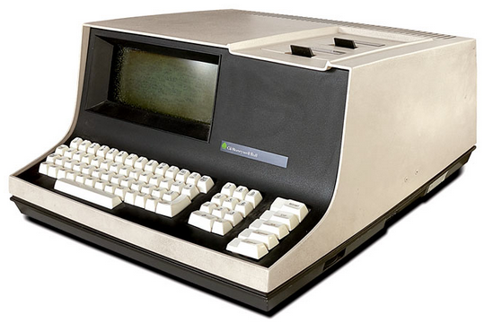
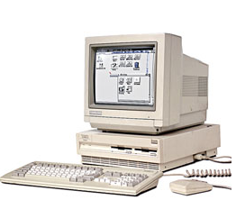
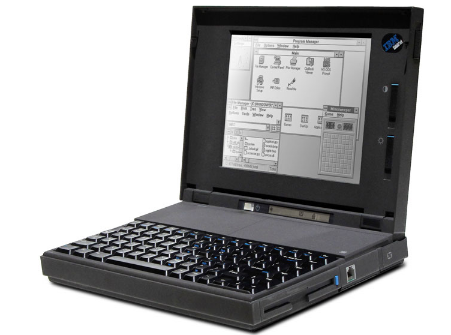

*****************
Cuarta generación
*****************

Cuarta generación (1971 - ...): Microprocesadores
==================

En esta generación se producen grandes avances en la industria hardware como la creación de los circuitos LSI (integrados a gran escala). También aparecen los ordenadores personales, entre finales de  a anterior generación y principios de la presente. Ejemplos de sistemas operativos de los primeros ordenadores personales son MS-DOS, desarrollado por Microsoft, Inc., para el IBM PC y MacOS de  pple Computer, Inc. Steve Jobs, cofundador de Apple, apostó por la primera interfaz gráfica basada en ventanas, iconos, menús y ratón a partir de una investigación realizada por Xerox. Siguiendo esta  ilosofía aparecería MS Windows. Durante los 90 apareció Linux a partir del núcleo desarrollado por Linus Torvalds. Los sistemas operativos evolucionan hacia sistemas interactivos con una interfaz cada  ez más amigable al usuario. Los  sistemas Windows han ido evolucionando, con diferentes versiones tanto para escritorio como para servidor (Windows 3.x, 98, 2000, XP, Vista, 7, Windows
Server 2003, 2008, etc), al igual que lo han hecho Linux (con multitud de distribuciones, Ubuntu, Debian, RedHat, Mandrake, etc) y los sistemas Mac
(Mac OS 8, OS 9, OS X, Mac OS X 10.6 "Snow Leopard", entre otros).
Un avance importante fue el desarrollo de redes de ordenadores a mediados de los años 80 que ejecutan sistemas operativos en red y sistemas operativos distribuidos. En un sistema operativo en red los usuarios tienen conocimiento de la existencia de múltiples ordenadores y pueden acceder a máquinas remotas y copiar archivos de un ordenador a otro. En un sistema distribuido los usuarios no saben donde se están ejecutando sus programas o dónde están ubicados sus programas, ya que los recursos de procesamiento, memoria y datos están distribuidos entre los ordenadores de la red, pero todo esto es transparente al usuario.
Actualmente, existen sistemas operativos integrados, para una gran diversidad de dispositivos electrónicos, tales como, teléfonos móviles, PDAs (Personal Digital Assistant, Asistente Digital Personal u ordenador de bolsillo), otros dispositivos de comunicaciones e informática y electrodomésticos. Ejemplos de este tipo de sistemas operativos son PalmOS, WindowsCE, Android OS, etc. Haremos una referencia especial al último, Android OS, se trata de un sistema operativo basado en Linux. Fue diseñado en un principio para dispositivos móviles, tales como teléfonos inteligentes y tablets, pero  actualmente se encuentra en desarrollo para su aplicación también en netbooks y PCs.

Primer microprocesador de 4 bits
============

.. image:: 4gen/micro4bit.png
   :width: 200
   
.. image:: 4gen/micro4bit2.png
   :width: 200

Intel 4004 (1971), 108kHz, unos 4004 transistores

Microprocesadores de 8 bits
================

   
Intel 8008 (1972), Intel 8080 (1974) e Intel 8085 (1976)

Datapoint 2200 , 1970, 4K-16K RAM
--------------

   
1972 HP-9830A
--------------

CPU:Custom 4-boards @ 8MHz, RAM:4KB or 8KB ,

.. image:: 4gen/HP-9830A.png
   :width: 400

1975 MITS Altair 8800 
-----------------

CPU:Intel 8080, 2.0 MHz; RAM:256 bytes, 64K max

.. image:: 4gen/Altair.png
   :width: 400

1976 PolyMorphic Systems Poly-88
---------------

Intel 8080A @ 1.84MHz, RAM 512B-16K

.. image:: 4gen/PolyMorphic.png
   :width: 400

1976 Compucolor 8001
--------------

.. image:: 4gen/Compucolor.png
   :width: 400

Intel 8080 @ 2MHz; 4K - 32K RAM
------------------

Microprocesadores de 16 bits 
==================

.. image:: 4gen/micro16.png
   :width: 200

Intel 8086 (1978), 4.77 MHz
----------------------

1979Findex
----------

CPU: Zilog Z80 @ 2.5MHz ; Memory:    48K dynamic RAM

.. image:: 4gen/Findex.png
   :width: 400

1979 Radio Shack TRS-80 Model II
--------------

CPU: Zilog Z-80A, 4 MHz RAM:32K, 64K

.. image:: 4gen/RadioShack.png
   :width: 400

1981 Xerox 820
--------------

CPU: Zilog Z80-A @ 2.5MHz ; Memory: 64K RAM

.. image:: 4gen/Xerox.png
   :width: 400

1983 Gavilan SC CPU
-------------------

Intel 8088 @ 5 MHz ;: RAM: 32K built-in

.. image:: 4gen/Gavilan.png
   :width: 400

1984 Apple Macintos 1h
------------

CPU:Motorola 68000, 7.83 Mhz ; RAM: 128K, later 512K

.. image:: 4gen/Apple.png
   :width: 400

1984 Data General One
---------------

CPU:Intel 80C88 @ 4MHz ; RAM:128K - 512K

1985 Atari 520ST
----------------

CPU:Motorola 68000 @ 8MHz ; RAM:512K

1985 Zenith Z-171 PC
----------

CPU:80C88 @ 4.77MHz ; RAM:256K - 640K

.. image:: 4gen/Zenith.png
   :width: 400

1987 Zenith eazy PC
-------------

CPU:NEC V40 @ 7.14MHz ; RAM: 512K, 640K max.

.. image:: 4gen/ZenithEazy.png
   :width: 400

1990 Commodore Amiga 3000
-------------

CPU: Motorola 68030 @ 16 or 25MHz ; RAM: 2MB - 18MB default

1992 Commodore Amiga 4000
------------

CPU: Motorola 68040 @ 25MHz; RAM:    2MB - 18MB onboard

.. image:: 4gen/CommodoreAmiga4.png
   :width: 400

1992 IBM ThinkPad
----------

CPU:Intel 80386 SL @ 25MHz ;Memory:4-16MB RAM

1995
====

2000
====

.. image:: 4gen/2000.png
   :width: 400

