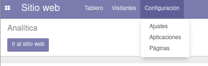
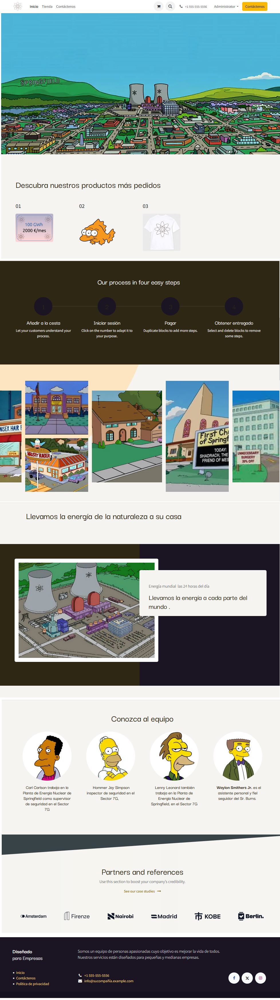
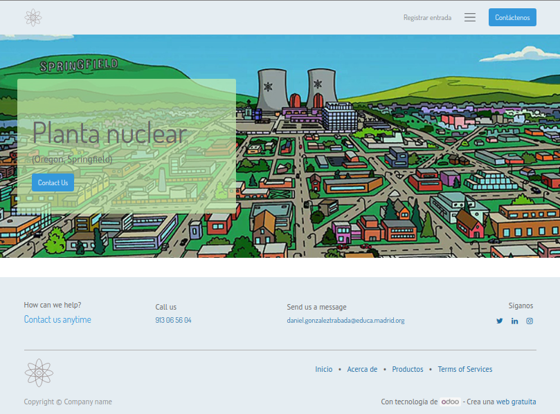
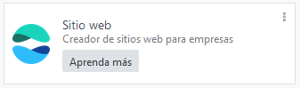

*********
Sitio Web
*********

Instala la aplicación de sitio web y configura la página web de tu empresa

Utiliza los logos vectorizados que creaste en el ejercicio anterior, Sitio web/configuración/Ajustes, etc ...

Configura la web y sube al curso un pantallazo como el siguiente:

