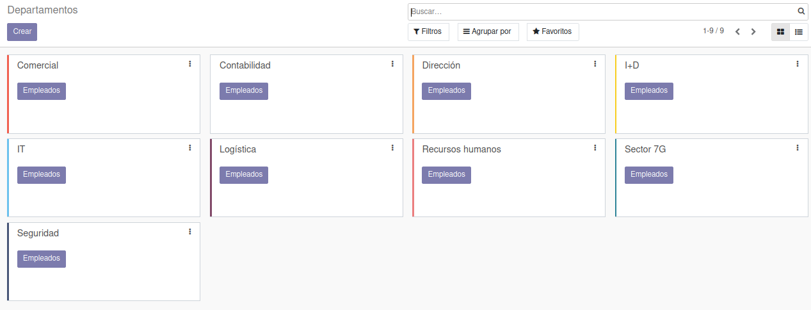
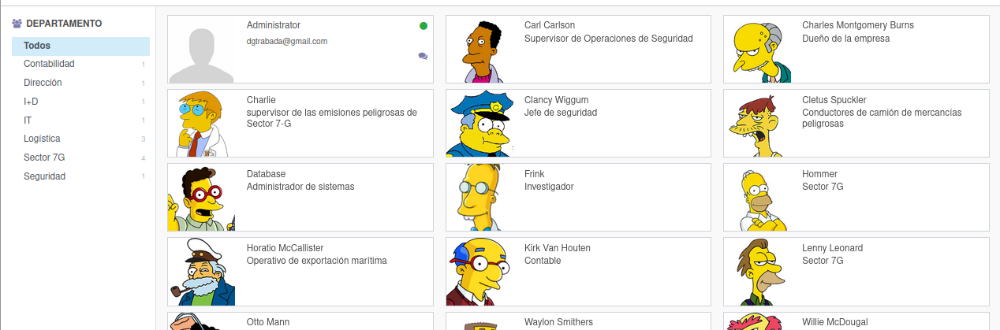
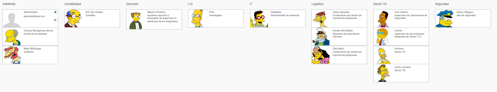
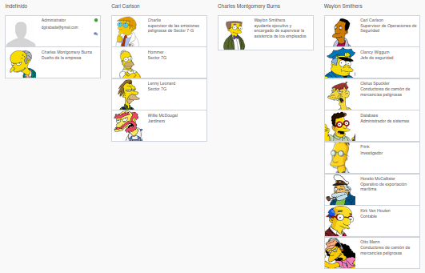

*********
Empleados
*********

Instalar la aplicación de empleados

Crea al menos 6 departamentos diferentes, sube un pantallazo en le que aparezcan:

Crea al menos 10 empleados, le asignamos al menos a 8 un departamento y a todos un gerente, excepto al dueño de la empresa.

Agruparlos por departamentos y sube un pantallazo como el siguiente:

Agruparlos por gerente y sube un pantallazo como el siguiente:

