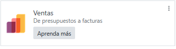
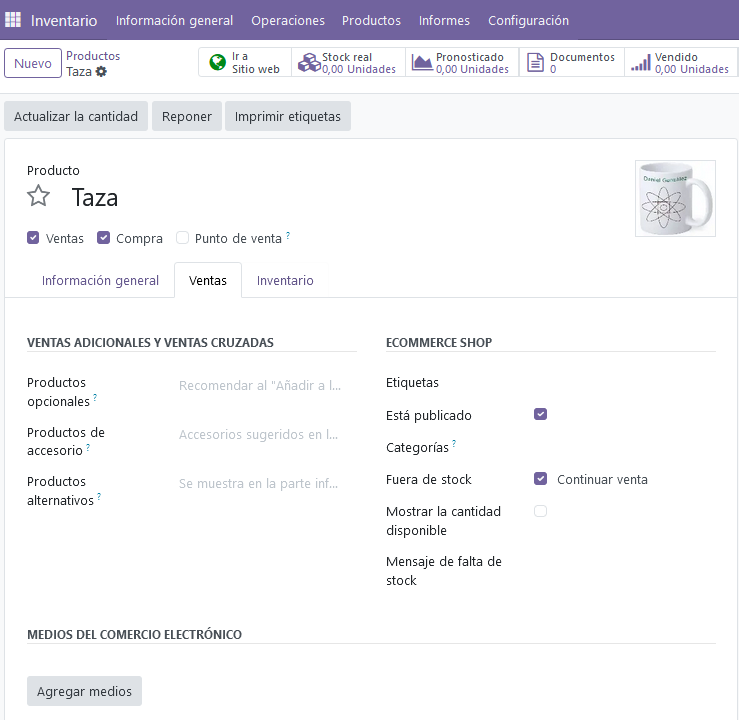
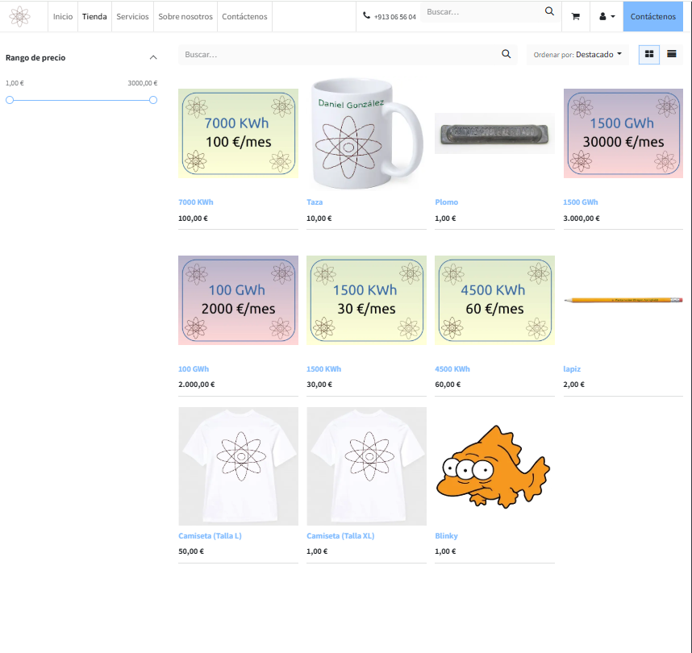

******
Ventas
******

* Ventas / Pedidos / Clientes
* Crea un cliente.
* Clientes / Escuela Primaria de Springfield /  Presupuestos y pedidos
* Le hacemos un presupuesto:

Confirma el pedido y valídalo, genera la factura y súbela al curso:

Acabamos de dar de alta a un cliente, pero lo que queremos hacer ahora es que los clientes se puedan dar de alta y compren nuestros productos o servicios desde la web para ello:

App / Vamos al sitio web e instalamos

Tenemos que publicar los productos que queramos Sitio web, para ello en Inventario / Producto, seleccionamos el producto que queremos y en ventas seleccionamos (Está publicado)

publicamos los productos que queramos

Abre otro navegador y vamos a registrar entrada en la web

Ponemos que no tenemos cuenta y generamos un nuevo cliente, compramos uno o varios productos, firmamos el presupuesto y desde la web confirmamos que esta pagado para hacer la factura

Sube al curso la factura creada:

.. image:: imagenes/08_Ventas91.png

Cambia CASA por solo su nombre manda el pedido a facturar, para eso modifica los datos del cliente y ponle una foto

.. image:: imagenes/08_Ventas92.png

por ultimo registra el pago

.. image:: imagenes/08_Ventas93.png

.. image:: imagenes/08_Ventas94.png

Personaliza las facturas y sube una en pdf

.. image:: imagenes/08_Ventas95.png

Para que los clientes puedan crearse cuentas, habilitar:

Ajustes/Ventas/Precio/Cuenta de cliente/[x]Registro gatris

