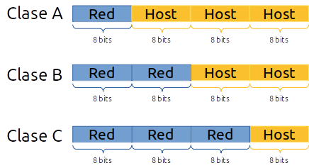

*******************
Direccionamiento IP
*******************

El direccionamiento IP es la parte encargada de asignar de forma correcta a cada equipo una dirección IP, de forma que los equipos puedan comunicarse correctamente entre sí

Las direcciones IPV4 se expresan mediante un número binario de 32 bits permitiendo un espacio de direcciones de hasta 4.294.967.296 (2\ :sup:`32`\ ) direcciones posibles.

Se reservaron ciertos rangos de direcciones IP de las clases A, B y C para permitir su uso interno o privado en redes de área local (LAN) como por ejemplo las de una casa o una oficina.

Dirección de red (Network) es la primera dirección de una subred y se usa para identificarla. No se puede asignar a un host,La dirección de red se obtiene estableciendo todos los bits de la parte de host en 0, veamos el ejemplo con la siguiente IP de tipo B 128.192.244.240:

.. code-block::

  Address:   128.192.224.240      10000000.11000000. 11100000.11110000
  Netmask:   255.255.0.0 = 16     11111111.11111111. 00000000.00000000
  Network:   128.192.0.0/16       10000000.11000000. 00000000.00000000
  HostMin:   128.192.0.1          10000000.11000000. 00000000.00000001
  HostMax:   128.192.255.254      10000000.11000000. 11111111.11111110

La dirección de **broadcast** es la última dirección de una red IP y se usa para enviar mensajes a todos los dispositivos dentro de esa red.

.. code-block::

    Broadcast: 128.192.255.255      10000000.11000000. 11111111.11111111
    Hosts/Net: 65534                 Class B

Las redes privadas son bastante comunes en esquemas de redes de área local (LAN) de oficinas, empresas y ámbito doméstico, debido a que no tienen la necesidad de usar direcciones IP públicas en sus dispositivos y no son enrutables a través de Internet.

Las direcciones de Internet privadas son:

.. image:: imagenes/ip_privadas.png

Esta última red de clase B, pertenece a las direcciones APIPA (Automatic Private IP Addressing), también llamadas link-local en IPv4, queda reservada para equipos que tienen activa la configuración de la tarjeta de red automática (para que un servidor DHCP les responda y les ofrezca su configuración) y ningún servidor DHCP les responda (habitualmente este servidor está configurado en el enrutador), en ese caso estos equipos cogen aleatoriamente una ip de este rango de IP privadas para poder comunicarse con otros equipos de la red a los que tampoco les haya respondido el servidor DHCP.

El subnetting IP
================

La subnetting (o subdivisión de redes) es una técnica utilizada para dividir una red de direcciones IP en subredes más pequeñas y eficientes. En otras palabras, se trata de dividir una red IP en varias subredes más pequeñas, para que los dispositivos puedan comunicarse de manera más eficiente.

Por tanto si tengo por ejemplo la dirección de host **172.17**.12.95 ya sabemos que es de **clase B** con mascara **255.255.0.0** y que pertenece a la red 172.17.0.0 sin necesidad de especificar máscara ninguna. Y esto es así porque el 172 inicial de la dirección pertenece a la clase B.

Ahora bien ¿Y si queremos disponer de redes más pequeñas que pertenezcan al espacio de direccionamiento 172.17.x.x?

Nada impide hacer lo siguiente:

- **172.17.1**.0 con mascara 255.255.255.0
- **172.17.2**.0 con mascara 255.255.255.0
- **172.17.3**.0 con mascara 255.255.255.0
- ...

Pero claro la red 172.17.1.0 255.255.255.0 no es en realidad una red de clase C, sino que con la máscara hemos definido una subred (subnet) de tipo C dentro de la red 172.17.0.0 que es una red tipo B y mucho más amplia.

Así pues este subnetting permite tener redes más pequeñas dentro de una red estándar mayor.
A nivel de routing todas esas subredes de tipo C quedan englobadas en una sola ruta de tipo B y el router de la red sólo necesita una ruta para el encaminamiento de estas subredes.

Además del subnetting, este juego con los bits de máscara permite hacer lo contrario que el subnetting y se llamó sumarizacion de redes IP.

CIDR
====

Hoy en día, **CIDR (Classless Inter-Domain Routing)** es el estándar utilizado en redes IP para la asignación y gestión de direcciones, reemplazando en gran medida el sistema antiguo de clases A, B y C, en esencia, aplica lo mismo que el subnetting pero ampliando el concepto. En CIDR no existen clases A, B o C. El valor de la dirección IP no implica ninguna máscara implícita, como sucedía antes con los primeros bits de la dirección. **En CIDR toda definición de una red IP debe ser acompañada de una definición de máscara que concreta la red.** 

Por ejemplo, cuando hablamos en términos de CIDR no podemos decir que la dirección 172.17.25.12 pertenezca a la red 172.17.0.0 a menos que se especifique como 172.16.25.12/16.

En CIDR ya no hay clases como tal, sino redes definidas por el prefijo que acompaña a la dirección de red, utiliza la nomenclatura de barra invertida, del tipo /xx (donde xx representa los bits puestos a 1 de la máscara en binario) y está basada en lo que se denominó variable-length subnet masking (VLSM).

Así por ejemplo, hablando en términos de subnetting, podemos decir que la red:
172.17.11.25 con máscara 255.255.255.0 (que no es en realidad una red de clase C) es una subred (o subnet) de la red de clase B 172.17.0.0.

La dirección de red sigue siendo la que tiene todos los bits del host a 0, y la de broadcast a 1, se utiliza una máscara de red, realizando la operación AND con la dirección IP para encontrar la dirección de red, por ejemplo:

La dirección IP es 192.168.20.100/26

.. code-block::

  Address:   192.168.20.100       11000000.10101000.00010100.01 100100
  Netmask:   255.255.255.192 = 26 11111111.11111111.11111111.11 000000
                       AND     ---------------------------------------
  Network:   192.168.20.64/26     11000000.10101000.00010100.01 000000
  
  HostMin:   192.168.20.65        11000000.10101000.00010100.01 000001
  HostMax:   192.168.20.126       11000000.10101000.00010100.01 111110
  Broadcast: 192.168.20.127       11000000.10101000.00010100.01 111111
  Hosts/Net: 62                    Class C, Private Internet

Cuando divides una red en subredes más pequeñas, la **primera subred** (la que comienza con la dirección de red original) y la **última subred** (la que termina con la dirección de broadcast de la red original) a menudo se reservan. Esto se debe a que algunos equipos antiguos o protocolos podrían confundirse al manejar estas subredes, ya que sus direcciones coinciden con la red original y su broadcast.

Ejemplos
--------

* **¿ Qué máscara habría que aplicar para dividir la red 194.168.100.0 en 16 subredes ?**

  La red 194.168.100.0 es una red de Clase C por defecto, lo que significa que su máscara de subred predeterminada es: 255.255.255.0 (o /24 en notación CIDR).

  :math:`2^{n} \geq 16`, es decir :math:`n \geq 4`

  tomamos los 4 primeros bits

  **1111** 0000 = **128 + 64 + 32 + 16** + 0*8 + 4*0 + 2*0 + 1*0 = 240

  es decir 194.168.100.0/28 (255.255.255.240)

  hay :math:`2^{4}-2 = 14` hosts por subred

  .. image:: imagenes/subred1.png

**VLSM (Máscara de Red de Longitud Variable)** permite dividir un espacio de red en partes desiguales, es decir, la mascara de subred de una dirección IP  variara según la cantidad de bits que se tomen prestados para una subred especifica, se conoce también como división de subredes en subredes. Veamos el siguiente ejemplo:

* **Una empresa compra una red con direcciones IP públicas de clase C 200.1.1.0. Las quiere repartir entre sus 8 departamentos. En el caso de que haga un subnetting sin VLSM, quedaría** :math:`2^{n} = 8`, **es decir,** :math:`n = 3` **(11100000).**

  .. image:: imagenes/subred2.png

  Podemos hacer de nuevo subnetting con la primera subred, 200.1.1.0/27 para crear 4 subredes (/29)

  .. image:: imagenes/subred3.png

* **Volvamos al caso anterior, 194.168.100.0 (Ejemplo de subneting clásico)** y hagamos n=2, es decir 194.168.100.0/26 (255.255.255.192)

  Hay :math:`2^{6}-2 = 60` hosts por subred

  .. image:: imagenes/subred4.png

  Vamos hacer sugneting con las 3 ultimas redes, tomaremos n=1,2,3

  .. image:: imagenes/subred5.png

  .. image:: imagenes/subneting.png

**Ejemplo de direccionamiento VLSM para 192.168.0.0/24**

Vamos a optimizar el espacio de direcciones utilizando VLSM para cumplir con los siguientes requisitos:

* 1 subred para 30 hosts (VLAN 1)
* 1 subred para 10 hosts (VLAN 2)
* 3 subredes para 2 hosts cada una (enlaces entre routers)

1. Empezamos asignar la subred más grande **(30 hosts)**.

   Para 30 hosts necesitamos: :math:`2^{n} - 2 \geq 30` es decir n = 5 

   * Máscara: /27 (255.255.255.224)
   * Subred asignada: **192.168.0.0/27**
   * Rango útil: 192.168.0.1 - 192.168.0.30  (:math:`2^{5} - 2 = 30` hosts por red)
   * Broadcast: 192.168.0.31

#. Asignamos la subred **(10 hosts)**.

   Para 10 hosts necesitamos: :math:`2^{n} - 2 \geq 10` es decir n = 4 

   * Máscara: /28 (255.255.255.240)
   * Subred asignada: **192.168.0.32/28**
   * Rango útil: 192.168.0.33 - 192.168.0.46  (:math:`2^{4} - 2 = 14` hosts por red)
   * Broadcast: 192.168.0.47

#. Asignamos las tres subredes **(2 hosts)**.

   Para 2 hosts necesitamos: :math:`2^{n} - 2 \geq 2` es decir n = 2 

   * Máscara: /30 (255.255.255.252)
   * Subredes asignadas: (:math:`2^{2} - 2 = 2` hosts por red)

     1. **192.168.0.48/30**

        * Rango útil: 192.168.0.49 - 192.168.0.50
        * Broadcast: 192.168.0.51

     1. **192.168.0.52/30**

        * Rango útil: 192.168.0.53 - 192.168.0.54
        * Broadcast: 192.168.0.55

     1. **192.168.0.56/30**

        * Rango útil: 192.168.0.57 - 192.168.0.58
        * Broadcast: 192.168.0.59

Tablas de Encaminamiento
=========================

Los routers mantienen una tabla de encaminamiento en la que registran las rutas hacia nodos y redes alcanzables. Estas rutas pueden ser **estáticas** (definidas manualmente por el administrador de red) o **dinámicas** (aprendidas automáticamente por el router).

- Cada nodo decide a qué nodo (dirección de red) enviará un paquete, basándose en pares de dirección IP de destino y la dirección del siguiente salto.

- Para direccionar un único equipo (no una red completa), se utiliza la máscara **255.255.255.255** o **/32**.

- Para establecer una ruta por defecto (hacia dónde enviar los paquetes si no se encuentra el destino), se utiliza la dirección **0.0.0.0/0**.

- Si la red es directamente alcanzable, la dirección del siguiente salto es una interfaz del router, que se indica como **0.0.0.0**.

- La **dirección de red** se obtiene realizando una operación lógica **AND** entre la **dirección IP** y la **máscara de subred**:  
  `Dirección_de_red = Dirección_IP AND Máscara`.

- Si dos direcciones IP pertenecen a la misma red, entonces **IP1 XOR IP2 = 0**. Esto indica que ambos hosts están en la misma red.

- La **dirección de broadcast** se obtiene con la operación **OR** entre la dirección de red y el complemento de la máscara:  
  `Dirección_de_Broadcast = Dirección_de_red OR NOT Máscara`.  **Esta es siempre la última dirección de una red o subred**.

- El router necesita tener una dirección IP en cada subred a la que esté conectado. Solo enrutará si el destino está en una subred diferente. Si no puede encontrar un siguiente salto, enviará un mensaje ICMP indicando que el destino es inalcanzable.

Ejemplo de Tabla de Enrutamiento
================================

Una tabla de enrutamiento básica contiene las siguientes columnas:

- **Destino**: La dirección IP de la red de destino.
- **Máscara de subred**: La máscara de subred que define el rango de direcciones dentro de la red de destino.
- **Gateway/Nodo siguiente**: La dirección IP del siguiente router o gateway al que se debe enviar el paquete.
- **Interfaz**: La interfaz de red a través de la cual se enviará el paquete.

+-------------------+----------------------+-----------------------------+--------------+
| **Destino**       | **Máscara de subred**| **Gateway/Nodo siguiente**  | **Interfaz** |
+===================+======================+=============================+==============+
| 192.168.1.0       | 255.255.255.0        | 192.168.1.1                 | eth0         |
+-------------------+----------------------+-----------------------------+--------------+
| 192.168.2.0       | 255.255.255.0        | 192.168.1.2                 | eth1         |
+-------------------+----------------------+-----------------------------+--------------+
| 0.0.0.0           | 0.0.0.0              | 192.168.1.24                | eth0         |
+-------------------+----------------------+-----------------------------+--------------+

Rutas de ejemplo:

- La primera entrada indica que para llegar a la red **192.168.1.0/24**, el paquete se enviará al siguiente salto en **192.168.1.1** a través de la interfaz **eth0**.
- La segunda entrada es para la red **192.168.2.0/24**, que se enviará a través de la interfaz **eth1** al siguiente salto en **192.168.1.2**.
- La tercera entrada es una **ruta por defecto** (`0.0.0.0/0`), indicando que cualquier tráfico que no coincida con una de las rutas anteriores se enviará a través del gateway **192.168.1.24**. Si 192.168.1.24 está conectado a Internet, cualquier dispositivo que use esta tabla de enrutamiento podrá navegar en la web.

Además de estas rutas estáticas, las rutas dinámicas pueden ser aprendidas automáticamente mediante protocolos como **OSPF**, **RIP** o **BGP**.
