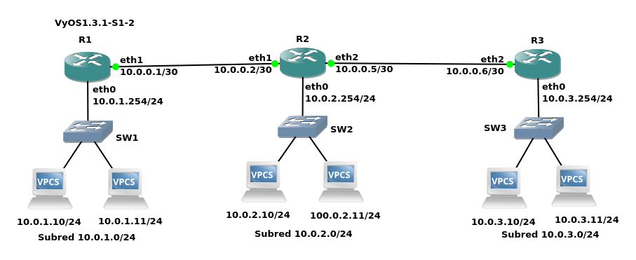

***************
Casos prácticos
***************

Caso práctico: Router Cisco 
===========================

Para instalar el router Cisco 7200 en GNS3 seguiremos los siguientes pasos:

1. Descarga la imagen para el router **Cisco c7200-adventerprisek9-mz.153-3.XB12.image** 
#. Añadelo a GNS3 ( New template / Install an appliance from the GNS3 server (recommended)
#. En **Routers** selecciona **Cisco 7200**
#. Install the appliance on your local computer 
#. Cuando estes en (Required files) presiona Import y busca los archivos que te has descargado.

Realiza la siguiente red, necesitaras añadir otro slots en el router (PA-FE-TX)

.. image:: imagenes/cisco7200_01.png

Configura los pcs virtuales (VPC)

.. code-block:: bash

  set pcname 192.168.1.10/24
  ip 192.168.1.10/24 192.168.1.1

  set pcname 192.168.1.11/24
  ip 192.168.1.11/24 192.168.1.1

  set pcname 192.168.2.10/24
  ip 192.168.2.10/24 192.168.2.1

Fíjate que los Pcs virtuales (VPC) no pueden verse los que estan en subredes diferentes

Vamos a configuración las interfaces de red del router, pondremos a FastEthernet0/0 la ip 192.168.1.1 y FastEthernet0/1 para la ip 192.168.2.1

.. code-block:: bash

  enable
  configure terminal
   interface FastEthernet0/0
   ip address 192.168.1.1 255.255.255.0
  no shutdown
  exit
  interface FastEthernet1/0
   ip address 192.168.2.1 255.255.255.0
   no shutdown
  exit

Puedes comprobar que las interfaces de red estan configruadas correctamente con el comando ``show ip interface brief``. Fijate que cuando configuras las interfaces del router Cisco 7200, el enrutamiento básico se configura automáticamente

.. image:: imagenes/cisco7200_03.png

Para ver las tablas de enrutamiento ejecutamos el comando ``show ip route``

.. image:: imagenes/cisco7200_04.png

Caso práctico: Router Cisco (DHCP)
==================================

Vamos a crear un servidor dhcp para la red 10.0.0.0/26

.. image:: imagenes/cisco_dhcp.png

.. code-block:: bash

  enable
  configure terminal
   service dhcp
   ip dhcp pool tu_nombre
   network 10.0.0.0 255.255.255.192
   default-router 10.0.0.1
   dns-server 8.8.8.8
   lease 2
    ip dhcp excluded-address 10.0.0.1 10.0.0.9
    interface FastEthernet0/0
    ip address 10.0.0.1 255.255.255.192
    no shutdown
   exit
  end
  write memory

La opción ``lease 2``, establece un período de arrendamiento de 2 días para las direcciones IP asignadas.

.. code-block:: bash

  show ip dhcp pool  # Muestra los pools creados
  show ip dhcp binding # Lista las asignaciones de IP
  debug ip dhcp server # Depuración en tiempo real

Podemos ver lo que ocurre con Wireshark, para ello seleccionamos el cable que une el router con el switch, pulsamos el botón derecho del ratón:

Vemos la captura de paquetes:

1. Tenemos **DHCP Discover** (Descubrimiento), frame 406. El cliente envía un paquete DHCP Discover (broadcast) para localizar servidores DHCP.

   * Transaction ID: 0x950b2e53 (identificador único de la transacción).
   * Origen: 0.0.0.0 (cliente sin IP).
   * Destino: 255.255.255.255 (broadcast).

#. **DHCP Offer** (Oferta), frame 342. El servidor DHCP responde con un DHCP Offer, ofreciendo una IP (10.0.0.11 en este caso).

   * Transaction ID: 0x950b2e53 (misma que el Discover).
   * Origen: IP del servidor DHCP (10.0.0.1).

#. **DHCP Request** (Solicitud), frame 406 (segundo). El cliente acepta la oferta y envía un DHCP Request (broadcast).

   * Confirma que quiere la IP 10.0.0.11.

#. **DHCP ACK** (Confirmación), frame 342 (segundo). El servidor confirma con un DHCP ACK, asignando oficialmente la IP 10.0.0.11 al cliente.

#. **ARP Gratuito** (Gratuitous ARP), frames posteriores. El cliente envía Gratuitous ARP (broadcast) para verificar que la IP 10.0.0.11 no esté en uso con el objetivo de evitar conflictos de IP en la red

Diagrama de flujo DHCP
----------------------

1. Cliente (0.0.0.0) --[DHCP Discover]--> Broadcast (255.255.255.255)
#. Servidor (10.0.0.1) --[DHCP Offer]--> Cliente
#. Cliente --[DHCP Request]--> Broadcast
#. Servidor --[DHCP ACK]--> Cliente (IP asignada: 10.0.0.11)
#. Cliente --[Gratuitous ARP]--> Broadcast (verifica IP)

Caso práctico: telnet & ssh
===========================

Unimos dos routers y habilitamos la consexión telnet y ssh, cambia ``domain-name tunombre`` y la contraseña ``alumno``  por ``tu nombre``

.. tabs::

    .. tab:: telnet & ssh

        .. image:: imagenes/R2WS.png

    .. tab:: R1

        .. code-block:: bash
         :emphasize-lines: 4,10

          enable
          configure terminal
          hostname R1
          ip domain-name tunombre 
          interface FastEthernet0/0
           ip address 10.0.0.1 255.255.255.0
           no shutdown
          crypto key generate rsa general-keys modulus 2048 
          ip ssh version 2 
          username admin privilege 15 secret alumno
          line vty 0 4
           transport input telnet ssh
           login local
          end
          write memory

    .. tab:: R2

        .. code-block:: bash
         :emphasize-lines: 4,10

          enable
          configure terminal
          hostname R2
          ip domain-name tunombre 
          interface FastEthernet0/0
           ip address 10.0.0.2 255.255.255.0
           no shutdown
          crypto key generate rsa general-keys modulus 2048 
          ip ssh version 2 
          username admin privilege 15 secret alumno
          line vty 0 4
           transport input telnet ssh
           login local
          end
          write memory

Analizamos con Wireshark la conexión entre los dos routers, podemos hacer un ping entre el router R1 y el R2 y filtrar los paquetes por ARP:

Como podemos ver esta captura muestra el tráfico ARP (Address Resolution Protocol) entre dos routers (R1 y R2) en GNS3. ARP se utiliza para resolver direcciones IP a direcciones MAC 

Lo siguiente que haremos es capturar los paquetes mientras que ejecutamos desde R1 ``telnet 10.0.0.2``

Para ver la contraseña tenemos que reconstruir la sesión, es decir sigue el flujo TCP completo haz clic derecho sobre cualquier paquete Telnet (ej. No. 47) y selecciona: Follow → TCP Stream (o "Seguir → Flujo TCP").

.. image:: imagenes/R2WS_telnet.png

En el caso de que hagamos lo mismo y ejecutamos desde R1 ``ssh -l admin 10.0.0.2`` obtendriamos:

.. image:: imagenes/R2WS_ssh.png

Lo que veríamos son los algoritmos negociados en Key Exchange Init (paquete 105): Negociación de claves (ej: Diffie-Hellman) y New Keys (paquete 125): Confirmación de cifrado.
En SSH, no es posible capturar el hash de la contraseña directamente desde el tráfico de red. El protocolo SSH cifra toda la comunicación (incluyendo credenciales) usando algoritmos como Diffie-Hellman y AES, en este caso podemos ver Diffie-Hellman Group Exchange (paquetes 111 y 121): Intercambio de parámetros para generar claves temporales.

Caso práctico: Router Cisco (Cloud)
===================================

En GNS3, el Cloud sirve para conectar tu laboratorio virtual con el mundo exterior, es decir, con tu computadora anfitriona (host) y, a través de ella, con Internet o redes físicas reales.

.. image:: imagenes/cisco_cloud.png

Configura el router con la ip **10.4.X.Y**, siendo X e Y los valores de tu ip. En el caso de tener un portatil tendrás que usar un dhcp y el gateway 192.168.3.1

.. code-block:: bash
  :emphasize-lines: 10

  enable
  configure terminal
  access-list 100 permit ip 20.0.0.0 0.0.0.255 any
  ip nat inside source list 100 interface FastEthernet1/0 overload
  interface FastEthernet0/0
   ip address 20.0.0.1 255.255.255.0
   no shutdown
   ip nat inside
  interface FastEthernet1/0
   ip address 10.4.104.100 255.0.0.0
   no shutdown
   ip nat outside
  ip route 0.0.0.0 0.0.0.0 10.0.0.2
  end
  write memory

Caso práctico: Router Cisco (Enrutamiento estático)
===================================================

.. image:: imagenes/cisco3R.png

**R1**

.. code-block:: bash

  enable
  configure terminal
  interface FastEthernet0/0
   ip address 192.168.1.1 255.255.255.0
   no shutdown
  interface FastEthernet1/0
   ip address 192.168.2.1 255.255.255.252
   no shutdown
  ip route 172.16.0.0 255.255.255.0 192.168.2.2 
  ip route 20.0.0.0 255.255.255.0 192.168.2.2
  ip route 192.168.4.0 255.255.252.0 192.168.1.1
  ip route 0.0.0.0 0.0.0.0 192.168.2.2
  end
  write memory

**R2**

.. code-block:: bash

  enable
  configure terminal
  interface FastEthernet0/0
   ip address 172.16.0.1 255.255.255.0
   no shutdown
  interface FastEthernet1/0
   ip address 192.168.2.2 255.255.255.252
   no shutdown
  interface FastEthernet2/0
   ip address 192.168.3.1 255.255.255.252
   no shutdown
  ip route 192.168.1.0 255.255.255.0 192.168.2.1
  ip route 20.0.0.0 255.255.255.0 192.168.3.2
  ip route 172.16.0.0 255.255.255.0 172.16.0.1
  ip route 0.0.0.0 0.0.0.0 192.168.3.2
  end
  write memory

**R3**

Configura el router con la ip **10.4.X.Y**, siendo X e Y los valores de tu ip

.. code-block:: bash
  :emphasize-lines: 16

  enable
  configure terminal
  access-list 100 permit ip 20.0.0.0 0.0.0.255 any
  access-list 100 permit ip 172.16.0.0 0.0.0.255 any
  access-list 100 permit ip 192.168.1.0 0.0.0.255 any 
   ip nat inside source list 100 interface FastEthernet2/0 overload
  interface FastEthernet0/0
   ip address 20.0.0.1 255.255.255.0
   no shutdown
   ip nat inside
  interface FastEthernet1/0
   ip address 192.168.3.2 255.255.255.252
   no shutdown
   ip nat inside
  interface FastEthernet2/0
   ip address 10.4.104.100 255.0.0.0
   no shutdown
   ip nat outside
  ip route 192.168.1.0 255.255.255.0 192.168.3.1
  ip route 172.16.0.0 255.255.255.0 192.168.3.1
  ip route 192.168.2.0 255.255.255.252 192.168.3.1
  ip route 0.0.0.0 0.0.0.0 10.0.0.2
  end
  write memory

Caso práctico: Router Cisco (Enrutamiento dinamico)
===================================================

vamos a configurar los anteriores routers con **OSPF** (Open Shortest Path First) es un protocolo de enrutamiento dinámico utilizado en redes IP para determinar las mejores rutas hacia destinos dentro de una red. 

Configura el router con la ip **10.4.X.Y**, siendo X e Y los valores de tu ip

**R1**

.. code-block:: bash

  enable
  configure terminal
  interface FastEthernet0/0
   ip address 192.168.1.1 255.255.255.0
   no shutdown
  interface FastEthernet1/0
   ip address 192.168.2.1 255.255.255.252
   no shutdown
  router ospf 1
   network 192.168.1.0 0.0.0.255 area 0
   network 192.168.2.0 0.0.0.3 area 0
 
  redistribute static subnets
  redistribute connected subnets
  default-information originate
  end
  write memory

**R2**

.. code-block:: bash

  enable
  configure terminal
  interface FastEthernet0/0
   ip address 172.16.0.1 255.255.255.0
   no shutdown
  interface FastEthernet1/0
   ip address 192.168.2.2 255.255.255.252
   no shutdown
  interface FastEthernet2/0
   ip address 192.168.3.1 255.255.255.252
   no shutdown
  router ospf 1
   network 172.16.0.0 0.0.0.255 area 0 
   network 192.168.2.0 0.0.0.3 area 0
   network 192.168.3.0 0.0.0.3 area 0
  default-information originate
  end
  write memory

**R3**

.. code-block:: bash
  :emphasize-lines: 16

  enable
  configure terminal
  access-list 100 permit ip 20.0.0.0 0.0.0.255 any
  access-list 100 permit ip 172.16.0.0 0.0.0.255 any
  access-list 100 permit ip 192.168.1.0 0.0.0.255 any
   ip nat inside source list 100 interface FastEthernet2/0 overload
  interface FastEthernet0/0
   ip address 20.0.0.1 255.255.255.0
   no shutdown
   ip nat inside  ! Zona interna (NAT)
  interface FastEthernet1/0
   ip address 192.168.3.2 255.255.255.252
   no shutdown
   ip nat inside  ! Zona interna (NAT)
  interface FastEthernet2/0
   ip address 10.4.104.100 255.0.0.0
   no shutdown
   ip nat outside ! Zona externa (Internet/salida NAT)
  router ospf 1
   network 20.0.0.0 0.0.0.255 area 0 
   network 192.168.3.0 0.0.0.3 area 0
   passive-interface FastEthernet0/0
   default-information originate 
  ip route 0.0.0.0 0.0.0.0 10.0.0.2
  end
  write memory

Podemos diagnosticar el funcionamiento con los siguientes comandos:

.. code-block:: bash

  show ip ospf neighbor                  # Lista de routers vecinos OSPF y su estado.
  show ip route ospf                     # La base de datos de enlaces (LSDB) con todos los LSA (Link-State Advertisements).
  show ip ospf interface FastEthernet1/0 # Rutas en la tabla de enrutamiento aprendidas por OSPF 
  show ip ospf database summary          #Muestra información general

Caso práctico: Router Cisco (7R)
================================

vamos a configurar los siguientes routers con **OSPF**:

.. tabs::

    .. tab:: Router Cisco (7R)

        .. image:: imagenes/Cisco7R.png

        .. image:: imagenes/Cisco7R_ping.png

    .. tab:: Configuración de routers

        **R1**

        .. code-block:: bash
 
          enable
          configure terminal
          interface FastEthernet1/0
           ip address 10.0.1.1 255.255.255.0
           no shutdown
          interface FastEthernet0/0
           ip address 10.0.2.2 255.255.255.0
           no shutdown
          router ospf 1
           network 10.0.1.0 0.0.0.255 area 0
           network 10.0.2.0 0.0.0.255 area 0
          redistribute static subnets
          redistribute connected subnets
          default-information originate
          end
          write memory

        **R2**

        .. code-block:: bash
 
          enable
          configure terminal
          interface FastEthernet0/0
           ip address 10.0.2.1 255.255.255.0
           no shutdown
          interface FastEthernet1/0
           ip address 10.0.4.1 255.255.255.0
           no shutdown
          interface FastEthernet2/0
           ip address 10.0.3.1 255.255.255.0
           no shutdown
          router ospf 1
           network 10.0.2.0 0.0.0.255 area 0
           network 10.0.4.0 0.0.0.255 area 0
           network 10.0.3.0 0.0.0.255 area 0
          redistribute static subnets
          redistribute connected subnets
          default-information originate
          end
          write memory

        **R3**

        .. code-block:: bash
 
          enable
          configure terminal
          interface FastEthernet0/0
           ip address 10.0.5.1 255.255.255.0
           no shutdown
          interface FastEthernet1/0
           ip address 10.0.4.2 255.255.255.0
           no shutdown
          interface FastEthernet2/0
           ip address 10.0.7.1 255.255.255.0
           no shutdown
          router ospf 1
           network 10.0.5.0 0.0.0.255 area 0
           network 10.0.4.0 0.0.0.255 area 0
           network 10.0.7.0 0.0.0.255 area 0
          redistribute static subnets
          redistribute connected subnets
          default-information originate
          end
          write memory

        **R4**

        .. code-block:: bash
 
          enable
          configure terminal
          interface FastEthernet0/0
           ip address 10.0.5.2 255.255.255.0
           no shutdown
          interface FastEthernet1/0
           ip address 10.0.6.1 255.255.255.0
           no shutdown
          interface FastEthernet2/0
           ip address 10.0.3.2 255.255.255.0
           no shutdown
          interface FastEthernet3/0
           ip address 10.0.9.1 255.255.255.0
           no shutdown
          router ospf 1
           network 10.0.5.0 0.0.0.255 area 0
           network 10.0.6.0 0.0.0.255 area 0
           network 10.0.9.0 0.0.0.255 area 0
           network 10.0.3.0 0.0.0.255 area 0
          redistribute static subnets
          redistribute connected subnets
          default-information originate
          end
          write memory

        **R5**

        .. code-block:: bash
 
          enable
          configure terminal
          interface FastEthernet0/0
           ip address 10.0.8.1 255.255.255.0
           no shutdown
          interface FastEthernet1/0
           ip address 10.0.6.2 255.255.255.0
           no shutdown
          interface FastEthernet2/0
           ip address 10.0.7.2 255.255.255.0
           no shutdown
          router ospf 1
           network 10.0.8.0 0.0.0.255 area 0
           network 10.0.6.0 0.0.0.255 area 0
           network 10.0.7.0 0.0.0.255 area 0
          redistribute static subnets
          redistribute connected subnets
          default-information originate
          end
          write memory

        **R6**

        .. code-block:: bash
 
          enable
          configure terminal
          interface FastEthernet0/0
           ip address 10.0.8.2 255.255.255.0
           no shutdown
          interface FastEthernet1/0
           ip address 10.0.11.1 255.255.255.0
           no shutdown
          interface FastEthernet2/0
           ip address 10.0.10.1 255.255.255.0
           no shutdown
          router ospf 1
           network 10.0.8.0 0.0.0.255 area 0
           network 10.0.11.0 0.0.0.255 area 0
           network 10.0.10.0 0.0.0.255 area 0
          redistribute static subnets
          redistribute connected subnets
          default-information originate
          end
          write memory

        **R7**

        .. code-block:: bash
 
          enable
          configure terminal
          interface FastEthernet0/0
           ip address 10.0.9.2 255.255.255.0
           no shutdown
          interface FastEthernet1/0
           ip address 10.0.10.2 255.255.255.0
           no shutdown
          router ospf 1
           network 10.0.9.0 0.0.0.255 area 0
           network 10.0.10.0 0.0.0.255 area 0
          redistribute static subnets
          redistribute connected subnets
          default-information originate
          end
          write memory

        **VPCS1**

        .. code-block:: bash
 
          set pcname 10.0.1.10/24
          ip 10.0.1.10/24 10.0.1.1

        **VPCS2**

        .. code-block:: bash
 
          set pcname 10.0.11.10/24
          ip 10.0.11.10/24 10.0.11.1

Caso práctico: Ubuntu (Docker)
==============================

Crea la siguiente red:

.. tabs::

    .. tab:: Router Cisco (7R)

        .. image:: imagenes/ubuntu_1.png

    .. tab:: Configuración de ubuntu

        .. code-block:: bash
 
           auto eth0
           iface eth0 inet static
	           address 10.4.104.100
	           netmask 255.0.0.0
	           gateway 10.0.0.2
	           up echo nameserver 8.8.8.8 > /etc/resolv.conf

           auto eth1
           iface eth1 inet static
	           address 20.0.1.1
	           netmask 255.255.255.0

           auto eth2
           iface eth2 inet static
	           address 20.0.2.1
	           netmask 255.255.255.0

Para Habilitar IP forwarding en ubuntu:

.. code-block:: bash

   echo 1 > /proc/sys/net/ipv4/ip_forward
   # Para que sea permanente añade o modifica esta línea en /etc/sysctl.conf:
   net.ipv4.ip_forward = 1
   #recarga:
   sysctl -p

Caso práctico: Router MikroTik
==============================

ikroTik utiliza RouterOS, un sistema operativo basado en Linux diseñado específicamente para la gestión de redes, podemos bajarnos `mikrotik-chr.gnsa y la chr-7.16.img <https://gns3.com/marketplace/appliances/mikrotik-cloud-hosted-router>`_ 

Para añadirlo a GNS3 New template / Import an appliance file (.gn3a extension) 

Vamos a utilizar tres ordenadores con la siguiente configuración:

.. image:: imagenes/MikroTik02.png

La forma más rápida de confiruar los 3 clientes es utilizando el botón de la derecha del ráton y pulsando Edit config, copiamos en cada caso la confiruación correspondiente:

.. code-block:: bash

  set pcname 10.0.1.10/24
  ip 10.0.1.10/24 10.0.1.1

  set pcname 10.0.1.11/24
  ip 10.0.1.11/24 10.0.1.1

  set pcname 10.0.2.10/24
  ip 10.0.2.10/24 10.0.2.1

Haz un pantallazo como el siguiente donde se vea que la 10.0.1.10 no llega a la 10.0.2.10

Asigna las IPs a las Interfaces de MikroTik

.. code-block:: bash

  /ip address add address=10.0.1.1/24 interface=ether1
  /ip address add address=10.0.2.1/24 interface=ether2

Puedes comprobar que todo esta bien con el comando ``/ip address print``

Por defecto, MikroTik ya enruta paquetes entre interfaces con direcciones IP directamente conectadas.
Para verificar que las rutas existen, utiliza:

.. code-block:: bash

  /ip route print
  
  #    DST-ADDRESS     GATEWAY    DISTANCE
  0    10.0.1.0/24     ether1     0
  1    10.0.2.0/24     ether2     0

Comprueba que ahora si llega y sube un pantallazo del ping y de las tablas de enrutamiento.

Caso práctico: Vyos
===================

Fíjate en la siguiente figura en la que se muestran 6 ordenadores unidos por 3 switch y 3 routers

Como podemos ver en la figura tenemos tres segmentos de red /24 y dos segmentos de red que unen los router en /30.

Para este caso práctico vamos a utilizar **GNS3** que es un software de emulación de red de código abierto que permite a los usuarios simular topologías de red complejas y experimentar con diferentes configuraciones de red y **VyOS**, que es un sistema operativo de red de código abierto basado en el proyecto Vyatta. Está diseñado para ser utilizado como un enrutador de red, firewall, VPN y plataforma de virtualización de red.

Para instalar un Router pulsaremos a (New

La forma más rápida de confiruar los 6 clientes es utilizando el botón de la derecha del ráton y pulsando Edit config, copiamos en cada caso la confiruación correspondiente:

.. code-block:: bash
  
 set pcname 10.0.1.10/24
 ip 10.0.1.10 10.0.1.254 24
 
 set pcname 10.0.1.11/24
 ip 10.0.1.11 10.0.1.254 24
 
 set pcname 10.0.2.10/24
 ip 10.0.2.10 10.0.2.254 24

 set pcname 10.0.2.11/24
 ip 10.0.2.11 10.0.2.254 24

 set pcname 10.0.3.10/24
 ip 10.0.3.10 10.0.3.254 24

 set pcname 10.0.3.11/24
 ip 10.0.3.11 10.0.3.254 24

Abre una terminal y comprueba que los clientes solo pueden hacer ping con nodos que esten en su misma subred, para que puedan verse todos entre sí pasamos a configurar los routers, para ello empezamos con **R2**, abrimos la teminal y vemos que no esta configuradas las interfaces de red

.. code-block:: bash
   
 vyos@vyos:~$ show interfaces
 Codes: S - State, L - Link, u - Up, D - Down, A - Admin Down
 Interface        IP Address                        S/L  Description
 ---------        ----------                        ---  -----------
 eth0             -                                 u/u  
 eth1             -                                 u/u  
 eth2             -                                 u/u  
 lo               127.0.0.1/8                       u/u  
                 ::1/128       
                 
Para configurarlas, abrimos una terminal:

.. code-block:: bash

 vyos@vyos:~$ configure
 WARNING: You are currently configuring a live-ISO environment,....
 [edit]
 vyos@vyos# set interfaces ethernet eth1 address 10.0.0.2/30
 [edit]
 vyos@vyos# set interfaces ethernet eth0 address 10.0.2.254/24
 [edit]
 vyos@vyos# set interfaces ethernet eth1 address 10.0.0.5/30
 
Tampoco estan configuradas las tablas de encaminamiento

.. code-block:: bash

 vyos@vyos:~$ netstat -r
 Kernel IP routing table
 Destination     Gateway         Genmask         Flags   MSS Window  irtt Iface
 
  
Añadimos las siguientes rutas estaticas: 

.. code-block:: bash

 vyos@vyos# set protocols static route 10.0.1.0/24 next-hop 10.0.0.1
 [edit]
 vyos@vyos# set protocols static route 10.0.3.0/24 next-hop 10.0.0.6
 [edit]

Para que los cambios tengan efectos los subimos y salvamos:

.. code-block:: bash

 vyos@vyos# commit
 [edit]
 vyos@vyos# save
 Saving configuration to '/config/config.boot'...
 Done
 [edit]

Comprobamos la tabla de encaminamiento de **R2**

.. code-block:: bash

 vyos@vyos# netstat -r
 Kernel IP routing table
 Destination     Gateway         Genmask         Flags   MSS Window  irtt Iface
 10.0.0.0        0.0.0.0         255.255.255.252 U         0 0          0 eth1
 10.0.0.4        0.0.0.0         255.255.255.252 U         0 0          0 eth1
 10.0.1.0        10.0.0.1        255.255.255.0   UG        0 0          0 eth1
 10.0.2.0        0.0.0.0         255.255.255.0   U         0 0          0 eth0
 10.0.3.0        10.0.0.6        255.255.255.0   UG        0 0          0 eth1
 [edit]
 
y las interfaces de red como

.. code-block:: bash

 vyos@vyos# show interfaces
  ethernet eth0 {
      address 10.0.2.254/24
      hw-id 0c:51:f2:fd:00:00
  }
  ethernet eth1 {
      address 10.0.0.2/30
      address 10.0.0.5/30
      hw-id 0c:51:f2:fd:00:01
  }
  ethernet eth2 {
      hw-id 0c:51:f2:fd:00:02
  }
  loopback lo {
  }
 [edit]
 
 
Para el caso **R1**, ponemos un resumen de los comandos utilizados

.. code-block:: bash

 show interfaces
 configure
 set interfaces ethernet eth0 address 10.0.1.254/24
 set interfaces ethernet eth1 address 10.0.0.1/30
 set protocols static route 10.0.2.0/24 next-hop 10.0.0.2
 set protocols static route 10.0.3.0/24 next-hop 10.0.0.2
 commit
 save

Comprobamos la tabla de encaminamiento de **R1**

.. code-block:: bash

 vyos@vyos# netstat -r
 Kernel IP routing table
 Destination     Gateway         Genmask         Flags   MSS Window  irtt Iface
 10.0.0.0        0.0.0.0         255.255.255.252 U         0 0          0 eth1
 10.0.1.0        0.0.0.0         255.255.255.0   U         0 0          0 eth0
 10.0.2.0        10.0.0.2        255.255.255.0   UG        0 0          0 eth1
 10.0.3.0        10.0.0.2        255.255.255.0   UG        0 0          0 eth1
 [edit]

y las interfaces de red como

.. code-block:: bash

 vyos@vyos# show interfaces
  ethernet eth0 {
      address 10.0.1.254/24
      hw-id 0c:36:d7:ab:00:00
  }
  ethernet eth1 {
      address 10.0.0.1/30
      hw-id 0c:36:d7:ab:00:01
  }
  ethernet eth2 {
      hw-id 0c:36:d7:ab:00:02
  }
  loopback lo {
  }
 [edit]

Para el caso de **R3**

.. code-block:: bash

 show interfaces
 configure
 set interfaces ethernet eth0 address 10.0.3.254/24
 set interfaces ethernet eth2 address 10.0.0.6/30
 set protocols static route 10.0.1.0/24 next-hop 10.0.0.5
 set protocols static route 10.0.2.0/24 next-hop 10.0.0.5
 commit
 save

Comprobamos la tabla de encaminamiento de **R3**

.. code-block:: bash

 vyos@vyos# netstat -r
 Kernel IP routing table
 Destination     Gateway         Genmask         Flags   MSS Window  irtt Iface
 10.0.0.4        0.0.0.0         255.255.255.252 U         0 0          0 eth2
 10.0.1.0        10.0.0.5        255.255.255.0   UG        0 0          0 eth2
 10.0.2.0        10.0.0.5        255.255.255.0   UG        0 0          0 eth2
 10.0.3.0        0.0.0.0         255.255.255.0   U         0 0          0 eth0
 [edit]
 
y las interfaces de red como

.. code-block:: bash

 vyos@vyos# show interfaces 
  ethernet eth0 {
      address 10.0.3.254/24
      hw-id 0c:73:d2:39:00:00
  }
  ethernet eth1 {
      hw-id 0c:73:d2:39:00:01
  }
  ethernet eth2 {
      address 10.0.0.6/30
      hw-id 0c:73:d2:39:00:02
  }
  loopback lo {
  }
 [edit]

Ejecuta los siguientes comandos ``ping 10.0.3.10`` y ``trace 10.0.2.10`` en la 10.0.1.10, sube un pantallazo
