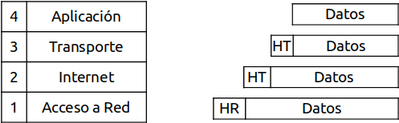
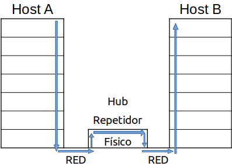
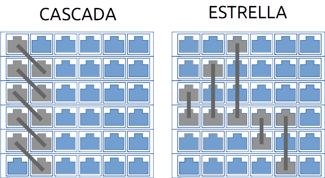

**********************************************
Transporte de datos y equipos de interconexión
**********************************************

La arquitectura TCP/IP transfiere los datos mediante su embalaje en paquetes. Cada capa va añadiendo bits de control al bloque que le llega antes de pasarlo a la capa siguiente. En la recepción el proceso es el contrario.

Para realizar la interconexión de redes, necesitamos diferentes elementos dependiendo de la longitud, número de nodos, situación etc...

Repetidores (nivel físico)
==========================

La señal de la red se va atenuando debido a la resistencia del cable, los repetidores regeneran la señal en ambas direcciones sin hacer ningún tipo de filtrado (nivel físico)

Concentradores o hub  (nivel físico)
====================================

.. image:: imagenes/hubico.png
  
El concentrador funciona repitiendo cada paquete en cada uno de los puertos con los que cuenta, excepto en el que ha recibido el paquete. Pueden ser pasivos o activos, es decir además regenera la señal. Para conectar un Hub-Hub lo hacemos con cable cruzado.

Bridge (puente)(nivel 2 enlace "tramas")
========================================

Su principal función es adaptar una red a otra (redes con diferentes topologías y diferentes protocolos). Distingue entre trafico local y no local, reduciendo así el tráfico de la red 

Switch (conmutador) (nivel 2)  
=============================

.. image:: imagenes/switchico.png
    
Es un Hub inteligente analiza las MAC de los equipos conectados, de esa forma solo manda los mensajes a un solo equipo disminuyendo considerablemente el tráfico de la red

.. image:: imagenes/schitch.png
  
.. image:: imagenes/hub_switch.png
    :width: 300

El router (encaminador) (nivel 3 Red)
=====================================

Se ocupan del encaminamiento de los paquetes entre sus distintos puertos, para ello utilizamos tablas de enrutamiento, interpretan las direcciones lógicas de la capa 3 en vez de la MAC, son capaces de cambiar el formato de las tramas y proporcionan seguridad y reducir la congestión de la red.

.. image:: imagenes/router.png

Pasarela o Gateway (nivel 4 de transporte)
==========================================

Una pasarela, puerta de acceso o gateway es un dispositivo que permite interconectar redes que utilizan arquitecturas diferentes. Es decir, es una puerta de enlace con una red
    

