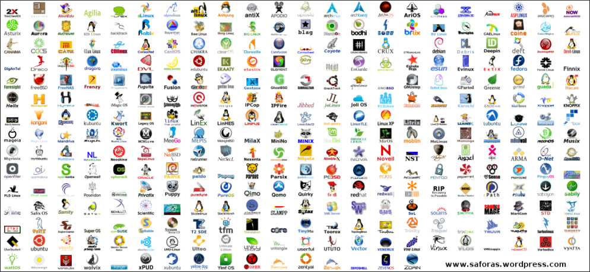

******************
Historia GNU/Linux
******************

GNU/Linux es la denominación técnica y generalizada que reciben los sistemas operativos están formados mediante la combinación de varios proyectos, entre los cuales destaca el entorno GNU llevado a cabo por la  Free Software Foundation, una fundación cuyo propósito es difundir el software libre, así como también el núcleo de sistema operativo conocido como «Linux», encabezado por el programador finlandés Linus Torvalds.

El desarrollo de estos sistemas operativos es uno de los ejemplos más prominentes de software libre: todo su código fuente puede ser utilizado, modificado y redistribuido libremente por cualquier persona, empresa o institución, bajo los términos de la Licencia Pública General de GNU, así como de otra serie de licencias.

A pesar de que en la jerga cotidiana la mayoría de las personas usan el vocablo «Linux» para referirse a este sistema operativo,​ en realidad ese es solo el nombre del kernel o núcleo, ya que el sistema completo está formado también por una gran cantidad de componentes del proyecto GNU, que van desde compiladores hasta entornos de escritorio.

Sin embargo, tras Tolvards publico su núcleo Linux en 1991 y ser este usado junto al software del proyecto GNU, una parte significativa de los medios generales y especializados han utilizado el término «Linux» para referirse a estos sistemas operativos completos.​ Cabe señalar que, existen derivados de sistemas operativos que usan el núcleo Linux, pero que no tienen componentes GNU, como por ejemplo el sistema operativo Android, así como distribuciones de software GNU donde el núcleo Linux está ausente, como por ejemplo el sistema operativo FreeBSD, que es un sistema operativo basado en Unix, que usa un micronúcleo de sistema operativo junto a algunas aplicaciones del proyecto GNU

Los sistemas operativos GNU/Linux, se encuentran normalmente en forma de compendios conocidos como distribuciones o distros, las cuales se les han añadido selecciones de aplicaciones y programas, con las cuales el sistema cuenta directamente al ser instalado, así como una amplia serie de programas que pueden descargarse desde un repositorio, que consiste en un almacén de software, para su posterior instalación. El propósito de estas distribuciones es ofrecer GNU/Linux como un producto final que el usuario pueda instalar en su computadora para que funcione como su sistema operativo principal, o también en un software de simulación virtual de computadora, cumpliendo con toda una serie de necesidades básicas para un grupo determinado de usuarios, o para el público general.

Algunas de estas distribuciones son especialmente conocidas por su uso en servidores de Internet, supercomputadoras, y sistemas embebidos.

Para ver de donde viene descárgate el siguiente `Timeline <https://upload.wikimedia.org/wikipedia/commons/1/1b/Linux_Distribution_Timeline.svg>`_

En la siguiente tabla puedes ver algunas de las distribuciones más utilizadas actualmente.

* Debian.
* Gentoo Linux
* OpenSuse
* Ubuntu
* Puppy Linux
* Linux Mint
* CentOS
* Kubuntu
* Fedora
* Slackware
* Sabayon
* SLAX
* PC LinuxOS
* FreeBSD

Filesystem Hierarchy Standard o FHS nació en 1994 y es actualmente mantenida por la Linux Foundation. La estructura de directorios aun siendo un estándar, hay casos de distribuciones GNU/Linux que directamente apuestan por él. Otras, por contra, si que hacen un esfuerzo en adaptarse en lo máximo posible a él, pero suelen desviarse en algunas áreas.

Entornos de Escritorio
======================

Linux ofrece muchas alternativas. Los entornos de escritorio más populares son:

* **GNOME** se ha traducido a 193 idiomas, con una cobertura mayor al 80% para 38 idiomas. GNOME está disponible en las principales distribuciones GNU/Linux, incluyendo Fedora, Debian, Ubuntu, Manjaro Linux, Red Hat Enterprise Linux, SUSE Linux Enterprise, CentOS, Oracle Linux, Arch Linux, Gentoo6​, SteamOS, entre otras. También, se encuentra disponible en Solaris, un importante sistema operativo UNIX y en Sistemas operativos Unix-like como FreeBSD
    
  .. image:: imagenes/gnome.png
    
* **KDE** es una comunidad internacional que desarrolla software libre. Produce un entorno de escritorio, multitud de aplicaciones e infraestructura de desarrollo para diversos sistemas operativos como GNU/Linux, Mac OS X, Windows, etc. Los principales componentes de software elaborados por KDE se agrupan bajo el nombre KDE Frameworks, KDE Plasma y KDE Applications. Las aplicaciones KDE están traducidas a aproximadamente 75 idiomas​ y están construidas con los principios de facilidad de uso y de accesibilidad moderna en mente. Las aplicaciones de KDE Applications funcionan de forma completamente nativa en GNU/Linux, BSD, Solaris, Windows y Mac OS X.

  .. image:: imagenes/kde.png

* **Xfce** (pronunciado como cuatro letras por separado)​ es un entorno de escritorio libre para sistemas tipo Unix como GNU/Linux, BSD, Solaris y derivados. Su objetivo es ser rápido y ligero, sin dejar de ser visualmente atractivo y fácil de usar. Consiste en varios componentes empaquetados por separado que en conjunto proporcionan la funcionalidad completa del entorno de escritorio, pero se pueden seleccionar por separado para que el usuario pueda adaptar el ambiente de trabajo a sus necesidades.

  .. image:: imagenes/xfce.png

* **MATE**, El lanzamiento de GNOME 3 remplazando la clásica metáfora de escritorio de versiones anteriores con una nueva interfaz construida sobre el Shell de GNOME, condujo a algunas críticas de la comunidad Linux. Muchos usuarios se negaron a aceptar la nueva interfaz de GNOME, pidiendo que alguien continuara el desarrollo de GNOME 2.3​

  .. image:: imagenes/mate.png
  
* **Cinnamon**. Es otra bifurcación de GNOME3
    
  .. image:: imagenes/cinnmaron.png
  

A continuación se muestra una pequeña evolución en los escritorios

1991 GNOME
==========

.. image:: imagenes/gnome_1991.png

1998 KDE1
==========

2000 KDE2
==========

2002 GNOME 2.0
==========

2004 GNOME 2.6
==========

.. image:: imagenes/gnome_2004.png

2007 GNOME 2.20
===============

2008 KDE 4.0
============

.. image:: imagenes/kde_2008.png

2014 KDE5
=========

.. image:: imagenes/kde_2014.png

2020 Gnome 3.36.3
=================

.. image:: imagenes/gnome_2020.png

2021 GNOME 4.0
==============

.. image:: imagenes/gnome_2021.png

xfce 4.4
========

