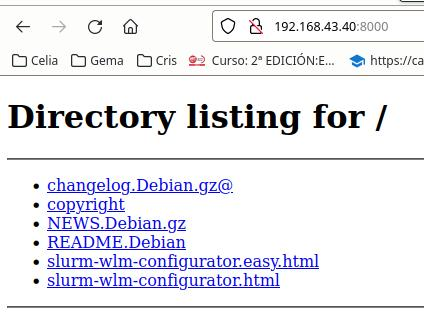

*****
Slurm
*****

**Slurm** (Simple Linux Utility for Resources Management), es un sistema de gestión de tareas y de clústeres (nodos o servidores de cómputo).

.. code-block:: bash

 srun    # Envía un trabajo para su ejecución
 scancel # Finaliza trabajos que se encuentren en ejecución o pendientes
 sinfo   # Muestra información sobre el estado de los nodos de cómputo
 squeue  # Informa sobre el estado de los trabajos en ejecución y pendientes
 sbatch  # Envía un script para su posterior ejecución

Caso práctico: Red interna con NIS, NFS, autofs y Slurm
************************************************

Servidor compute-0-0
********************

Lo instalaremos en el servidor compute-0-0, en el que exporta los usuarios por NIS y el home por NFS, como podemos ver también en el siguiente `vídeo <https://mediateca.educa.madrid.org/video/e84ii5ywht6gafmy>`_

.. code-block:: bash

 apt install slurm-wlm
 
**Munge** es un servicio de autenticación y validación de credenciales. Se utilizará con Slurm para validar sus procesos. comprueba que se haya instalado ejecutando

.. code-block:: bash

 munge -n | unmunge
 
Buscamos el archivo **slurm-wlm-configurator.html**, para ello ejecuta el comando 

.. code-block:: bash

 dpkg -L slurmctld
 
Vamos al directorio donde este instalado, en mi caso:
 
.. code-block:: bash

 cd /usr/share/doc/slurmctld/
    
 # levantamos el servidor http
 python3 -m http.server
    
Ponemos en el navegador la <IP servidor>:8000 y vamos a slurm-wlm-configurator.html

Cambiamos el nombre del servidor en **SlurmctldHost** por **compute-0-0**

Ponemos el nombre de un nodo en NodeName, por ejemplo  **compute-0-1**, fijate que este en /etc/hosts

En **ProctrackType = linuxproc**

Aceptamos las demás opciones que vienen por defecto presionando submit, después de esto saldrá un archivo de texto que copiaremos en **/etc/slurm/slurm.conf**, (ten cuidado si el directorio es **/etc/slurm-llnl/**)

Descomenta o copia a mano estas lineas:

.. code-block:: bash

 SlurmUser=slurm
 SlurmdUser=root
 AuthType=auth/munge
 CryptoType=crypto/munge
 ProctrackType=proctrack/linuxproc

Lanza los servicios:

.. code-block:: bash

 systemctl start slurmctld

Fíjate que el cliente **compute-0-1** no esta todavía configurado **STATE = unkonwn**

.. code-block:: bash

 root@compute-0-0:~# sinfo
 PARTITION AVAL   TIMELIMIT   NODES  STATE NODELIST
 debug*      up      infite       1   unk* compute-0-1
 

Cliente compute-0-1
*******************

En el que instalamos Slurmd

.. code-block:: bash

 apt-get install slurmd

Comprueba que los nodos son accesibles por el root desde el servidor sin el uso de contraseña

.. code-block:: bash

 root@compute-0-0:~# ssh compute-0-1 hostname
 compute-0-1

Comprueba que se haya instalado munge ejecutando (munge -n | unmunge),  para que los nodos se puedan autentificar en el servidor tenemos que copiar la misma clave y el archivo de configuración slurm.conf, es decir desde compute-0-0 hacemos

.. code-block:: bash

 i=compute-0-1
 scp /etc/munge/munge.key ${i}:/etc/munge/
 ssh ${i} chown munge /etc/munge/munge.key
 ssh ${i} chmod 400 /etc/munge/munge.key
 ssh ${i} systemctl enable munge --now
 ssh ${i} systemctl restart munge
 ssh ${i} systemctl status munge

 scp /etc/slurm/slurm.conf  ${i}:/etc/slurm/slurm.conf
 ssh ${i} touch /var/log/slurmd.log
 ssh ${i} chown slurm: /var/log/slurmd.log
 ssh ${i} systemctl enable slurmd.service
 ssh ${i} systemctl start slurmd.service
 ssh ${i} systemctl restart slurmd.service
 ssh ${i} systemctl status slurmd.service
  
 munge -n | ssh ${i} unmunge

 systemctl restart slurmctld.service
 systemctl status slurmctld.service
  
Volvemos a comprobar desde el servidor el estado del nodo

.. code-block:: bash

 root@compute-0-0:~# sinfo
 PARTITION AVAL   TIMELIMIT   NODES  STATE NODELIST
 debug*      up      infite       1   idle compute-0-1

Iniciamos los servios en compute-0-1

.. code-block:: bash

 systemctl start slurmd.service
 
Volvemos a comprobar desde el servidor el estado del nodo:

.. code-block:: bash

 root@compute-0-0:~# sinfo
 PARTITION AVAL   TIMELIMIT   NODES  STATE NODELIST
 debug*      up      infite       1   idle compute-0-1

en el caso de que no se ambie el estado automaticamente lo podemos intentar a cambiar a mano

.. code-block:: bash

 scontrol update nodename=compute-0-1 state=idle
