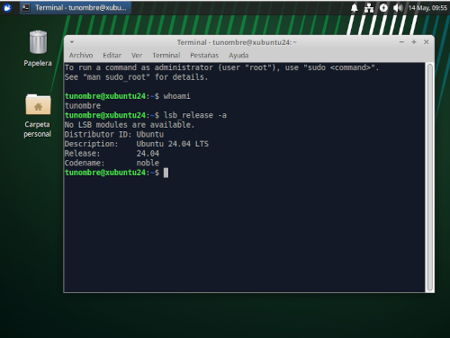
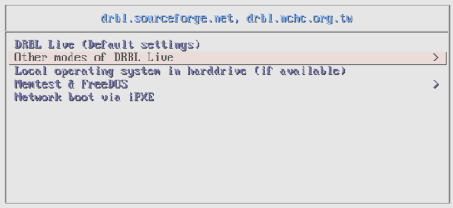
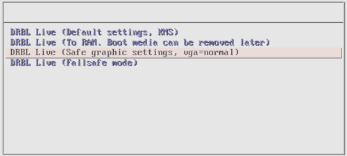
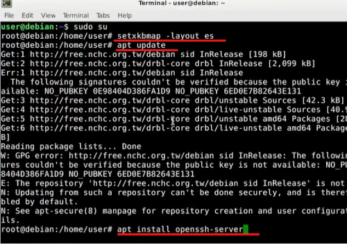
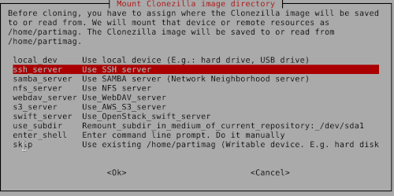
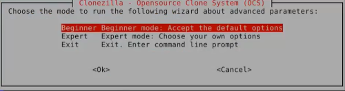
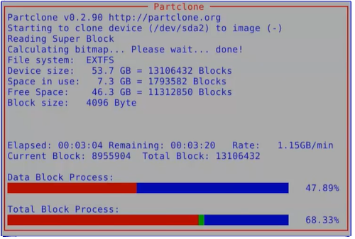

*********
Clonación
*********

La clonación es la creación de una copia exacta de un sistema, disco duro, partición, o conjunto de datos. Este proceso es comúnmente utilizado para respaldos, migraciones de sistemas, despliegues de múltiples estaciones de trabajo, y recuperación ante desastres.

* **Tipos de Clonación**

  * Clonación de Disco Completo:
  
    Copia todos los datos, incluyendo el sistema operativo, aplicaciones y archivos personales, de un disco duro a otro. El disco clonado puede ser utilizado para arrancar el sistema exactamente como el disco original.

  * Clonación de Partición:
    
    Similar a la clonación de disco, pero se enfoca en una partición específica del disco en lugar de todo el disco.

  * Clonación Incremental/Diferencial:

    Clona solo los cambios realizados desde la última clonación, lo que ahorra tiempo y espacio en disco. La clonación incremental se basa en la última copia incremental o completa, mientras que la clonación diferencial se basa en la última copia completa.

   * Clonación en Red:
     
     Permite clonar discos a través de una red, útil para desplegar sistemas operativos en múltiples computadoras simultáneamente, como se realiza con herramientas como Clonezilla y DRBL.

Caso práctico: Clonación con DRBL
=================================

Puedes ver la configuración en el siguiente `vídeo <https://mediateca.educa.madrid.org/video/6dr12pgqtozm9hd6>`_

DRBL (Diskless Remote Boot in Linux) es un sistema de software que permite a las computadoras arrancar y operar sin un disco duro local, utilizando en su lugar una red para obtener el sistema operativo y los datos necesarios. DRBL incluye Clonezilla, una herramienta de clonación de discos y particiones. Clonezilla puede usarse para clonar discos y particiones de manera eficiente en múltiples computadoras simultáneamente, lo que es útil para despliegues masivos.

Primero instalamos un sistema ligero, para este caso instalremos la versión minima de **XUbuntu 24.04** (xubuntu-24.04-minimal-amd64.iso ). Xubuntu es una variante oficial de Ubuntu que utiliza el entorno de escritorio XFCE, conocido por ser ligero y adecuado para sistemas con recursos limitados.

Utiliza 2GB de RAM con un disco duro de 50GB y haz que el usuario se llame **tunombre**

Vamos a crear otra maquina virtual en la que depositar las imagenes, para ello usaremos 2GB de RAM y un disco duro de 50GB, llamada **SERVER**, la iniciaremos con el disco de drbl-live-xfce. En el caso de que la opción por defecto **DRBL Live (Default settings)** te de problemas utiliza:

Lo primero que haremos es instalar y confirar un servidor de ssh, además de montar y formatear el disco duro en ``/home/partimag``. Para ello la tendremos que poner la Red en modo **Adaptador puente** o **NAT**, instalar, montar y luego cambiarla a **Red interna** para que las demás maquinas puedan verla.

Ahora vamos a crear una imagen de **XUbuntu 24.04** en el **SERVER** dentro de ``/home/partimag``, para ello iniciaremos "XUbuntu 24.04" con la iso de drbl-live-xfce e iniciamos  Clonezilla, haciendo que cree una imagen del discoduro entero. Para ello seleccionamos la siguiente opción de Clonezilla live

Creamos una nueva maquina virtual llamada "XUbuntu 01", con disco duro de 50GB y red interna, la iniciamos con drbl-live-xfce y restauramos la imágen que hemos creado. Para ello seleccionamos las mismas opciones  de Clonezilla live, cambiando savedisk por restoredisk

seleccionamos la imagen que hemos creado:

.. image:: imagenes/clon16.png

En la segunda parte, clonaremos varias maquinas al mismo tiempo, para ello iniciaremos el Clonezilla server, lo configuraremos para que restaure tres equipos "X01, X02, X03" y restaure la imágen que hemos creado antes.

Iniciamos en el **SERVER** el Clonezilla server.

Por otro lado crearemos tres maquinas virtuales más, con 50GB de disco duro y con red interna, las iniciaremos con drbl-live con la opción Network boot via iPXE, para que se inicie la clonación

.. image:: imagenes/clon23.png

