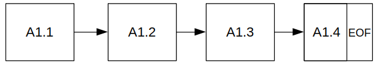
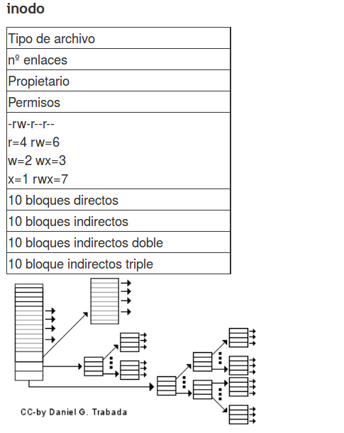
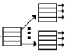
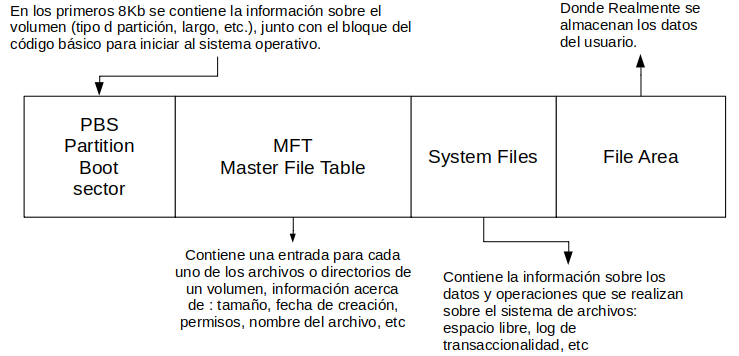
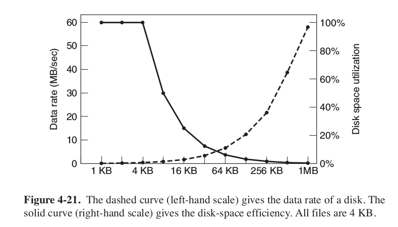

*******************
Sistema de archivos
*******************

La memoria secundaria
=====================

Una de las primeras formas de organizar la información en la memoria secundaria fue mediante la asignación en forma de lista ligada

.. image:: imagenes/memoria_secundaria.png
  :width: 200

En cada bloque contiene la dirección del siguiente bloque o si es el ultimo da dirección con el valor EOF. Uno de los problemas que nos encontramos es que si queremos leer el bloque i, tendremos que pasar por todos lo anteriores (esto puede ser muy ineficiente)

Un forma más eficiente de organizarlo es almacenar los archivos de una forma contigua sin embargo cuando un archivo aumente de tamaño tendremos que cambiarlo de sitio creándose de esta forma la fragmentación externa:

.. image:: imagenes/frag_ext.png

Podemos evitar mover todo el archivo creando bloques, esto creará fragmentación interna, cuanto menor sea el tamaño del bloque mejor sera el aprovechamiento de la partición

.. image:: imagenes/frag_int.png

FAT (File Allocation Table)
===========================

El sistema FAT Se genera una entrada por cada bloque del disco

.. image:: imagenes/FAT.png
  :width: 200

En esta tabla podemos ver 2 archivos:

| A : [5] -> [4] -> [2]
| B : [3] -> [7]

En un disco duro 160 GB con bloques de 16KB tendríamos 160*230 / 16*210= 10*220 bloques en FAT32, si cada entrada ocupa 32bit (4B) es decir que la tabla tendría 40 MB

El Sistema I-NODOS (ls -i) (ext)
================================

Con bloques de 1KB y direcciones de 32 bits podemos apuntar a:

.. image:: imagenes/inodos1.png

(1*2¹⁰*2³bit) / (2⁵bit) = 2⁸ = 256 direcciones 
  

(256)² = 2¹⁶

.. image:: imagenes/inodos3.png

(256)³ = 2²⁴

tendríamos en todal : 10 + 2⁸ + 2¹⁶ + 2²⁴ ≈ 2²⁴ = 16 GB

NTFS 
====

NTFS se divide en 4 zonas

  
Tamaño Bloque
=============

Tamaños grades, nos dan mucha fragmentación interna, lo que hace que se desperdicie capacidad de disco duro
Tamaños pequeños hace que los archivos se expandan en múltiples bloques lo que hace queprovoca velocidad de lectura menores.
Tanenbaum et al. (2006) en  Computer Science Department, obtiene:

Tipos de sistemas de archivos
=============================

Existen muchos tipos de sistemas de archivos. En la siguiente tabla vemos algunos de los más famosos:

+----------+--------------+---------------+-------------+----------+
| Sistema  | archivo      | partición     | SO          | Soporta  |
| archivos | (máx.)       | (máx.)        | Utilizado   | Usuarios |
+==========+==============+===============+=============+==========+
|  FAT16   |      2GB     |     2GB       | Windows     |    NO    |
+----------+--------------+---------------+-------------+----------+
|**FAT32** |    **4GB**   |     2TB       |**Windows**  |  **NO**  |
+----------+--------------+---------------+-------------+----------+
|**NTFS**  |   **~ TB**   |    ~ EB       |**Windows**  |  **SI**  |
+----------+--------------+---------------+-------------+----------+
|  EXT3    |     2 TB     |    32TB       | GNU/Linux   |    SI    |
+----------+--------------+---------------+-------------+----------+
|**EXT4**  |   **~ TB**   |    ~ EB       |**GNU/Linux**|  **SI**  |
+----------+--------------+---------------+-------------+----------+

En el sistema de archivos hay dos tipos fundamentales de objetos: los directorios y los archivos, Los archivos son los objetos encargados de contener los datos, mientras que los directorios o carpetas son los objetos cuya misión principal es permitir una mayor organización de los archivos dentro del disco.

Los archivos suelen estar formados por el nombre y la extensión, la extensión indica que tipo de archivo es, fijate en los siguientes ejemplos:

* Extensiones de Ofimática:

  * TXT: archivos de texto plano, sin formato.
  * DOC: documentos de Word. Este formato está obsoleto, ya que pertenece a las versiones antiguas de Office.
  * DOCX: formato por defecto de los documentos de Word. Este formato no permite ejecutar macros.
  * DOCM: igual que el DOCX, pero con macros habilitadas.
  * ODT: documento de texto en formato OpenDocument, ideal para usar con suites alternativas como LibreOffice.
  * PDF: formato de Adobe Acrobat. Protege el estilo y evita modificaciones.
  * RTF: formato de texto enriquecido, perfecto para compartir entre distintos sistemas operativos.
  * CSV: formato abierto para representar cualquier tipo de datos en forma de tabla.
  * XLS: documentos de Excel. Este formato está obsoleto, ya que pertenece a las versiones antiguas de Office.
  * XLSX: formato por defecto de los documentos de Excel. Este formato no permite ejecutar macros.
  * XLSM: igual que XLSX, pero con macros habilitadas.
  * ODS: hoja de cálculo en formato OpenDocument, ideal para usar con suites ofimáticas alternativas como LibreOffice.
  * PPS: presentación de diapositivas de PowerPoint configurada para abrirse siempre en modo presentación. Este formato está obsoleto, ya que pertenece a las versiones antiguas de Office.
  * PPT: presentación de diapositivas de PowerPoint. Este formato está obsoleto, ya que pertenece a las versiones antiguas de Office.
  * PPSX: formato por defecto de PowerPoint para abrir el archivo en modo presentación. Este formato no permite ejecutar macros.
  * PPTX: formato por defecto de PowerPoint. Este formato no permite ejecutar macros.
  * PPSM: igual que el PPSX, pero con macros.
  * PPTM: igual que el PPTX, pero con macros.
  * POTX: plantilla de Microsoft PowerPoint.
  * ODP: formato OpenDocument para presentación de diapositivas, ideal para usar con suites ofimáticas alternativas como LibreOffice.

* Extensiones de audio

  * MP3: codec de música estándar con compresión.
  * WMA: formato de audio desarrollado por Microsoft con compresión y posible DRM.
  * WAV: formato de audio digital con o sin compresión.
  * FLAC: formato de audio digital de alta fidelidad y sin pérdidas.
  * MIDI: protocolo para transferencia de datos, con información de sonido, de 8 bits.
  * OGG: codec de audio libre, muy popular como alternativa al MP3.
  * M3U: lista de reproducción.
  
* Extensiones de video

  * AVI: contenedor de audio y vídeo que puede contener varios flujos de datos de audio y de vídeo.
  * DIVX: formato utilizado para almacenar archivos de vídeo de alta definición y calidad.
  * MOV: formato utilizado por QuickTime.
  * MP4: formato capaz de almacenar contenido multimedia como audio, vídeo y subtítulos.
  * MPG: formato con compresión de baja pérdida de calidad.
  * MKV: formato contenedor de vídeo que guarda por separado el audio y el vídeo.
  * WMV: formato de vídeo desarrollado por Microsoft con compresión y posible DRM.
  * WPL: lista de reproducción de Windows Media Player.
  
* Extensiones de fotos

  * JPEG / JPG: formato más utilizado en imágenes digitales, con compresión y pérdida.
  * PNG: formato gráfico con compresión sin pérdida. Soporta transparencias.
  * BMP: imagen de mapa de bits.
  * ICO: archivo de icono.
  * SVG: imagen de gráficos vectoriales.
  * WEBP: formato de imagen con compresión desarrollado por Google para web.
  * GIF: imágenes animadas.
  * PSD: proyecto de Adobe Photoshop.
  * HEIC: formato de imagen utilizado por Apple en macOS y iOS.
  * NEF/CRW: formato de imagen RAW, en bruto, utilizado por cámaras Nikon y Canon.
  * AI: proyecto de Adobe Ilustrator.
  * ID: proyecto de InDesign de Adobe.
    Extensiones de archivos comprimidos
  * ZIP: formato desarrollado por WinZIP.
  * RAR: formato de compresión desarrollado por WinRAR más eficiente que el ZIP.
  * RAR5: versión renovada de RAR con mejoras de seguridad y recuperación de datos.
    * 7Z: formato libre desarrollado por el creador de 7-Zip.
    * ACE: archivo comprimido con WinACE.
    * R00, R01, etc: archivo WinRAR dividido en partes.
    * GZ: archivo comprimido en GZIP, muy frecuente en Linux.
    * tar.bz2: otro formato de archivo comprimido de Linux.

Junto con el nombre del archivo, el sistema operativo almacena también unos atributos que califican al archivo. Entre otros pueden ser la hora y fecha de creación o su ultima modificación, su propietario, si es oculto, si pertenece al sistema, el tamaño, si esta cifrado, si es solo para lectura, escritura o ejecución, si es un enlace simbólico, etc

Los directorios son una división lógica de almacenamiento de archivos u otros subdirectorios, al igual que los archivos tienen atributos que cambiarán según el sistema operativo que utilicemos, los cuales las veremos más adelante. Las operaciones más comunes sobre los directorios son:

* Crear
* Copiar
* Mover
* Renombrar
* Eliminar
* Listar archivos y carpetas
* Entrar y salir
