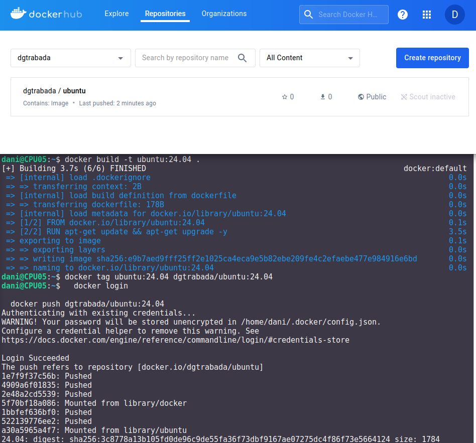
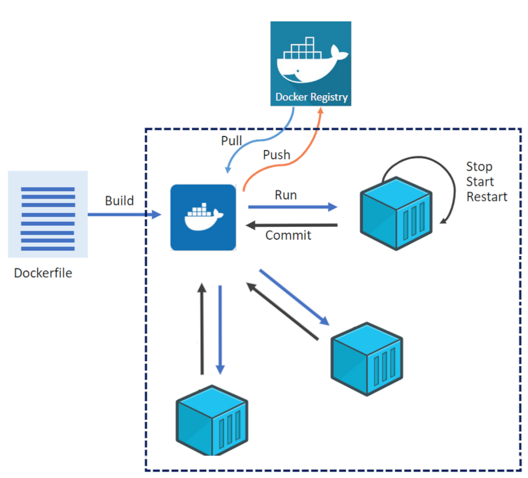
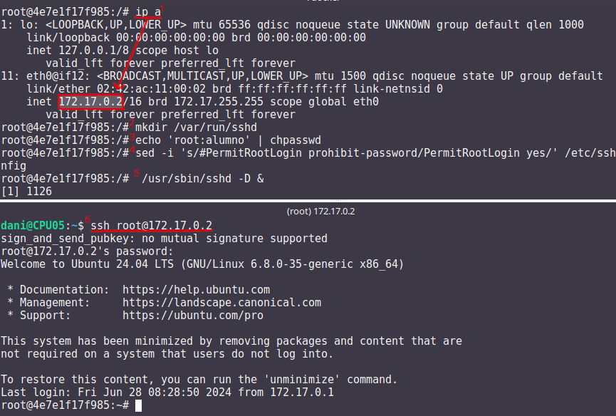
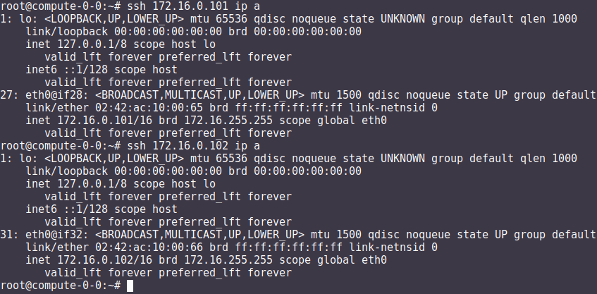

*****************
La virtualización
*****************

La virtualización es una tecnología que permite la creación de entornos virtuales o máquinas virtuales (VM) que funcionan de manera independiente en un mismo sistema físico. Consiste en la abstracción de los recursos físicos, como la CPU, la memoria, el almacenamiento y los dispositivos de entrada/salida, para asignarlos y compartirlos entre varias máquinas virtuales.

El objetivo principal de la virtualización es maximizar la utilización de los recursos físicos y mejorar la eficiencia de los sistemas informáticos. Al utilizar la virtualización, es posible ejecutar múltiples sistemas operativos y aplicaciones en un único servidor o computadora, lo que reduce la necesidad de hardware físico adicional.

Algunos conceptos clave relacionados con la virtualización son:

* **Hipervisor**: También conocido como monitor de máquina virtual (VMM), es el software o firmware responsable de crear y gestionar las máquinas virtuales. Se encarga de asignar y administrar los recursos físicos entre las VM.

  Existen dos tipos principales de hipervisores, también conocidos como monitores de máquina virtual (VMM):

  * **Hipervisor de tipo 1 o "nativo"** (Bare Metal Hypervisor): Este tipo de hipervisor se ejecuta directamente sobre el hardware físico sin depender de un sistema operativo anfitrión. Actúa como una capa de virtualización entre el hardware y las máquinas virtuales. Algunos ejemplos de hipervisores de tipo 1 son:
  
    * VMware ESXi
    * Microsoft Hyper-V
    * Citrix XenServer
    * KVM (Kernel-based Virtual Machine)
    * Oracle VM Server

  * **Hipervisor de tipo 2 o "hosted"** (Hosted Hypervisor): Este tipo de hipervisor se ejecuta como una aplicación dentro de un sistema operativo anfitrión. Utiliza los recursos y servicios del sistema operativo subyacente para proporcionar la virtualización. Algunos ejemplos de hipervisores de tipo 2 son:
  
    * VMware Workstation
    * Oracle VirtualBox
    * Microsoft Virtual PC
    * Parallels Desktop

* **Máquina virtual (VM)**: Es un entorno virtual que emula una computadora completa con su propio sistema operativo, aplicaciones y configuraciones. Cada VM se ejecuta de forma aislada y puede ser tratada como una entidad independiente.

* **Host**: Es el sistema físico o servidor que ejecuta el hipervisor y aloja las máquinas virtuales.

* **Guest**: Es la máquina virtual que se ejecuta dentro de un host. Puede ser un sistema operativo completo o una instancia de una aplicación específica.

* **Portabilidad**: Las máquinas virtuales son independientes del hardware subyacente, lo que facilita su migración entre diferentes servidores físicos sin necesidad de modificar el sistema operativo o las aplicaciones.

*  **Escalabilidad**: La virtualización permite escalar verticalmente (aumentar los recursos asignados a una VM) o escalar horizontalmente (agregar más VM) según las necesidades de carga de trabajo.

La virtualización se utiliza en diversos entornos, como servidores, redes, almacenamiento y escritorios, proporcionando flexibilidad, eficiencia y mayor aprovechamiento de los recursos informáticos.

Que sus componentes sean virtuales no quiere decir necesariamente que no existan. Por ejemplo, una máquina virtual puede tener unos recursos reservados de 2 GB de RAM y 20 GB de disco duro, que salen del PC donde está instalada la máquina virtual

Hay varias aplicaciones muy conocidas capaz de hacer esto, aunque las más famosas son VMWare, VirtualBox, QEMU , etc..

VirtualBox
==========

.. image:: imagenes/virtualbox.png

Resumen:

**OVF/OVA** : es un estándar abierto para empaquetar y distribuir un dispositivo virtual que consta de una o varias máquinas virtuales (VM).

**Clonación completa**, una copia exacta (incluyendo todos los archivos de disco duro virtual) de la máquina original serán creados.

**Clonación enlazada**, una nueva máquina será creada, pero los archivos de las unidades de disco duro virtuales serán vinculados a los archivos de disco duro virtual de la máquina original y no podrá mover la nueva máquina virtual a una computadora diferente sin mover los originales también.

*Puede que en algún momento, por diversos motivos, nos encontremos con alguna dirección MAC duplicada en una MV (poco frecuente) o entre MV diferentes. Como ya sabemos, en una misma LAN no puede haber dos interfaces de red con igual MAC, esto nos daría problemas de red a nivel de enlace. Para evitar este problema debemos cambiar las MAC para que no estén duplicadas.*

**VirtualBox Guest Additions** es un conjunto de controladores y aplicaciones del sistema que mejoran el rendimiento y la funcionalidad de un sistema operativo invitado que se ejecuta dentro de una máquina virtual de VirtualBox. Cuando instalas las Guest Additions en el sistema operativo invitado, se habilitan funciones como carpetas compartidas, integración de ratón sin problemas, mejor soporte de video y mejor rendimiento.

El paquete de Guest Additions proporciona controladores adicionales para el hardware de tu máquina virtual, incluyendo gráficos, redes y dispositivos de entrada. También incluye utilidades que te permiten redimensionar la ventana de la máquina virtual dinámicamente, compartir carpetas entre el sistema anfitrión y el invitado, y habilitar el intercambio de portapapeles.

**Las instantáneas (snapshots)** en VirtualBox son una característica que te permite guardar el estado actual de una máquina virtual en un punto específico del tiempo. Con las instantáneas, puedes capturar una imagen completa de la máquina virtual, incluyendo su configuración, discos virtuales y memoria, y luego restaurarla posteriormente si es necesario.

Al crear una instantánea, VirtualBox guarda una copia del estado actual de la máquina virtual, incluyendo los registros de la CPU, la memoria y el estado de los discos virtuales. Esto te permite revertir fácilmente a ese punto en el tiempo en caso de que realices cambios o configuraciones que desees deshacer más adelante.

**Las tecnologías VT-x** (Intel Virtualization Technology) y **AMD-V** (AMD Virtualization) son extensiones de hardware que proporcionan soporte para la virtualización en procesadores Intel y AMD, respectivamente. Estas tecnologías permiten que los hipervisores, como VirtualBox, ejecuten máquinas virtuales de manera más eficiente y segura. Si habilitamos esa opción, entonces también podremos habilitar "Habilitar **paginación anidada**" que mejorará aún más el rendimiento del sistema permitiendo gestionar la memoria por medio del hardware y no del software.

**los discos duros estáticos** tienen un tamaño fijo, ofrecen un rendimiento constante pero pueden ocupar más espacio en el almacenamiento del host. **Los discos duros dinámicos** crecen según sea necesario, permiten un uso eficiente del almacenamiento y son más fáciles de migrar y copiar, pero pueden experimentar fragmentación y pueden tener un rendimiento ligeramente inferior en comparación con los discos estáticos

**La opción PAE/NX** permite habilitar el acceso a más de 4 GB de memoria RAM en sistemas de 32 bits y se habilita la protección NX para mejorar la seguridad del sistema. Si se deshabilita, el sistema operativo y las aplicaciones estarán limitados a utilizar solo 4 GB de memoria y no se aprovechará la protección NX.

En “**Carpetas Compartidas**”, podemos crear una carpeta compartida entre la máquina anfitrión y la invitada. Para ello, hacemos clic en “Agregar Carpeta compartida”…

En Avanzado, podemos cambiar otras opciones, como puede ser el permitir que ambos sistemas, el invitado y el anfitrión, puedan **compartir el portapapeles**, lo que permitirá copiar y pegar de uno a otro.

* **RED**

  * **Cable conectado** que se encuentra en la parte de opciones avanzadas en la sección de red de la MV (también en el menú contextual del icono de red que se encuentra en la parte inferior derecha de la ventana de la MV, eligiendo Connect Network Adapter, o a través del menú de la MV Dispositivos -> Red).
  * **Modo NAT** es la forma más sencilla que tiene una MV para acceder a una red externa. Por lo general, no se requiere ninguna configuración en la red, ni en el anfitrión ni en el invitado. Por esta razón, es el modo de red por defecto en VB. En modo NAT, VB coloca un router entre el exterior (hacia donde hace NAT) y el invitado. Dicho router posee un servidor DHCP que sirve hacia el interior. Este router mapea el tráfico desde y hacia la MV de forma transparente. Cada MV en modo NAT tendrá su propio router, por lo que estarán en redes aisladas, lo que implica, que por defecto, las MMVV que tienen su tarjeta de red en modo NAT no pueden verse entre sí.
  * **Modo Red NAT**, el cual funciona como el router de nuestra casa, es decir, los equipos que estén dentro de la misma red NAT podrán comunicarse entre sí, y es aquí donde radica la diferencia con el modo NAT el cual siempre constituye una red con un único equipo y no de varios como ahora es el caso. 
    Para utilizarlo tenemos que crear la red NAT : Desde el menú Archivo -> Preferencias -> Red -> Redes NAT.
  * **Modo Adaptador puente** simula que la tarjeta virtual está conectada al mismo switch que la tarjeta física del anfitrión, por lo tanto, la MV se va a comportar como si fuese un equipo más dentro de la misma red física en la que está el equipo anfitrión. 
  * **Modo Red interna**, podemos construir redes aisladas, en las cuales solo habrá comunicación entre las MsVs que pertenezcan a la misma red interna.
  * **Modo Solo-anfitrión** se utiliza para crear una red interna a la que pertenecerá también el equipo anfitrión, algo que no sucede en el modo Red interna.

Comandos útiles virtualBox:
---------------------------

- ``VBoxManage list vms``: Listar maquinas virtuales
- ``VBoxManage list vms runningvms``: Listar maquinas virtuales que estan ejecutasdose
- ``VBoxManage startvm 'Ubuntu Server 24.04' --type headless``: Ejecutarla sin entorno gráfico
- ``VBoxManage controlvm 'Ubuntu Server 16.04' savestate``: Guardar el estado

En modo gráfico:

* ``Ctrl_derecho + Supr`` : Ctrl + Atl + Supr
* ``Ctrl_derecho`` : Salir de pantalla
* ``Ctrl_derecho + f`` : pasar/volver de pantalla completa
* ``Ctrl_derecho + c``: pasar/volver modo escalado

Caso práctico: MV Ubuntu Server 24.04
-------------------------------------

* Descárgate el sistema operativo Ubuntu Server 24.04 en formato (ISO) de su página oficial

* Utiliza un disco de 200 GB y 2G de RAM

* Iniciamos la maquina y procedemos a la instalación, llama a esta maquina virtual **MV Ubuntu Server 24.04**

* Utiliza un adaptador puente para la red con **IP** 10.4.X.Y/8 (255.0.0.0), donde **X.Y** son parte de las ips de vuestros equipos, en el caso de que tengas un portátil utiliza DHCP.

* **DNS** 8.8.8.8, **Gateway** 10.0.0.2 y **subred** 10.0.0.0/8, 

* Hacemos el siguiente esquema de particiones, para ello selecciona (x) Custom storage layout

  .. image:: imagenes/MV_Ubuntu_Server_22.04.jpg

* Usuario: **tunombre** y utiliza de contraseña: **alumno**
  Para el nombre del servidor utiliza compute-0-0, si no lo has hecho durante la instalación modifica el archivo **/etc/hostname** 

Caso práctico: Windows 11
-------------------------

* Descarte la ISO de Windwos 11 de la página de `Microsoft <https://www.microsoft.com/es-es/software-download/windows11>`_

* Creamos una nueva maquina virtual llamada **Windows11**

* Creamos una maquina virtual con 100GB de disco duro reservado dinámicamente, 4GB de RAM, dos procesadores, un adaptador en modo modo puente y un memoria de vídeo de 128MB.  Omite la instalación desantendida y habilita EFI, Secure Boot y el TPM

* Para la instalación desconecta el cable de red virtual:
  
  Configuración/Red/Adaptador1/Avanzadas/[  ]Cable conectado
  
* En el caso de que aparezca el aviso de **"startup.nsh"** en Virtualbox, presionamos shift+F10 y cambiamos el idioma a English, vamos a continuar y pasamos al menu de instalación.

* Selecciona "No tengo clave de producto" y selecciona Windows 11 Education  

* Selecciona la instalación personalizada : instalar solo Windows (avanzado)

* Configuramos Windows con una cuenta local [#f1]_, para ello :

  * Omitimos una segunda distribución de teclado y cuando se quiera conectar a una red seleccionamos "No tengo internet",
 
  * Seguimos con **Continuar con la configuración limitada** 
  
  * Configuramos Windows con una cuenta local
 
    * usuario : **tunombre**
    * contraseña : **@lumn0**

  * Preguntas de seguridad para esta cuenta:
   
    * ¿Cuál era el nombre de tu primera mascota? **@lumn0**      
    * ¿Cuál es el nombre de la ciudad en la que naciste? **@lumn0**      
    * ¿Cuál era tu apodo de infancia? **@lumn0**

* **No** permitimos que Microsoft y las aplicaciones usen tu ubicación, ni permitimos que encuentren nuestro dispositivo, es decir que en las siguientes preguntas, le diremos que "**No**" o "**Solo los obligatorios**",  le daremos los mínimos permisos a Microsoft sobre nuestros datos y maquinas.

* De igual manera rechazamos la ayuda del asistente digital, ni usamos el reconocimiento de voz en línea

.. rubric:: Notas
  
.. [#f1] En el caso de que no aparezca haz la instalación como si fuera a ser parte de un Dominio

Caso práctico: Windows Server 2022
----------------------------------

Windows Server es la plataforma para crear una infraestructura de aplicaciones conectadas, redes y servicios web. Como administrador de Windows Server, probablemente haya usado muchas de las consolas nativas de Administración de Microsoft (MMC) de Windows Server para mantener la infraestructura segura y disponible.

* **Windows Server Standard:** permite ejecutar como máximo dos VMs en hasta dos procesadores y 64GB RAM. Es ideal para un entorno no virtualizado o poco virtualizado en el que se desee incluir características de alta disponibilidad.

* **Windows Server  Datacenter:** permite ejecutar un número ilimitado de VMs en hasta dos procesadores. Se recomienda para un entorno altamente virtualizado que requiera características de alta disponibilidad, incluida la agrupación en clústeres.

* Respecto a la interfaz de usuario, se ofrecen dos posibilidades pero siempre se podrá pasar de una opción a la otra libremente en cualquier momento.

  * **Server Core:** reduce el espacio requerido en el disco, la posible superficie expuesta a ataques y especialmente los requisitos de servicio y reinicio del servidor.
  
  * **Servidor con una GUI:** ofrece los elementos de la interfaz de usuario y las herramientas de administración de gráficos.
  
Si no dispones de de una licencia de Windows Server 2022, puedes obtener, de forma totalmente gratuita, una versión de evaluación plenamente funcional durante un periodo de 180 días en la siguiente dirección https://www.microsoft.com/es-ES/evalcenter/evaluate-windows-server-2022

* Creamos una maquina virtual con 100GB de disco duro reservado dinámicamente, 2GB de RAM, 2CPU, un adaptador en modo modo puente y un memoria de vídeo de 128MB

* Para la instalación seleccionamos: Windows Server 2022 Standard Evaluation (experiencia de escritorio)

* Contraseña del Administrador: @lumn0

* Utiliza un adaptador puente para la red con **IP** 10.4.X.Y/8 (255.0.0.0), donde X.Y son parte de las ips de vuestros equipos, en el caso de que tengas un portátil utiliza ¿DHCP?, **DNS** 8.8.8.8, **Gateway** 10.0.0.2

* Configurar nombre: Panel / Servidor local : Cambiamos nombre equipo, le llamamos SRV-tunombre

* Comprobar que la zona horaria sea la correcta : Servidor local / Ajustar zona horaria

* Habilitamos ping : Administrador del servidor / Panel / Herramientas, buscamos la opción de firewall de Windows con seguridad avanzada nos vamos a las reglas entrantes, que es donde nos está bloqueando el tráfico firewall. Nos dirigimos a la zona de la derecha y buscamos “Archivos e impresoras compartidas (petición eco IMCPv4…” solicitud de echo entrante v4 y damos a habilitar

Caso práctico: Windows Server 2022 sin GUI
------------------------------------------

* Creamos una maquina virtual llamada **WS22tunombre**, con 100GB de disco duro reservado dinámicamente, 2GB de RAM, 2CPU, un adaptador en modo modo puente y un memoria de vídeo de 128MB

* Para la instalación seleccionamos:  Windows Server 22 Standar Evaluation (instalamos la versión sin la mayor parte del entorno gráfico)

* Instalación nueva : Personalizada, instalar solo Windows (avanzado) y usamos todo el disco.

* Contraseña del Administrador: @lumn0

* Instala el servidor ssh

* Utiliza un adaptador puente para la red con **IP** 10.4.X.Y/8 (255.0.0.0), donde X.Y son parte de las ips de vuestros equipos, en el caso de que tengas un portátil utiliza DHCP, **DNS** 8.8.8.8, **Gateway** 10.0.0.2

* Cambia el nombre por WS22tunombre 

* Habilita el ping

* Instala el editor vi

ayuda: :ref:`Configuración de Windows (PowerShell)`

Docker
======

Docker es una plataforma de código abierto en la que se usan contenedores que permite empaquetar, distribuir y ejecutar aplicaciones en entornos aislados

A diferencia de las máquinas virtuales, los contenedores comparten el kernel del sistema operativo subyacente y solo virtualizan los recursos a nivel de aplicación, lo que los hace más ligeros y rápidos.

**Componentes principales**

- **Imagen**: Plantilla de solo lectura que contiene el sistema operativo, el entorno de ejecución y la aplicación.
- **Contenedor**: Instancia en ejecución de una imagen.
- **Docker Engine**: Motor que gestiona los contenedores, incluida la creación, ejecución y eliminación.
- **Dockerfile**: Archivo de texto que contiene las instrucciones para construir una imagen.

**Dockerfile y construcción de imágenes**

- Un Dockerfile especifica cómo se debe ensamblar una imagen.
- Se utiliza el comando ``docker build`` para construir una imagen a partir de un Dockerfile.

**Docker Hub**

Registro público de imágenes Docker donde puedes encontrar imágenes preconstruidas para muchas aplicaciones y sistemas operativos.

**Redes y volúmenes**

- Docker permite la creación de redes virtuales para conectar contenedores entre sí.
- Los volúmenes permiten persistir datos más allá del ciclo de vida de un contenedor.

**Orquestación de contenedores**

Herramientas como Docker Swarm y Kubernetes permiten gestionar y escalar grandes clústeres de contenedores.

**Tipos de redes**

* **Bridge (puente)**

  - Es la red predeterminada en Docker.
  - Permite la comunicación entre los contenedores en el mismo host.
  - Cada contenedor tiene su propia dirección IP en la subred de la red puente.
  - Útil para aplicaciones que se ejecutan en un solo host y necesitan comunicarse entre sí.

* **Host (anfitrión)**

  - Los contenedores comparten el espacio de red con el host.
  - No hay aislamiento de red entre los contenedores y el host.
  - Los contenedores pueden acceder a los mismos puertos que el host.
  - Proporciona un mejor rendimiento en comparación con las redes puente para aplicaciones que necesitan acceder a recursos del host.

* **Overlay (superposición)**

  - Permite la comunicación entre contenedores en hosts diferentes en un clúster de Docker Swarm.
  - Utiliza la tecnología de redes de superposición para conectar contenedores en diferentes hosts.
  - Proporciona una red virtualizada única para el clúster, independiente de la infraestructura subyacente.

* **Macvlan**

  - Asigna una dirección MAC única a cada contenedor, esto hace aparecer como dispositivos físicos en la red.
  - Los contenedores tienen su propia dirección IP en la red física.
  - Útil para integrar contenedores en redes existentes que dependen de la comunicación a nivel de capa 2.

* **None (ninguna)**

  - No se asigna ninguna red al contenedor.
  - Útil para contenedores que no necesitan acceso de red en absoluto.

Gestión de imágenes y contenedores
----------------------------------

- ``docker build``: construir una imagen a partir de un Dockerfile.
- ``docker tag``: Etiquetamos la imagen.
- ``docker push``: Subimos la imagen.
- ``docker pull``: Descarga una imagen de Docker Hub u otro repositorio.
- ``docker images``: lista las imagenes.
- ``docker rmi``: Elimina una imagen.
- ``docker run``: Crea y ejecuta un contenedor a partir de una imagen.
- ``docker ps``: Muestra los contenedores en ejecución.
- ``docker ps -a``: Muestra todos los contenedores.
- ``docker exec -it compute-0-0 /bin/bash`` : Acceder a una shell Bash dentro de un contenedor.
- ``docker stop`` / ``docker start``: Detiene o inicia un contenedor.
- ``docker commit``: Mandamos los cambios a la imagen.
- ``docker rm``: Elimina un contenedor.

Caso práctico: Instalación de Docker en Ubuntu 24.04 LTS
---------------------------------------------------------

.. code-block:: bash

  # Desinstalación de versiones antiguas
  sudo apt-get remove docker.io
  sudo apt-get remove docker-doc
  sudo apt-get remove docker-compose
  sudo apt-get remove docker-compose-v2
  sudo apt-get remove podman-docker
  sudo apt-get remove containerd
  sudo apt-get remove runc
  
  # Añade la clave GPG oficial de Docker:
  sudo apt update
  sudo apt install -y ca-certificates curl
  sudo install -m 0755 -d /etc/apt/keyrings
  sudo curl -fsSL https://download.docker.com/linux/ubuntu/gpg -o /etc/apt/keyrings/docker.asc
  sudo chmod a+r /etc/apt/keyrings/docker.asc

  # Añadir el repositorio a las fuentes de APT:
  echo \
  "deb [arch=$(dpkg --print-architecture) signed-by=/etc/apt/keyrings/docker.asc] https://download.docker.com/linux/ubuntu \
  $(. /etc/os-release && echo "$VERSION_CODENAME") stable" | \
  sudo tee /etc/apt/sources.list.d/docker.list > /dev/null
 
  sudo apt update

  #Instalar los paquetes de Docker Engine
  sudo apt install -y docker-ce docker-ce-cli containerd.io \
  docker-buildx-plugin docker-compose-plugin

  #Asignación de permisos al usuario para ejecutar docker cli
  sudo groupadd docker
  sudo usermod -aG docker $USER
  newgrp docker

  #Configuración del arranque automático de los servicios
  sudo systemctl enable docker.service
  sudo systemctl enable containerd.service

  #Comprobaciones
  docker ps

Caso práctico: construir una imagen de docker y subirla al repositorio
----------------------------------------------------------------------

Lo primero que haremos es darnos de alta en `Docker Hub <https://hub.docker.com/>`_ es un repositorio de imágenes de contenedores público y centralizado, donde los usuarios pueden:

* Almacenar y compartir imágenes de contenedores
* Descubrir imágenes de contenedores
* Colaborar en proyectos 
* Automatizar flujos de trabajo

Para construir una imagen de Docker, necesitamos crear el archivo ``Dockerfile``, veamos el siguiente para contruirnos una imagen de Ubuntu 24.04:

.. code-block:: bash

  # Usar Ubuntu 24.04 como imagen base
  FROM ubuntu:24.04

  # Actualizar los repositorios y paquetes
  RUN apt-get update && apt-get upgrade -y

Las instrucciones más comunes en un Dockerfile:

1. **FROM**: Define la imagen base desde la cual se construirá la nueva imagen.
2. **COPY** o **ADD**: Copian archivos o directorios desde el sistema de archivos del host al sistema de archivos del contenedor.
3. **RUN**: Ejecuta comandos en el contenedor durante la fase de construcción.
4. **WORKDIR**: Establece el directorio de trabajo para las instrucciones `RUN`, `CMD`, `ENTRYPOINT`, `COPY` y `ADD`.
5. **CMD**: Especifica un comando que se ejecuta cuando se inicia un contenedor.
6. **ENTRYPOINT**: Configura un contenedor para que se ejecute como un ejecutable.
7. **EXPOSE**: Indica que el contenedor escucha en puertos específicos en tiempo de ejecución.
8. **ENV**: Establece variables de entorno.

Construimos la imágen:

.. code-block:: bash

  docker build -t ubuntu:24.04 .

Etiquetamos la imagen:

.. code-block:: bash

  docker tag ubuntu:24.04 dgtrabada/ubuntu:24.04

Para subir la imagen, primero iniciar sesión en Docker Hub y luego la subimos ``push``:

.. code-block:: bash

  docker login

  docker push dgtrabada/ubuntu:24.04
  
  

Vamos a instalar el editor vim y la actualizamos:

.. code-block:: bash

  #Listar imagenes:
  $ docker images
  
  REPOSITORY         TAG       IMAGE ID       CREATED          SIZE
  dgtrabada/ubuntu   24.04     e9b7aed9fff2   10 minutes ago   267MB

  #Creamos un nuevo contendor
  docker run -it dgtrabada/ubuntu:24.04 /bin/bash
  
  #instalamos el editor vim (apt-get install vim)
  root@e9b7aed9fff2:/# apt-get install -y vim
  
  #nos salidmos del contenedor (Ctrl+d)
  #listamos los contendores:
  $ docker ps -a
  CONTAINER ID   IMAGE                    COMMAND         CREATED         STATUS         PORTS     NAMES
  406694d11d68   dgtrabada/ubuntu:24.04   "/bin/bash"   2 minutes ago   Up 2 minutes   

  #mandamos los cambios a la imagen
  $ docker commit 406694d11d68 dgtrabada/ubuntu:24.04
  sha256:bffbb89703458ec685907be409c758e07207a3420d513780b247aa9d4ebe1d2a
  
  #subimos la imagen a Docker Hub
  $ docker push dgtrabada/ubuntu:24.04

Para ejecutar este contenedor en cuanquier otro ordenador con docker lo unico que tenemos que hacer es:

.. code-block:: bash

  #Se bajará la imagen
  $ docker pull dgtrabada/ubuntu:24.04
  
  #Crear un nuevo contendor
  docker run -it dgtrabada/ubuntu:24.04 /bin/bash

Caso práctico: Instalar servidor de ssh, ip y ping
--------------------------------------------------

Nos bajarmos la imagen del repositorio, creamos un contendemor e instalamos los comandos:

.. code-block:: bash

  root@4e7e1f17f985:/# apt update
  root@4e7e1f17f985:/# apt-get install -y iproute2 iputils-ping
  root@4e7e1f17f985:/# apt-get install -y openssh-server
  
Configuramos ssh para poder logearnos como root:

.. code-block:: bash

  root@4e7e1f17f985:/# mkdir /var/run/sshd
  root@4e7e1f17f985:/# echo 'root:alumno' | chpasswd
  root@4e7e1f17f985:/# sed -i 's/#PermitRootLogin prohibit-password/PermitRootLogin yes/' /etc/ssh/sshd_config

  #Por ultimo lanzamos el demonio sshd y ya puedes conectarte por ssh
  root@4e7e1f17f985:/# /usr/sbin/sshd -D &

Salimos del contendor y mandamos los cambios a la imagen

.. code-block:: bash

  $ docker commit 4e7e1f17f985 dgtrabada/ubuntu:24.04
  sha256:fc2ab89b8f222c6b10d9c66e3c055e9e1c0dbfa45add33e603b8043b6c1a1beb
  
  #subimos la imagen a Docker Hub
  $ docker push dgtrabada/ubuntu:24.04
  
  #podemos lanzar el contedor con ssh:
  docker exec -it 4e7e1f17f985 /usr/sbin/sshd
  

Fíjate que podríamos haber hecho lo mismo con el siguiente dockerfile:

.. code-block:: bash

  # Usar Ubuntu 24.04 como imagen base
  FROM ubuntu:24.04

  # Actualizar los repositorios y paquetes
  RUN apt-get update && apt-get upgrade -y

  # Instalamos
  RUN apt-get install -y vim iproute2 iputils-ping openssh-server
 
  RUN mkdir /var/run/sshd

  # Cambiar la contraseña del usuario root 
  RUN echo 'root:alumno' | chpasswd

  # Permitir el acceso por SSH al root
  RUN sed -i 's/PermitRootLogin prohibit-password/PermitRootLogin yes/' /etc/ssh/sshd_config

Caso práctico: Contenedores en una misma subred
-----------------------------------------------

docker tiene por defecto 3 redes                        

.. code-block:: bash

  root@UStunombre:~# docker network ls
  NETWORK ID     NAME      DRIVER    SCOPE
  e6ab6d5cdeea   bridge    bridge    local
  a39dbd6d158e   host      host      local
  1092da8fd7e1   none      null      local
  
  
Vamos a crear una nueva subnet llamada red16, que por defecto se creara en modo bridge:

.. code-block:: bash

  docker network create --subnet=172.16.0.0/16 red16

Crearemos un contenedor con ip 172.16.0.100 llamdo compute-0-0

.. code-block:: bash

  #primero lo creamos
  docker run -it --network red16 --ip 172.16.0.100  --hostname compute-0-0 --name compute-0-0 dgtrabada/ubuntu:24.04 /bin/bash
  
  #Para lanzamos el contenedor:
  docker start  compute-0-0 
  
  #levantamos el servidor ssh
  docker exec -it compute-0-0 /usr/sbin/sshd -D &
  
Hacemos lo mismo para compute-0-1 compute-0-2, con ips 172.16.0.101 y 172.16.0.102, lanza los tres contenedores [#c3]_ y haz que se pueda acceder por ssh sin contraseña desde compute-0-0 a compute-0-1 y compute-0-2

.. rubric:: Footnotes

.. [#c3] Levantar los tres contenedores

  .. code-block:: bash
  
    docker start  compute-0-0 
    docker exec -it compute-0-0 /usr/sbin/sshd -D &
    docker start  compute-0-1 
    docker exec -it compute-0-1 /usr/sbin/sshd -D &
    docker start  compute-0-2 
    docker exec -it compute-0-2 /usr/sbin/sshd -D &
 
  Apagar las maquinas:
    
  .. code-block:: bash
  
    docker stop  compute-0-0 
    docker stop  compute-0-1 
    docker stop  compute-0-2 

docker-compose.yml
------------------

Docker Compose es una herramienta que permite definir y gestionar aplicaciones de múltiples contenedores de Docker, usa un archivo YAML para definir los servicios, redes y volúmenes que necesita tu aplicación, y luego usar un solo comando para crear e iniciar todos estos servicios.

Típicamente contiene varias secciones importantes:

* **Version**: Define la versión del formato de archivo de Docker Compose.
* **Services**: Define los servicios (contenedores) que forman parte de tu aplicación.
* **Networks** (opcional): Define las redes personalizadas que se utilizarán.
* **Volumes** (opcional): Define los volúmenes personalizados que se utilizarán para almacenar datos.

En los ejemploas anteriores podríamos levantar las tres maquinas con el siguiente ``docker-compose.yml`` ejecutando **docker-compose up -d**, para este ejemplo tienes que tener red16 ya creada 

.. code-block:: bash

  version: '3.8'
  services:

    compute-0-0:
      image: dgtrabada/ubuntu:24.04
      container_name: compute-0-0
      hostname: compute-0-0
      networks:
        red16:
          ipv4_address: 172.16.0.100
      tty: true
      stdin_open: true

    compute-0-1:
      image: dgtrabada/ubuntu:24.04
      container_name: compute-0-1
      hostname: compute-0-1
      networks:
        red16:
          ipv4_address: 172.16.0.101
      tty: true
      stdin_open: true

    compute-0-2:
      image: dgtrabada/ubuntu:24.04
      container_name: compute-0-2
      hostname: compute-0-2
      networks:
        red16:
          ipv4_address: 172.16.0.102
      tty: true
      stdin_open: true

  networks:
    red16:
      external: true

Kubernetes
----------

También conocido como **K8s** es un sistema open-source para la automatización del despliegue, escalado y gestión de aplicaciones contenorizadas.

Fue desarrollado originalmente por Google y ahora es mantenido por la Cloud Native Computing Foundation (CNCF).

Partes Principales
^^^^^^^^^^^^^^^^^^

- **Nodo (Node)**:

  - **Nodos Maestro (Master Nodes)**: Administran el clúster y toman decisiones sobre la gestión del clúster.
  - **Nodos de Trabajo (Worker Nodes)**: Ejecutan las aplicaciones en contenedores.

- **Pod**:
  - La unidad de despliegue más pequeña en Kubernetes, que puede contener uno o varios contenedores.

- **Controlador (Controller)**: Mantienen el estado deseado del clúster. Tipos de controladores incluyen:
    
  - **Deployment**: Administra la creación y escalado de un conjunto de pods.
  - **ReplicaSet**: Asegura que un número específico de pods estén corriendo.
  - **StatefulSet**: Administra la persistencia y el orden de los pods.
  - **DaemonSet**: Asegura que todos (o algunos) nodos ejecuten una copia de un pod.

- **Servicio (Service)**: Define un conjunto lógico de pods y una política para acceder a ellos. Tipos de servicios incluyen:

  - **ClusterIP**: Expone el servicio en una IP interna del clúster.
  - **NodePort**: Expone el servicio en el mismo puerto en cada nodo del clúster.
  - **LoadBalancer**: Utiliza un balanceador de carga externo.

- **ConfigMap y Secret**:

  - **ConfigMap**: Separa la configuración estática del código de la aplicación.
  - **Secret**: Almacena y gestiona información sensible.

- **Volumen (Volume)**: Permiten el almacenamiento persistente de datos en los contenedores.

- **Ingress**: Gestiona el acceso externo a los servicios en un clúster, típicamente mediante HTTP.

- **Namespace**: Divide un clúster de Kubernetes en secciones virtuales para separar ambientes como desarrollo, testing y producción.

Funcionamiento Básico
^^^^^^^^^^^^^^^^^^^^^

1. **Planificación**: El planificador asigna pods a los nodos de trabajo basándose en la disponibilidad de recursos.

2. **Orquestación y Gestión**: Kubernetes garantiza que la aplicación esté en el estado deseado y reprograma pods en caso de fallos.

3. **Escalado**: Kubernetes puede escalar automáticamente la cantidad de instancias de una aplicación.

4. **Mantenimiento y Actualización**: Kubernetes permite actualizaciones sin tiempo de inactividad mediante controladores como Deployment que gestionan actualizaciones de manera gradual.

Caso práctico: Instalar kubernetes en Ubuntu 24.04
--------------------------------------------------

  #actualizamos
  sudo apt-get update
  sudo apt-get upgrade -y

  #Desactivamos la swap
  sudo swapoff -a
  
  #Para que no se active cuandose reinicie el sistema comenta la linea en el /etc/fstab, El kubelet, que es el agente principal de Kubernetes que corre en cada nodo del clúster, requiere que el swap esté desactivado. Kubernetes asume que el swap está desactivado para garantizar un rendimiento consistente y predecible de las aplicaciones. Si el swap está habilitado, el sistema puede empezar a mover partes de la memoria de trabajo de los contenedores al disco, lo que puede causar una degradación significativa del rendimiento y afectar la estabilidad de las aplicaciones.
  
  #Configurar el enrutamiento IP
  sudo modprobe br_netfilter
echo '1' | sudo tee /proc/sys/net/ipv4/ip_forward

  #Instalar dependencias necesarias
  sudo apt-get install -y apt-transport-https ca-certificates curl
  
  #Instalar docker
  sudo apt-get install -y docker.io
  sudo systemctl enable docker #habilitamos
  sudo systemctl start docker #iniciamos
  
  #Añadir la clave GPG de Kubernetes
  curl -s https://packages.cloud.google.com/apt/doc/apt-key.gpg | sudo apt-key add -
  #Añadir el repositorio de Kubernetes
  sudo bash -c 'cat <<EOF >/etc/apt/sources.list.d/kubernetes.list
deb http://apt.kubernetes.io/ kubernetes-xenial main
EOF'
  
  #Actualizar el repositorio e instalar kubeadm, kubelet y kubectl
  sudo apt-get update
  sudo apt-get install -y kubelet kubeadm kubectl
  #si da problemas intenta:
  #snap install kubeadm --classic
  #snap install kubectl --classic
  #snap install kubelet --classic

  
  sudo apt-mark hold kubelet kubeadm kubectl
   
