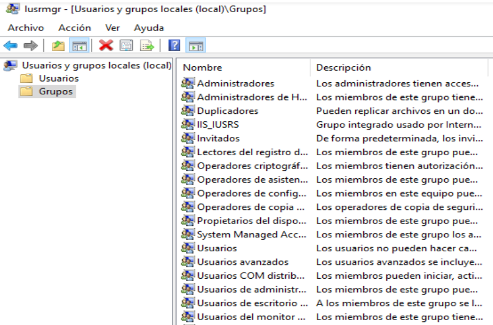

*************************
Usuarios y grupos Windows
*************************

Cuenta de usuario
=================

Una cuenta de usuario se utiliza para:

* Autentificar la identidad del usuario
* Autorizar o denegar el acceso a los recursos
* Administrar la seguridad
* Auditar las acciones realizadas con la cuenta

Hay dos cuentas predefinidas: **Administrador e invitado**

Un usuario local es una cuenta a la que se pueden conceder permisos y derechos para el equipo donde se está creando la cuenta

Grupos
======

Se utilizan para poder asignar privilegios comunes a varios usuarios o equipos
Hace más sencilla la administración

Un usuario puede pertenecer a varios grupos y tener los permisos asignados a cada uno de ellos

Hay ciertos grupos que se crean durante la instalación del sistema. Son las Identidades especiales

Ejecutamos el comando **lusrmgr.msc**

Un grupo local
==============

Un grupo local es una cuenta a la que se pueden conceder permisos y derechos para el equipo donde se ha creado

Perfiles de usuario
===================

Permite definir el entorno de trabajo de los usuarios en red
El perfil local sólo es accesible desde el equipo donde se ha creado
Un perfil temporal se crea cuando se produce un error en la carga del perfil de usuario, y se elimina al final de la sesión
Se accede mediante la ficha Perfil de la pantalla de Propiedades del usuario:

.. image:: imagenes/perfil_usuario_windows.png

* Un perfil de usuario permite asignar scripts de inicio de sesión y rutas de acceso locales

* Un script de inicio de sesión es un archivo con extensión .bat que contiene una secuencia de comandos que se ejecuta automáticamente cuando el usuario inicia una sesión.

* Una ruta de acceso local es una ruta a un directorio local privado del usuario.

* Es el directorio predeterminado en Símbolo de Sistema

