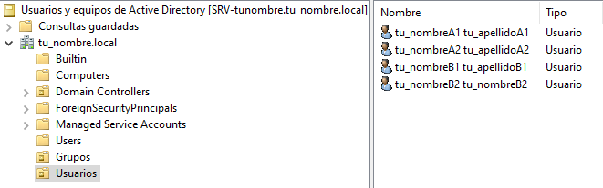
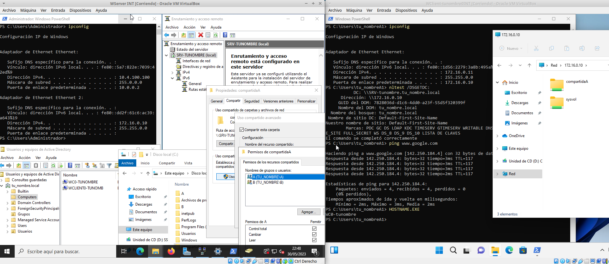

**********************
Casos prácticos : Active Directory
**********************

Caso práctico: AD y DNS con adaptador puente
===============================

Crea los siguiente clones enlazados con los adaptadores en modo puente:

* Clon enlazado 1 de "Windows Server 2022" llamado **SRV-tunombre** con IP 10.4.X.Y/8
* Clon enlazado 2 de "Windows 11" llamado **WC5-tunombre** 10.5.X.Y/8

Instalación y configuración de Active Directory y DNS
-------------

* En **SRV-tunombre** vamos a **Administrador del servidor/Panel/Agregar roles y características/Instalación basada en características o en roles** Seleccionar un servidor del grupo de servidores, escoger **SRV-tunombre/Marcar la casilla Servicios de dominio de Active Directory**

Creación de un dominio:
-------

* Partiendo de la ventana Resultados de la instalación de Active Directory, pulsar en Promover este servidor a controlador de dominio. (Si se había cerrado la ventana anterior es posible acceder a ella pulsando en el icono de advertencia de la barra de herramientas del Administrador del servidor)

  .. image:: imagenes/WS_promoverservidorCD.png
    
* De momento, el servidor SRV-tunombre no pertenece a ningún dominio. Tampoco existe un bosque al que agregar un nuevo dominio. Por lo tanto, el primer paso para formar el dominio **tunombre.local** es crear un nuevo bosque. Para ello seleccionar la opción **Agregar un nuevo bosque**. Tras escribir el nombre del dominio: tunombre.local, pulsar Siguiente. En capacidades del controlador del dominio, el Servidor de Sistema de nombres de dominio (DNS) y el Catálogo global (GC) deben estar marcados. Contraseña @lumn0

NetBIOS es una especificación de interfaz utilizado para nombrar recursos de red en sistemas Windows anteriores a Windows 2000. Verificar el nombre NetBIOS tu_nombre y pulsar Siguiente

Si todo ha sido configurado correctamente, hacer clic en Instalar.

Por ultimo cuando se reinicie habilita las actualizaciones dinámicas, para ello en **Inicio->Herramientas administrativas/DNS/expandir SRV-TUNOMBRE /expandir Zonas de búsqueda directa/** clic el botón derecho del ratón en **tu_nombre.local/Propiedades/General/lista Actualizaciones dinámicas** elegir **sin seguridad y con seguridad**, a continuación hacer clic en Aceptar.

Unidades Organizativas, usuarios y grupos
-------------------------

La estructura lógica de Windows Server se basa en la utilización de dominios y unidades organizativas. En un dominio se puede crear una jerarquía de unidades organizativas, las cuales pueden contener usuarios, grupos, equipos, impresoras y carpetas compartidas, además de otras unidades organizativas.

Para crear de las unidades organizativas en **Inicio/Herramientas administrativas/Usuarios y equipos de Active Directory** dentro del domino **tu_nombre.local** crea las siguientes unidades organizativas (clic botón derecho del ratón -> Nuevo -> Unidad Organizativa) **Usuarios y Grupos**

Dentro de la UO Grupos, crea el grupo global de seguridad A y B

Dentro de la UO Ususarios, crea los usuarios:

* tu_nombreA1

  * Nombre completo: tu_nombreA1 tu_apellido_A1.
  * Contraseña @lumn0A1
  * Nombre de inicio de sesión del usuario: tu_nombreA2@tu_nombre.local
  * La contraseña nunca expira
  * Hazle miembro del grupo A

* tu_nombreA2 

  * Nombre completo: tu_nombreA2 tu_apellido_A2
  * Contraseña @lumn0A2
  * Nombre de inicio de sesión del usuario: tu_nombreA2@tu_nombre.local
  * La contraseña nunca expira
  * Hazle miembro del grupo A

* tu_nombreB1

  * Nombre completo: tu_nombreB1 tu_apellido_B1.
  * Contraseña @lumn0B1
  * Nombre de inicio de sesión del usuario: tu_nombreB1@tu_nombre.local
  * La contraseña nunca expira
  * Hazle miembro del grupo B

* tu_nombreB2 

  * Nombre completo: tu_nombreB2 tu_apellido_B2
  * Contraseña @lumn0B2
  * Nombre de inicio de sesión del usuario: tu_nombreB2@tu_nombre.local
  * La contraseña nunca expira
  * Hazle miembro del grupo B

Unir un equipo al dominio
----------

Vamos a unir **WC5-tunombre** al dominio tu_nombre.local, para ello:

1. Cambiamos el nombre de la maquina

#. Ponemos el DNS la ip del dominio **SRV-tunombre**.

#. Haz clic derecho en el botón "Inicio" y selecciona "Sistema > Información" en el menú desplegable.

#. En la ventana de "Sistema", haz clic en "Configuración avanzada del sistema" en el panel izquierdo.

#. Se abrirá la ventana de "Propiedades del sistema". Haz clic en la pestaña "Nombre de equipo" y luego en el botón "Cambiar".

#. En la siguiente ventana, verás la opción "Miembro de". Asegúrate de seleccionar la opción "Dominio" en lugar de "Grupo de trabajo".

#. Ingresa un nombre del dominio **tu_nombre.local** 

   .. image:: imagenes/quitar_dominio.png
   

#. Haz clic en "OK" para guardar los cambios. Es posible que se te solicite reiniciar el equipo para aplicar los nuevos ajustes.

Quitar el equipo del dominio
-----------

1. Accede al equipo con una cuenta de administrador local.

#. Haz clic derecho en el botón "Inicio" y selecciona "Sistema" en el menú desplegable.

#. En la ventana de "Sistema", haz clic en "Configuración avanzada del sistema" en el panel izquierdo.

#. Se abrirá la ventana de "Propiedades del sistema". Haz clic en la pestaña "Nombre de equipo" y luego en el botón "Cambiar".

#. En la siguiente ventana, verás la opción "Miembro de". Asegúrate de seleccionar la opción "Grupo de trabajo" en lugar de "Dominio".

#. Ingresa un nombre de grupo de trabajo para el equipo. Por defecto, el grupo de trabajo suele ser "WORKGROUP", pero puedes ingresar un nombre diferente si lo deseas.

#. Haz clic en "OK" para guardar los cambios. Es posible que se te solicite reiniciar el equipo para aplicar los nuevos ajustes.

#. En el servicdor **"Inicio/Herramientas administrativas/Ususarios y equipos de Active Directory/"**

#. Selecciona **tu_nombre.local**, y quita los clientes que has sacado del dominio en la pestaña de **Computers**

Configurar una carpeta compartida
-------

Las carpetas y archivos en Windows permiten configurar los siguientes permisos:

* **Control total** el usuario tiene control total sobre la carpeta y puede añadir, cambiar, mover y eliminar elementos. El usuario también puede agregar y quitar permisos de la carpeta y subcarpetas.

* **Modificar** una combinación de lectura y escritura. El usuario también tiene la capacidad de eliminar los archivos dentro de la carpeta. También puede ver el contenido de las subcarpetas.

* **Leer y Ejecutar** los usuarios pueden leer el contenido de los archivos y
ejecutar los programas de la carpeta.

Vamos a compartir la carpeta **C:\\compartida** alojada en nuestro servidor, con los permisos solo de lectura, para ello:

Con el botón **derecho del ratón** accedemos a las propiedades de la carpeta vamos a la pestaña de **Compartir** aqui en **Uso compartido avanzado** seleccionamos compartir esta carpeta. 

En la misma pestaña de **Compartir** este mismo dialogo nos vamos a **Compartir** permisos y comprobamos que **Todos** solo con permisos de Lectura

Como podemos ver esta compartida en: **\\SRV-TUNOMRE\compartida** o **\\10.4.100.100**, si el cliente es linux podemos acceder **smb://10.4.100.100/**

Instalación de software utilizando directivas de grupo
---------

1. Vamos a poner en la carpeta compartida el programa a instalar en formato msi [#msi]_, para este caso utilizaremos `VideoLAN <https://www.videolan.org/>`_.

#. Para crear un objeto de directiva de grupo, abre la consola de administración de directivas de grupo (Group Policy Management Console) en el controlador de dominio **Inicio/Herramientas administrativas de Windows/Administración de directivas de grupo**. Crea un nuevo objeto de directiva de grupo (GPO) **Instalar VLC**

   .. image:: imagenes/GPO_VLC.png

#. En la pestaña de **Configuración/Configuración del equipo** vamos a Edición

   .. image:: imagenes/GPO_VLC_configuracion.png

#. En **Directiva Instalar/Configuración del equipo/Directivas/Configuración de software** creamos un nuevo paquete  
   
   .. image:: imagenes/GPO_VLC_editar.png
   

#. Especificar la ubicación del programa (.msi o .exe) dandole la ip y la carpeta compartida, vamos a seleccionar una instalación asignada, es decir (se instala automáticamente cuando se inicia sesión) en el caso de seleccionar la instalación publicada (el usuario puede elegir instalarlo desde el Centro de software de Windows).

   .. image:: imagenes/GPO_VLC_editar2.png
    
#. Haz un par de clientes más para nuestro dominio. Crea una nueva UO llamada Equipo y dentro crea otra llamada Despacho1, deja el cliente WC5-Tunombre fuera y dentro del Despacho1 el cliente WC6-Tunombre y WC7-Tunombre

   .. image:: imagenes/GPO_VLC_Equipos.png
    
#. En la consola de administración de Directivas de grupo, navega hasta  Despacho1, haz clic derecho en la OU y selecciona **Vincular un GPO existente**

   .. image:: imagenes/GPO_VLC_editar3.png
    
#. Los cambios en las políticas de grupo pueden requerir que el cliente se reinicie para que las configuraciones tengan efecto. Por otro lado si queremos aplicar nosotros mismos las directivas de grupo en los clientes de Windows, abre una ventana del símbolo del sistema (cmd) o PowerShell y ejecuta el comando **gpupdate /force**. Esto obligará al equipo a buscar y aplicar las nuevas directivas de grupo.

.. rubric:: Footnotes

.. [#msi] El formato **MSI** es un estándar de instalación utilizado en Windows que proporciona una forma estructurada y coherente de distribuir, administrar y desinstalar aplicaciones. Permite una gestión centralizada, una instalación consistente y confiable, y un mantenimiento y actualización eficientes de las aplicaciones en entornos Windows.

Caso práctico: AD y DNS con red interna
===============================

* Creamos un nuevo adaptador red para el servidor, le asignamos una red interna y le ponemos la dirección 172.16.0.10/16

* Cambiamos en el cliente el adaptador a una red interna, le asignamos la red 172.16.0.11/16 con puerta de enlace 172.16.0.10 y DNS 172.16.0.10

Configurar servicio de enrutamiento
-------

Tenmos que la red interna es Ethernet 2 : 172.16.0.10

* Panel / Agregar roles y características

  Seleccionamos nuestro servidor **SRV-tunombre**

En Roles de servidor marcamos la casilla de:

* [x] Remote Access / **Acceso remoto**

En servicios de rol seleccionamos:

* [x] DirectAccess and VPN(RAS)

* [x] Routing

Para comfigurar servicio de **enrutamiento** vamos a **Panel/Herramientas/Enrutamiento y Acceso remoto**, seleccionamos nuestro servidor **SRV-tunombre**, presionamos el botón de la derecha del ratón y Configuramos y habilitamos el enrutamiento y acceso remoto seleccionando:

* [x] Traduccion de direcciones de red (NAT)

Seleccionamos la tarjeta que tengamos en modo puente. (10.4.X.Y)

* [x] Configurar mas adelante el DHCP y el DNS

Por ultimo unir un equipo al dominio tu_nombre.local, si utilizas la misma maquina virtual tendrás que quitarla del domnio, cambiarle el nombre y volver a meterla, si utilizas un nuevo clon enlazado simplemente únela como hemos hecho antes al dominio teniendo en cuenta que ahora el DNS y la puerta de enlace es 172.16.0.10

Configurar una carpeta compartida
-------

Vamos a compartir la carpeta **C:\\compartidaA** alojada en nuestro servidor, como lectura para el grupo B y rwx para el grupo A, para ello:

Con el botón derecho del ratón accedemos a las propiedades de la carpeta vamos a la pestaña de compartir aqui en **Uso compartido avanzado** seleccionamos compartir esta carpeta. En este mismo dialogo nos vamos a permisos y **quitamos Todos**, después agregamos A y B. Al grupo A le damos el control total y al grupo B solo leer

