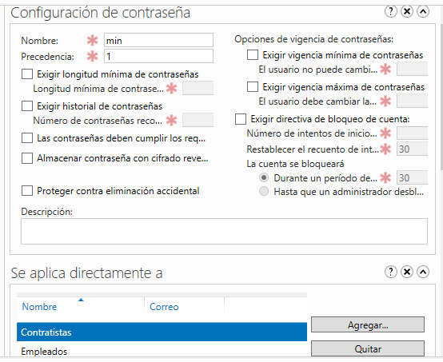
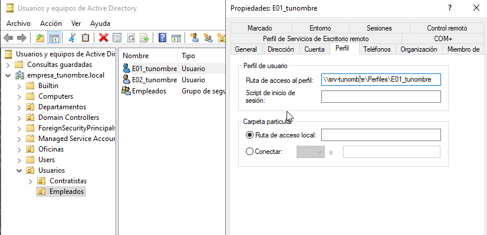
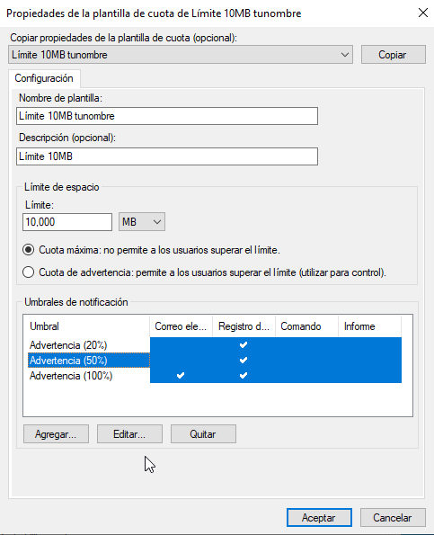

**************************************************
Casos prácticos : Active Directory con red interna
**************************************************

Crea los siguiente clones enlazados con los adaptadores en modo puente:

* Clon enlazado 1 de "Windows Server 2022" llamado **SRVtunombre** con IP 10.4.X.Y/8, DHCP si es portatil y un nuevo adaptador red para el servidor, le asignamos una red interna y le ponemos la dirección 172.16.0.10/16
* Clon enlazado 2 de "Windows 11" llamado **WC05tunombre** con un adaptador a una red interna, le asignamos la red 172.16.0.15/16 con puerta de enlace 172.16.0.10 y DNS 172.16.0.10
* Clon enlazado 3 de "Windows 11" llamado **WC06tunombre** con un adaptador a una red interna, le asignamos la red 172.16.0.16/16 con puerta de enlace 172.16.0.10 y DNS 172.16.0.10
* Clon enlazado 3 de "Windows 11" llamado **WC07tunombre** con un adaptador a una red interna, le asignamos la red 172.16.0.17/16 con puerta de enlace 172.16.0.10 y DNS 172.16.0.10

Puedes ver la configuración en el siguiente `vídeo <https://mediateca.educa.madrid.org/video/ifaxyhi1amzd8jg3>`_

Configurar servicio de enrutamiento
-----------------------------------

Para configurar el servicio de enrutamiento vamos a:

* Panel / Agregar roles y características

  Seleccionamos nuestro servidor **SRVtunombre**

En Roles de servidor marcamos la casilla de:

* [x] Remote Access / **Acceso remoto**

En servicios de rol seleccionamos:

* [x] DirectAccess and VPN(RAS)

* [x] Routing

Para comfigurar servicio de **enrutamiento** vamos a **Panel/Herramientas/Enrutamiento y Acceso remoto**, seleccionamos nuestro servidor **SRVInt-tunombre**, presionamos el botón de la derecha del ratón y Configuramos y habilitamos el enrutamiento y acceso remoto seleccionando:

* [x] Traduccion de direcciones de red (NAT)

Seleccionamos la tarjeta que tengamos en modo puente. (10.4.X.Y) o por (DHCP caso portatil)

* [x] Configurar mas adelante el DHCP y el DNS

Configura el controlador de dominio
-----------------------------------

Crea un controlador de dominio llamado **empresa_tunombre.local** y las siguientes unidades organizativas:

* OU=Oficinas

  * OU=Madrid
 
    * OU=Ventas
      
    * OU=Marketing
   
    * OU=Administración
    
  * OU=Barcelona
   
    * OU=Ventas
            
    * OU=Marketing
      
    * OU=Administración
      
* OU=Departamentos
        
  * OU=Recursos Humanos
        
  * OU=Finanzas
      
  * OU=IT
      
* OU=Usuarios
        
  * OU=Empleados
        
  * OU=Contratistas

* La **OU Oficinas** se utiliza para agrupar las unidades organizativas por ubicación geográfica.

* Las **OU Madrid y Barcelona** se utilizan para agrupar los departamentos dentro de cada oficina.

* La **OU Departamentos** se utiliza para agrupar las unidades organizativas por función.

* La **OU Usuarios** se utiliza para agrupar las cuentas de usuario.

**Ayuda**: En el caso de querer borrar una OU que esta protegída contra el borrado accidental, en propiedades en la pestaña Objeto desmarcar dicha protección. En el caso de no ver esta pestaña, haz clic en ver en la barra de menú y selecciona Características avanzadas.
   
Configura los usuarios del sistema
-----------------------------------

Crea el grupo de seguridad global Empleados dentro del UO Empleados y Contratistas dentro de su UO Contratistas.
Dentro de cada unidad organizativa crea los siguientes usuarios:

* UO Empleados
  
  * E01_tunombre perteneciente al grupo Empleados

  * E02_tunombre perteneciente al grupo Empleados
  
* UO Contratistas
  
  * C01_tunombre perteneciente al grupo Contratista

  * C02_tunombre perteneciente al grupo Contratista

.. image:: imagenes/ADINT02.png

Directivas de passwords
-----------------------

Crear una nueva directiva de password sobre el grupo Empleados y Contratistas, para ello abre el **Centro de administración de Active Directory** selecciona tunombre (local)/System/Password Settings Container

.. image:: imagenes/directivaPASS01.jpeg

Nuevo/Configuración de contraseña

.. image:: imagenes/directivaPASS02.jpeg

Dentro del Centro de administración de Windows Server, puedes encontrar una sección para configurar las políticas de contraseña.

* **Nombre**: Es el nombre que le asignas a la política de contraseña para identificarla fácilmente. Puedes darle un nombre descriptivo que refleje los requisitos o el propósito de la política.

* **Precedencia**: La precedencia se refiere al orden en el que se aplican las políticas de contraseña cuando existen múltiples políticas configuradas. Este campo te permite establecer la prioridad o el nivel de precedencia de la política de contraseña en relación con otras políticas. La política con la precedencia más alta tiene prioridad.

* **Longitud mínima**: Especifica la longitud mínima que deben tener las contraseñas para cumplir con la política. Puedes establecer un valor numérico para indicar el número mínimo de caracteres requeridos.

* **Complejidad de la contraseña**: Este campo te permite configurar si las contraseñas deben cumplir con requisitos de complejidad. Puedes habilitar o deshabilitar la complejidad y definir qué elementos se requieren, como letras mayúsculas, letras minúsculas, números y caracteres especiales.

* **Duración máxima de la contraseña**: Aquí puedes especificar el tiempo máximo que una contraseña puede estar en uso antes de que los usuarios deban cambiarla. Puedes establecer una cantidad de días después de los cuales se requiere un cambio de contraseña.

* **Historial de contraseñas**: Este campo define el número de contraseñas anteriores que los usuarios no pueden reutilizar. Por ejemplo, si estableces un historial de contraseñas de 5, los usuarios no podrán usar ninguna de las últimas 5 contraseñas que hayan utilizado.

* **Bloqueo** de cuenta por intentos fallidos: Puedes configurar el número máximo de intentos fallidos de inicio de sesión permitidos antes de que una cuenta de usuario se bloquee temporalmente. Esto ayuda a proteger las cuentas contra ataques de fuerza bruta.

Intalar programas y cambiar el fondo de escritorio por GPO
----------------------------------------------------------

Vamos a establecer un fondo de pantalla a través de una GPO y a instalar VideoLaN en los ordenadores que se encuentran en la UO Barcelona / Administración, es decir WC05tunombre y WC07tunombre. Esta directiva no se aplicara sobre WC06tunombre ya que esta en la "OU=Computers"

.. image:: imagenes/GPOINT01.png

En **Inicio/Herramientas administrativas de Windows/Administración de directivas de grupo** creamos una GPO llamada FondoPantalla y otra que se llame intalar VLC

.. image:: imagenes/GPOINT02.png

Utilizaremos la carpeta C:\\Windows\\SYSVOL [#sysvol]_, esta carpeta se comparte de forma predeterminada en los controladores de dominio, lo que permite a los clientes y otros controladores de dominio acceder a los archivos de políticas de grupo y scripts de inicio y cierre.

.. image:: imagenes/GPOINT03.png

En el Objeto de **directiva de grupo (GPO) Instalar VLC**, en la pestaña de **Configuración/Configuracióndel equipo**  vamos a Edición, en **Directivas Intalar VLC/Configuración del equipo/Directivas/Configuración de software/Instalación de sofware/** creamos un nuevo paquete y especificar la ubicación del programa (.msi o .exe) y seleccionamos el método de implementación asignada

.. image:: imagenes/GPOINT04.png

Para cambiar el fondo de pantalla,  editamos la directiva FondoPantalla, y en **Configuración de usuario/Directivas/Plantillas administrativas/Active Desktop/Tapiz del escritorio**, lo habilitamos

Por ultimo vamos a **Administracion de directivas de grupo/** buscamos **Oficina/Barcelona/Administración** vinculamos las **dos GPO existenetes**

.. image:: imagenes/GPOINT06.png

Configuración de carpetas compartidas
-------------------------------------

Crea las siguientes carpetas compartidas con los siguientes permisos:

* C:\\compartida\\empleados\\E01_tunombre (E01_tunombre tiene permisos de lectura y escritura)
  
* C:\\compartida\\empleados\\E01_tunombre (E02_tunombre tiene permisos de lectura y escritura)

* C:\\compartida\\empleados\\empleados_compartida (al grupo de empleados tiene permiso de lectura)
 
* C:\\compartida\\contratista\\C01_tunombre (C01_tunombre tiene permisos de lectura y escritura)

* C:\\compartida\\contratista\\C01_tunombre (C02_tunombre tiene permisos de lectura y escritura)

* C:\\compartida\\contratista\\contratista_compartida (al grupo de contratista tiene permiso de lectura)

Mapear unidades de red a las carpetas compartidas.
--------------------------------------------------

Queremos que se monten de forma automatica la carpeta contratista_compartida en la unidad G: con la etiqueta contratos a los usuarios que estan dentro de la OU=contratista y la carpeta empleados_compartida en F: con la etiqueta comunicados a los usuarios que estan dentro de la OU=empleados

En **Inicio/Herramientas administrativas de Windows / Administración de directivas de grupo** creamos una GPO directamente **"Ususarios / Empleados"** en llamada **"Mapeo de unidades de empleados"**

.. image:: imagenes/GPOINT07.png

Con el botón derecho del ratón abrimos el **"Editor de administración de directivas de grupo / Configuración de usuario / Preferencias / Asignacines de unidades -> nuevo / unidad asignada"**

Seleccionamos la Acción de Crear:

En el cliente tenemos que:

.. image:: imagenes/GPOINT10.png

En el caso de que tengamos problemas, ``gpupdate /force`` es un comando que fuerza una actualización de las políticas de grupo en un equipo cliente de Windows.

Script al inicio de la sesión 
-----------------------------

Vamos hacer el mapeo de unidades en red con siguiente script llamado **montar.bat** en C:\\Windows\\SYSVOL\\sysvol\\empresa_tunombre.local\\scripts

.. code-block:: bash

  net use h: \\SRV-tunombre\contratistas_compartida
  net use i: \\SRV-tunombre\empleados_compartida
  
Vamos a los usuarios en los que queremos que se monten las unidades, **Usuarios y equipos del AD / Usuarios / Empleados / E02_tunombre / propiedades y en la pestaña de perfil**  lo metemos en el Script de inicio de sesión

.. image:: imagenes/Perfil01.png

Perfil móvil
------------
Vamos a crear un perfil movil a los contratistas, para ello primero creamos una carpeta compartida llamada Perfiles con acceso de escritura y lectura para todos los usuarios.

En **Usuarios y equipos de Active Directory**, En la ventana de propiedades de la cuenta, hacemos clic sobre la solapa Perfil. En ella, debemos dar valor al cuadro de texto Ruta de acceso al perfil. El contenido seguirá el siguiente formato: **\\\\SRV-tunombre\\Perfiles\\C01_tunombre**, de forma mas general podríamos cambiar C01_tunombre por **%username%**

Cuando se cierra la sesión, el perfil se actualizará en el servidor:

.. image:: imagenes/Perfil03.png

Aplicar cuota
-------------

Lo primero es agregar los roles y caracteríscas necesarias, en Administrador del servidor / Agregar roles y caracteristicas, en la lista de roles, dentro de "Servidor de archivos y almacenamiento / Servidor de iSCSI y archivo / Administrador de recursos del servidor de archivos"

Para activar las cuotas vamos a:

.. image:: imagenes/CuotaAD02.png

Creamos una nueva plantilla llamada **Límite 10MB tunombre**, con Advertencia al 20 y 50%

Aplica la plantilla creada en la carpeta compartida en la que se encunetran los perfiles móviles, cuando lo apliques no olvides marcar **Aplica la plantilla aut. y crear cuotas en subcarpetas nuevas y existentes.**

.. image:: imagenes/CuotaAD04.png

Inicia la sesión con algún usuario, copia algún archivo para que exceda la cuota, cuando cierres la sesisión te dara un error en la sincronización del perfil, vuelve a loguearte con el usuario y abre el visor de eventos:

.. image:: imagenes/CuotaAD05.png

Perfil Obligatorio
------------------

Un perfil obligatorio es un tipo especial de perfil de usuario que se carga desde una ubicación específica en lugar de desde la carpeta de perfil de usuario normalmente utilizada. Esto significa que los cambios realizados por el usuario durante la sesión no se guardan entre sesiones.

1. Personalizamos en el cliente el perfil movil que hemos creado, este seguardará en el servidor en C:\\Perfiles\E01_tunombre.v6

#. Desde propiedades de la carpeta del perfil vamos a Seguridad / Opciones avanzadas y cambiamos el propietario a Administrador, marcamos la opción de reemplazar en todas las subcarpetas

#. Copiamos la carpeta E01_tunombre.v6 a platilla.v6 y la compartimos para todos solo con permisos de lectura

#. Hacemos que los usuarios deseados tengan esta carpeta como su perfil: \\\\SRV-tunombre\\Perfiles\\plantilla

#. Entramos en la carpeta plantilla.v6, activamos los elementos ocultos, si hay una carpeta en AppData llamada localLow o Roaming la eliminamos.

#. Abrimos el registro y vamos a HKEY_USERS, vamos a archivo, cargamos subarbol/plantilla elegimos el archivo NTUSER.DAT, abrimos y le ponemos nombre a la clave (perfilobligatorio) y le damos permisos al grupo perfileobligatorio, le damos control total con herencia. Finalmente le damos archivo y descargamos el subárbol.

#. En el plantilla.v6 cambiamos NTUSER.DAT NTUSER.MAM.

