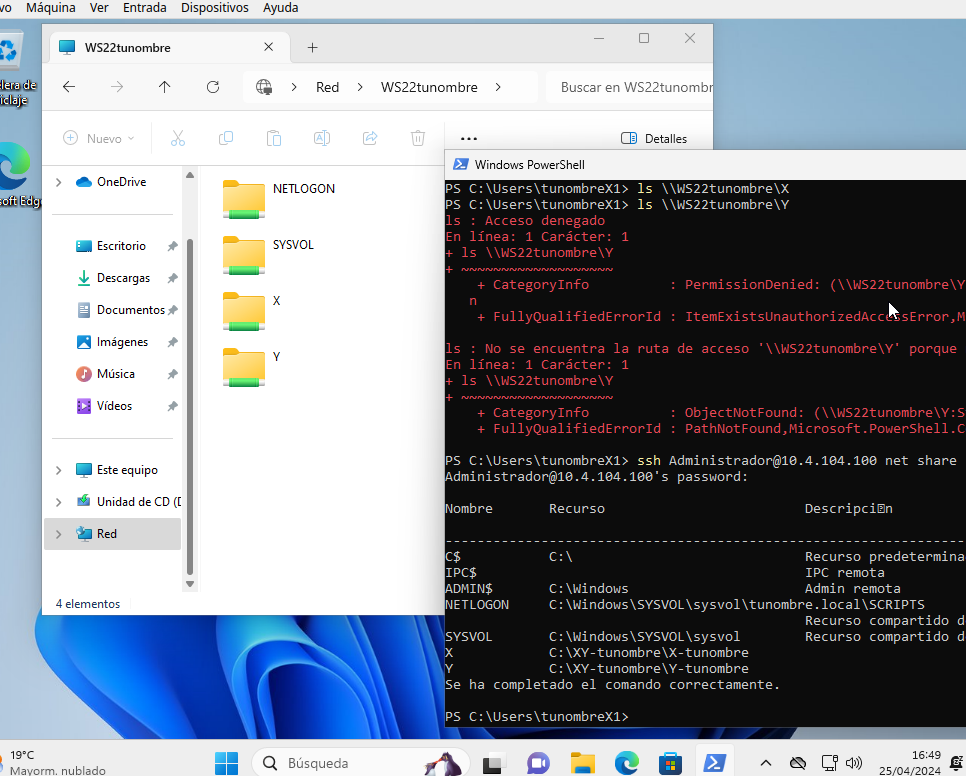
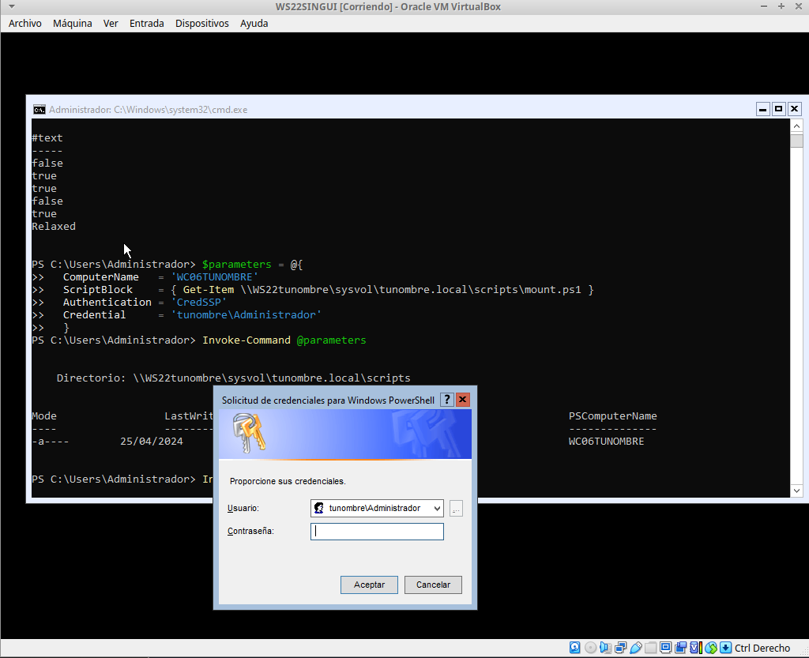

********************************************
Casos prácticos : Active Directory sin GUI
********************************************

Crea los siguiente clones enlazados:

* Clon enlazado 1 de "`Windows Server 2022 sin GUI <https://dgtrabada.github.io/so/maquinas_virtuales.html#caso-practico-windows-server-2022-sin-gui>`_" llamado **WS22tunombre** con IP 10.4.X.Y/8 o DHCP si es portatil y un nuevo adaptador red para el servidor, le asignamos una red interna a la que ponemos la dirección 172.16.0.10/16

* Clon enlazado 2 de "`Windows Server 11 <https://dgtrabada.github.io/so/maquinas_virtuales.html#caso-practico-windows-11>`_" llamado **WC05tunombre** con un adaptador a una red interna, le asignamos la red 172.16.0.15/16 con puerta de enlace 172.16.0.10 y DNS 172.16.0.10

Configurar servicio de enrutamiento
-----------------------------------

.. code-block:: powershell

  # Instalar el servicio de enrutamiento
  Install-WindowsFeature Routing -IncludeManagementTools
   
  # habilitar NAT para la red interna
  New-NetNat -Name "NAT" -InternalIPInterfaceAddressPrefix "172.16.0.10/16"
  
  #habilitamos el reenvío de paquetes
  Set-NetIPInterface -Forwarding Enabled

Instalación y configuración de Active Directory y DNS
-----------------------------------------------------

Instalamos el rol de Servicio de dominio de Active Directory

.. code-block:: powershell

  Install-WindowsFeature -Name AD-Domain-Services -IncludeManagementTools

Promocionamos el servidor como controlador de dominio

.. code-block:: powershell

  Import-Module ADDSDeployment

No tenemos creada ninguna parte de la infraestructura, comenzamos creando el bosque y se creará automáticamente el resto de la estructura
  
.. code-block:: powershell

  Install-ADDSForest
  DomainName : tunombre.local
  password : @lumn0

Puedes comprobar que se ha creado con el siguiente comando:

.. code-block:: powershell

  Get-ADComputer -Filter * 

.. image:: imagenes/WS22NGUI00.png

Unidades Organizativas, usuarios y grupos
-----------------------------------------

Vamos a crear las siguientes  unidades organizativas:

.. code-block:: powershell

  New-ADOrganizationalUnit -DisplayName "DespachoX" -Name "DespachoX" -path "DC=tunombre,DC=local"
  New-ADOrganizationalUnit -DisplayName "DespachoY" -Name "DespachoY" -path "DC=tunombre,DC=local"

Puedes comprobar las unidades creadas:

.. code-block:: powershell

  Get-ADOrganizationalUnit -LDAPFilter "(name=*)"  | FT Name,DistinguishedName

En el caso de que te necesites borrar una OU, recuerda que primero tienes que deshabilitar el borrado accidental y luuego borrar

.. code-block:: powershell

  Set-ADOrganizationalUnit -Identity "OU=DespachoX,DC=tunombre,DC=local" -ProtectedFromAccidentalDeletion $False
  Remove-ADOrganizationalUnit -Identity "OU=DespachoX,DC=tunombre,DC=local" -Recursive

Grupos y usuarios
------------------

Vamos a crear los sigientes usuarios y grupos de seguridad

* Grupo X
  
  * Usuario: tunombreX1 con la contraseña @lumn0X1, haz que sea miembro del grupo X
  * Usuario: tunombreX2 con la contraseña @lumn0X2, haz que sea miembro del grupo X
  
* Grupo Y
  
  * Usuario: tunombreY1 con la contraseña @lumn0Y1, haz que sea miembro del grupo Y
  * Usuario: tunombreY2 con la contraseña @lumn0Y2, haz que sea miembro del grupo Y  

.. code-block:: powershell

  New-ADGroup -DisplayName "X" -Name "X" -GroupScope DomainLocal -GroupCategory Security -Path "DC=tunombre,DC=local"
  New-ADGroup -DisplayName "Y" -Name "Y" -GroupScope DomainLocal -GroupCategory Security -Path "DC=tunombre,DC=local"

Después creamos los usuarios, como se ve en el siguiente ejemplo con el usuario tu_nombreA1

.. code-block:: powershell 
  
  New-ADUser -DisplayName "tunombreX1" -Name "tunombreX1" -UserPrincipalName "tunombreX1" -Enabled:$True -Path "DC=tunombre,DC=local" -AccountPassword (ConvertTo-SecureString -string "@lumn0X1" -AsPlainText -Force) -ChangePasswordAtLogon:$False

Al establecer ``-ChangePasswordAtLogon:$False``, estás indicando que no se requiere que el usuario cambie la contraseña la primera vez que inicia sesión. Si lo queremos cambiar sobre un usuario ya creado ``Set-ADUser -Identity "tunombreX1" -ChangePasswordAtLogon $False``, en el otro caso tendremos que iniciar la sesión al menos una vez para cambiar la contraseña y hasta que no lo hagamos no podremos loguearnos por ssh.

Por ultio lo añadimos al grupo

.. code-block:: powershell
 
  Add-ADGroupMember -Identity "X" -Members "tunombreX1"

Podemos comprobar que se han creado los grupos y los usuarios:

.. code-block:: powershell

  Get-ADGroupMember "X" | Select-Object Name
  Get-ADGroupMember "Y" | Select-Object Name

Unir equipo al dominio
----------------------

Para añadir el equipo al dominio **WC05tunombre** primero tendremos que cambiar el DNS:

.. code-block:: powershell

  #Comprobamos el DNS del cliente
  Get-DnsClientServerAddress

  #En el caso de que no apunte al servidor, lo cambiamos:
  Set-DnsClientServerAddress -InterfaceIndex 6 -ServerAddresses ("172.16.0.10", "8.8.8.8")
   
Por ultimo lo metemos dentro del dominio con el siguiente comando que ejecutamos en el cliente, necesitaremos exportar el display para que aparezca el dialogo para meter la contraseña

.. code-block:: powershell

  Add-computer -domainname "tunombre.local" -Credential  tunombre\administrador -restart -force
   
  #puedes comprobar que se añadido en el servidor ejecuntando allí
  Get-ADComputer -Filter * | FT Name
  
.. image:: imagenes/WS22NGUI03.png

En el caso de que quieras hacerlo sin exportar el diplay:

.. code-block:: powershell

  $password = ConvertTo-SecureString "@lumn0" -AsPlainText -Force
  $credenciales = New-Object System.Management.Automation.PSCredential("tunombre\administrador", $password)

  Add-Computer -DomainName "tunombre.local" -Credential $credenciales -Restart -Force

Es posible que al haber clonado los equipos no os deje por tener el mismo SID, para cambiarlo:

.. image:: imagenes/sysprep.png

Si queremos sacar la maquina del dominio, en una terminal del servidor con permiso de administrador ejceutamos:

.. code-block:: powershell

  Remove-ADComputer -Identity "NombreDeLaComputadora"

En Windows, puedes utilizar el siguiente comando para sincronizar la hora con un servidor de tiempo en línea:

.. code-block:: powershell
  
  w32tm /resync

Carpeta compartida
------------------

Creamos una carpeta en el servidor y la compartimos:

.. code-block:: powershell

  #Desde el servidor
  mkdir C:\Users\compartida_tunombre
  New-SmbShare -Name "compartida_tunombre"  -Path "C:\Users\compartida_tunombre\" -ReadAccess "Todos" -FullAccess "Administradores"

.. code-block:: powershell
   
  #Podemos ver que esta en:
  ls "\\WS22TUNOMBRE\compartida_tunombre"
   
  #La montamos en el cliente en la unidad Z
  New-PSDrive -Name "Z" -PSProvider "FileSystem" -Root "\\WS22TUNOMBRE\compartida_tunombre" 
  

Habilitar scripts
-----------------
New-GPO -Name "Habilitar Ejecución de Scripts"

Set-GPRegistryValue -Name "Habilitar Ejecución de Scripts" -Key "HKLM\SOFTWARE\Policies\Microsoft\Windows\PowerShell\ScriptExecution" -ValueName "ExecutionPolicy" -Type String -Value "AllSigned"

Get-GPO -Name "Habilitar Ejecución de Scripts"  | New-GPLink -Target "OU=DespachoX,DC=tunombre,DC=local"

Mapear unidades de red a las carpetas compartidas utilizando GPO
----------------------------------------------------------------

Lo primero que heremos es mover los ordenadores a la unidad organizativa donde vamos a vincular la GPO

.. code-block:: powershell

  #En AD tenemos los siguientes clientes
  Get-ADComputer -Filter * | Select-Object Name, DistinguishedName

  #Nuestro cliente esta en:
  Get-ADComputer -Filter {Name  -eq "WC05TUNOMBRE"} | FT DistinguishedName
 
  #tenemos las siguientes unidades organizativas
  Get-ADComputer -Filter {Name  -eq "WC05TUNOMBRE"} | FT DistinguishedName
  
  #Movemos el equi al "DespachoX"
  $IdentidadEquipo = $(Get-ADComputer -Identity "WC05TUNOMBRE").DistinguishedName
  
  Move-ADObject -Identity $IdentidadEquipo -TargetPath "OU=DespachoX,DC=tunombre,DC=local" -Confirm:$False

Vamos a crear un script para que se ejecute al inicio de la sesión:

.. code-block:: powershell

  cat \\WS22tunombre\sysvol\tunombre.local\scripts\mount_H.ps1
  New-PSDrive -Name "H" -PSProvider "FileSystem" -Root "\\WS22TUNOMBRE\compartida_tunombre"

.. code-block:: powershell

  #Creamos la politica de grupo:
  New-GPO -Name "Mapear en H"
  
  # Asignar la configuración de inicio de sesión a la GPO
  Set-GPRegistryValue -Name "Mapear en H" -Key "HKLM\SOFTWARE\Microsoft\Windows\CurrentVersion\Run" -ValueName "ScriptName" -Type String -Value "\\WS22tunombre\sysvol\tunombre.local\scripts\mount_H.ps1"
  
  #La vinculamos:
  Get-GPO -Name "Mapear en H"  | New-GPLink -Target "OU=DespachoX,DC=tunombre,DC=local"
  
  #Si queremos desvincular: 
  #Remove-GPLink -Name <Nombre> -Target <Path_OU_Dominio>
  #Borrarla:
  #Remove-GPO -Name <Nombre> -Domain <dominio>

Instalación de software utilizando directivas de grupo
------------------------------------------------------

Vamos a crear una GPO para instalar un programa, para ello tendremos que vincularla a una unidad organizativa.

 
  
Nos bajamos el programa, y lo ponemos en una carpeta que se compartida:

.. code-block:: powershell

  #es posible que el link de descarga haya cambiado...
  cd C:\Windows\SYSVOL\sysvol\tunombre.local
Invoke-WebRequest -Uri "https://mirrors.up.pt/pub/videolan/vlc/3.0.20/win64/vlc-3.0.20-win64.msi" -OutFile "vlc-3.0.20-win64.msi"

Creamos la GPO y la vinculamos a la OU correspondiente:  

.. code-block:: powershell

  #Creamos la politica de grupo:
  New-GPO -Name "Instalar VLC"
  
  #La vinculamos:
  Get-GPO -Name "Instalar VLC"  | New-GPLink -Target "OU=DespachoX,DC=tunombre,DC=local"
  
  #Si queremos desvincular: 
  #Remove-GPLink -Name <Nombre> -Target <Path_OU_Dominio>
  #Borrarla:
  #Remove-GPO -Name <Nombre> -Domain <dominio>
  
  #creamod el script en \\WS22TUNOMBRE\sysvol\tunombre.local\scripts\InstallVLC.ps1:
  $rutaMSI = "\\WS22TUNOMBRE\sysvol\tunombre.local\vlc-3.0.20-win64.msi"
  # Instalar el MSI
  Start-Process msiexec.exe -ArgumentList "/i `"$rutaMSI`" /qn" -Wait

  Set-GPRegistryValue -Name "Instalar VLC" -Key "HKLM\Software\Microsoft\Windows\CurrentVersion\Run" -ValueName "Instalar VLC" -Type String -Value "powershell.exe -File \\WS22TUNOMBRE\sysvol\tunombre.local\scripts\InstallVLC.ps1"

 

rm -r C:\Users\XY

mkdir C:\Users\XY
mkdir C:\Users\XY\X
mkdir C:\Users\XY\Y

# Obtener el objeto ACL actual de la carpeta XY
$acl= Get-Acl -Path "C:\Users\XY"

# Permisos para la carpeta principal (lectura y escritura)
$permisos= "ReadAndExecute", "ListDirectory"

# Crear la regla de acceso para el grupo X
$reglaX = New-Object System.Security.AccessControl.FileSystemAccessRule("X",$permisos, "Allow")
$reglaY = New-Object System.Security.AccessControl.FileSystemAccessRule("Y",$permisos, "Allow")

# Agregar las reglas de acceso 
$acl.AddAccessRule($reglaX)
$acl.AddAccessRule($reglaY)

cd C:\Users\XY

$acl= Get-Acl -Path "C:\Users\XY\X"
$permisos = "Modify"
$regla = New-Object System.Security.AccessControl.FileSystemAccessRule("X",$permisos, "Allow")
$acl.AddAccessRule($regla)

$acl= Get-Acl -Path "C:\Users\XY\Y"
$permisos = "Modify"
$regla = New-Object System.Security.AccessControl.FileSystemAccessRule("Y",$permisos, "Allow")
$acl.AddAccessRule($regla)

$usuario = "tunombreX1"
$password = ConvertTo-SecureString "@lumn0X1" -AsPlainText -Force
$credenciales = New-Object System.Management.Automation.PSCredential($usuario, $password)

Start-Process powershell.exe -Credential $credenciales 

Set-ADUser -Identity "nombreusuario" -ChangePasswordAtLogon $False

Start-Process powershell.exe -Credential $credenciales